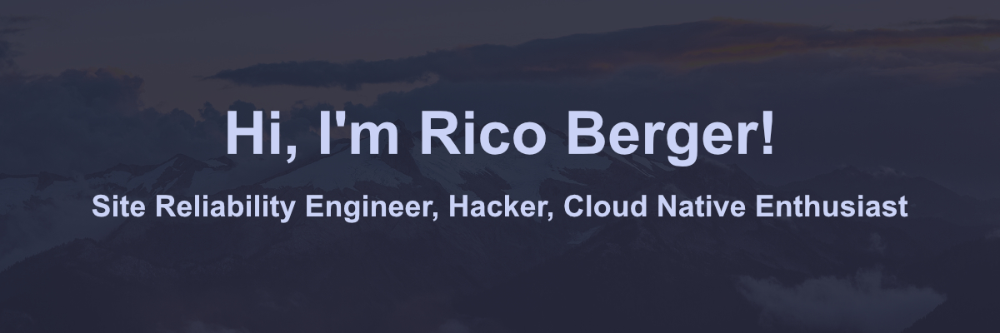

I'm a passionate Site Reliability Engineer / Platform Enginner with a deep
commitment to ensuring the reliability, scalability, and performance of systems
and services. With a strong background in both development and operations, I
thrive on collaborating with cross-functional teams to design and maintain
infrastructure that supports rapid deployment and continuous integration.

### Projects

| Projects                                                                       | Stars                                                                                                               | Forks                                                                                                               | Issues                                                                                                                | Pull Requests                                                                                                                   |
| ------------------------------------------------------------------------------ | ------------------------------------------------------------------------------------------------------------------- | ------------------------------------------------------------------------------------------------------------------- | --------------------------------------------------------------------------------------------------------------------- | ------------------------------------------------------------------------------------------------------------------------------- |
| [kubenav](https://github.com/kubenav/kubenav)                                  |                    |                    |                    |                    |
| [FeedDeck](https://github.com/feeddeck/feeddeck)                               |                  |                  |                  |                  |
| [kobs](https://github.com/kobsio/kobs)                                         |                        |                        |                        |                        |
| [Vault Secrets Operator](https://github.com/ricoberger/vault-secrets-operator) |  |  |  |  |
| [script_exporter](https://github.com/ricoberger/script_exporter)               |         |         |         |         |

### Latest Blog Posts

- [Neovim: Extend snacks.nvim Explorer](https://ricoberger.de/blog/posts/neovim-extend-snacks-nvim-explorer/)
- [My Dotfiles](https://ricoberger.de/blog/posts/my-dotfiles/)
- [Welcome to My New Website](https://ricoberger.de/blog/posts/welcome-to-my-wew-website/)

[More Blog Posts](https://ricoberger.de/blog/)

### Languages and Tools

