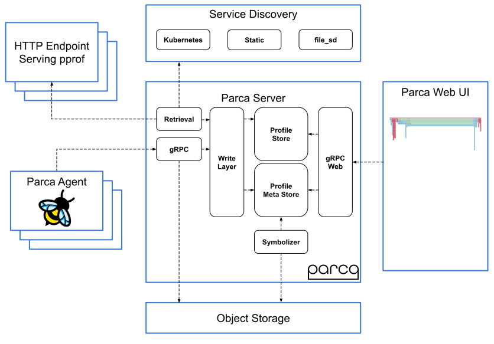
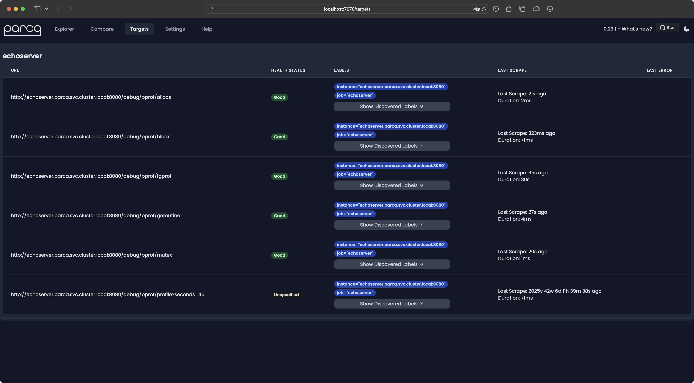
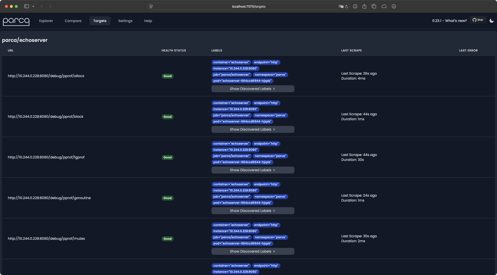
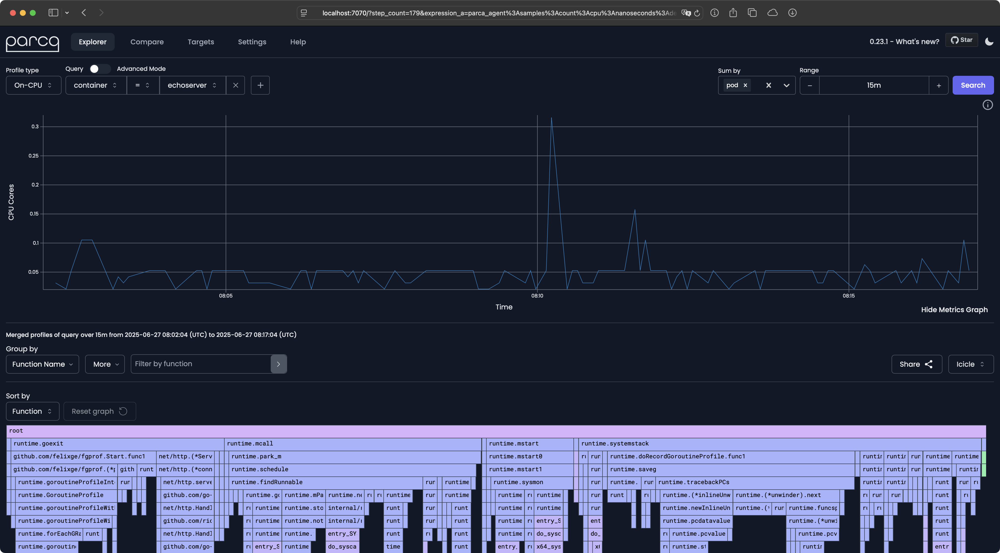
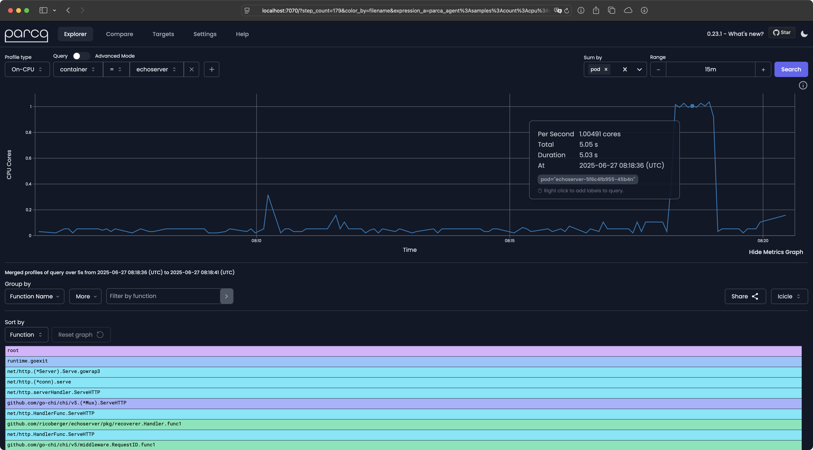
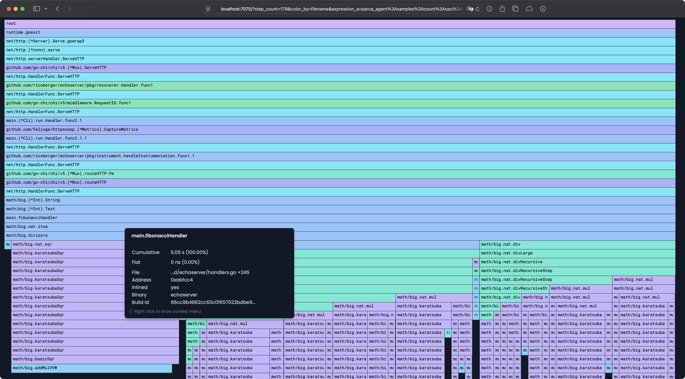
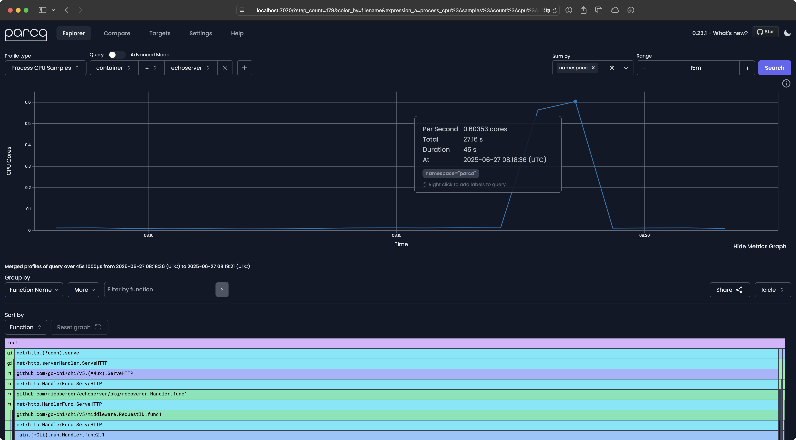
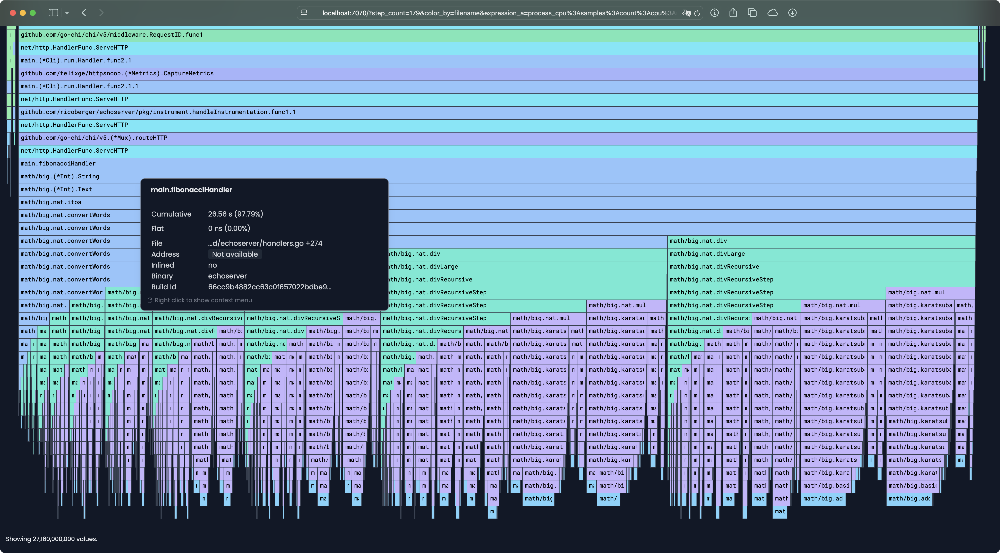
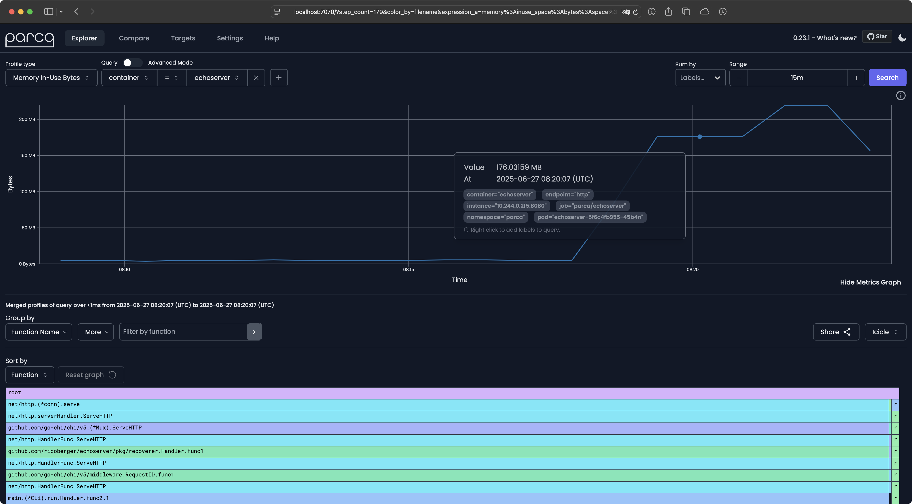
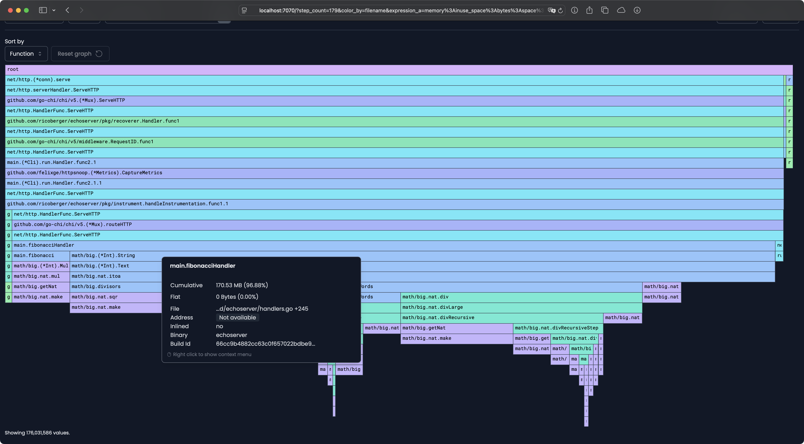

In today's blog post, we will examine continuous profiling using Parca. We will
set up Parca in a Kubernetes cluster, explore its architecture, and collect
profiles from an example application. Finally, we will review the Parca UI to
analyze the collected profiles. If you are not familiar with continuous
profiling, I recommend reading the
["What is profiling?"](https://www.parca.dev/docs/overview#what-is-profiling)
section in the Parca documentation.

Parca has two main components: the Parca Server and the Parca Agent. The Parca
Server stores profiling data and enables querying and analysis over time. The
Parca Agent is an eBPF-based whole-system profiler.

The diagram below illustrates the architecture of Parca and the Parca Agent.



Parca can source profiles by retrieving them from targets via HTTP or by using
the Parca Agent, which pushes them to the Parca Server. The Parca Server then
stores these profiles. Different series of profiles are identified by their
unique label combinations and can be visualized through the Parca UI, which is
provided by the Parca Server, using icicle-graphs.

## Installation

In the following we will deploy an example application to a Kubernetes cluster,
which exposes HTTP endpoints serving pprof, the Parca Server and the Parca
Agent. Let's start by creating a new namespace called `parca` and deploying the
[echoserver](https://github.com/ricoberger/echoserver) as our example
application.

```sh
kubectl create namespace parca
helm upgrade --install echoserver --namespace parca oci://ghcr.io/ricoberger/charts/echoserver --version 1.0.3 --set-json='podLabels={"app": "echoserver"}'
```

In the next step we deploy the Parca Server, by applying the
`1-1-parca-server.yaml` file from the
[ricoberger/playground](https://github.com/ricoberger/playground/tree/d278b2c9dd149d2aea7bfda036a764ae51e0e6a1/kubernetes/parca)
repository:

```sh
kubectl apply -f https://raw.githubusercontent.com/ricoberger/playground/d278b2c9dd149d2aea7bfda036a764ae51e0e6a1/kubernetes/parca/1-1-parca-server.yaml
```

This will create a Service, StatefulSet, and ConfigMap for the Parca Server. The
ConfigMap contains the configuration for the Parca Server. We define the storage
location (the local filesystem[^1]) that Parca will use to store the profiles
and add a scrape configuration for our example application.

```yaml
object_storage:
  bucket:
    config:
      directory: /data
    type: FILESYSTEM
scrape_configs:
  - job_name: echoserver
    scrape_interval: 45s
    scrape_timeout: 60s
    static_configs:
      - targets:
          - echoserver.parca.svc.cluster.local:8080
    profiling_config:
      pprof_config:
        fgprof:
          enabled: true
          path: /debug/pprof/fgprof
```

Last but not least, we deploy the Parca Agent using the `1-2-parca-agent.yaml`
file:

```sh
kubectl apply -f https://raw.githubusercontent.com/ricoberger/playground/d278b2c9dd149d2aea7bfda036a764ae51e0e6a1/kubernetes/parca/1-2-parca-agent.yaml
```

The Parca Agent is deployed as a DaemonSet and requires a ClusterRole,
ClusterRoleBinding, and ServiceAccount to watch all Nodes and Pods within the
cluster. The deployed ConfigMap contains the configuration for the Parca Agent,
including the relabel configuration, ensuring that the pushed profiles have all
the necessary labels for later differentiation.

At this point, our example application, the Parca Server and the Parca Agent,
should be up and running:

```plaintext
NAME                              READY   STATUS    RESTARTS   AGE
echoserver-664ccd6944-hjxpb       1/1     Running   0          4m15s
parca-agent-lq8h5                 1/1     Running   0          3m7s
parca-server-0                    1/1     Running   0          3m37s
```

We can also access the Parca UI via
`kubectl port-forward -n parca svc/parca-server 7070`, where we should see our
example application in the targets list:
[http://localhost:7070/targets](http://localhost:7070/targets).



### Parca Operator

Before we continue exploring the Parca UI, I want to share a small side project
of mine. The [Parca Operator](https://github.com/ricoberger/parca-operator)
allows us to dynamically populate the `scrape_configs` of the Parca Server using
a `ParcaScrapeConfig` Custom Resource.

The operator uses the Kubernetes Service Discovery feature of Parca to
dynamically add, update, and remove scrape configurations, similar to the
Prometheus Operator. This allows us to replace our static configuration for the
echoserver, which would not function correctly if we run more than one replica
of the service.

Let's first update our configuration for the Parca Server by removing the
`scrape_configs`:

```sh
kubectl apply -f https://raw.githubusercontent.com/ricoberger/playground/d278b2c9dd149d2aea7bfda036a764ae51e0e6a1/kubernetes/parca/2-1-parca-server.yaml
```

Now we can install the Parca Operator using the corresponding Helm chart and the
[`3-1-parca-operator.yaml`](https://raw.githubusercontent.com/ricoberger/playground/d278b2c9dd149d2aea7bfda036a764ae51e0e6a1/kubernetes/parca/3-1-parca-operator.yaml)
values file. The operator will mount the Parca Server's configuration file and
create a new configuration file as a Secret in the `parca` namespace, named
`parca-server-generated`.

```sh
helm upgrade --install parca-operator --namespace parca oci://ghcr.io/ricoberger/charts/parca-operator --version 1.2.0 -f https://raw.githubusercontent.com/ricoberger/playground/d278b2c9dd149d2aea7bfda036a764ae51e0e6a1/kubernetes/parca/3-1-parca-operator.yaml
```

In the next step, we will update our Parca Server setup to use the Secret
instead of the ConfigMap for its configuration. We will also add a ClusterRole,
ClusterRoleBinding, and ServiceAccount for the Parca Server, enabling it to list
and watch all Pods in the cluster.

```sh
kubectl apply -f https://raw.githubusercontent.com/ricoberger/playground/d278b2c9dd149d2aea7bfda036a764ae51e0e6a1/kubernetes/parca/3-2-parca-server.yaml
```

```plaintext
NAME                              READY   STATUS    RESTARTS   AGE
echoserver-664ccd6944-hjxpb       1/1     Running   0          8m2s
parca-agent-lq8h5                 1/1     Running   0          6m54s
parca-operator-6789868cdd-7txdf   1/1     Running   0          103s
parca-server-0                    1/1     Running   0          49s
```

Last but not least, we will create a `ParcaScrapeConfig` for our example
application:

```sh
kubectl apply -f https://raw.githubusercontent.com/ricoberger/playground/d278b2c9dd149d2aea7bfda036a764ae51e0e6a1/kubernetes/parca/3-3-echoserver-parcascrapeconfig.yaml
```

In the `ParcaScrapeConfig` we select all Pods, which are having the `app` label
set to `echoserver`. We also set the port which is used to serve the pprof
endpoints.

In the `ParcaScrapeConfig`, we select all Pods with the `app` label set to
`echoserver`. We also specify the port (`http`) used to serve the pprof
endpoints. The remaining configuration is similar to the static configuration we
used previously.

```yaml
apiVersion: parca.ricoberger.de/v1alpha1
kind: ParcaScrapeConfig
metadata:
  name: echoserver
  namespace: parca
spec:
  selector:
    matchLabels:
      app: echoserver
  scrapeConfig:
    port: http
    interval: 45s
    timeout: 60s
    profilingConfig:
      pprofConfig:
        fgprof:
          enabled: true
          path: /debug/pprof/fgprof
```

If we access the [targets list](http://localhost:7070/targets) in the Parca UI
now, we should see a new job for the echoserver with a different set of labels
than before.



## Explore Profiles

In the last section of this blog post, we will explore the profiles ingested
into Parca. Let's open the Parca UI by creating a port-forward to the Parca
Server using the command `kubectl port-forward -n parca svc/parca-server 7070`
and then opening [http://localhost:7070/](http://localhost:7070/) in our
browser.

In the first step we explore the profiles captured by the Parca Agent. To do
this, we select `On-CPU` from the `Profile Type` dropdown menu. For now, we are
only interested in the profiles of the echoserver. To filter the profiles, we
select the `container` label and the `echoserver` value. Lastly, we select the
`pod` label from the `Sum By` dropdown menu. After that, we should see the
profiles captured by the Parca Agent for the echoserver.



To simulate a CPU intensive task, we create a port-forward to the echoserver
using the command `kubectl port-forward -n parca svc/echoserver 8080`.
Afterwards we run the following cURL command:

```sh
curl -vvv "http://localhost:8080/fibonacci?n=100000000"
```

Once the request is complete, we can refresh the profiles displayed in the Parca
UI by clicking the `Search` button. We should now observe a spike in the CPU
usage of the echoserver. By hovering over one of the data points, we can see how
many cores the echoserver used per second and the total CPU usage time. Clicking
on the data point will display the captured sample below the graph, allowing us
to check where the most time was spent. As expected, most of the time should be
attributed to the `main.fibonacciHandler` function.

<div class="grid grid-cols-2 md:grid-cols-2 gap-4">
  <div>
    <a href="./assets/on-cpu-profile-1.png">
      
    </a>
  </div>
  <div>
    <a href="./assets/on-cpu-profile-2.png">
      
    </a>
  </div>
</div>

When using the Parca Agent, only the `On-CPU` profiles are available. However,
since we added a scrape configuration for the echoserver, the other profiles
should also be available. These include:

- **Fgprof Samples Total**: CPU profile samples observed regardless of their
  current On/Off CPU scheduling status
- **Fgprof Samples Time Total**: CPU profile measured regardless of their
  current On/Off CPU scheduling status in nanoseconds
- **Goroutine Created Total**: Stack traces that created all current goroutines.
- **Memory Allocated Objects Total**: A sampling of all past memory allocations
  by objects.
- **Memory Allocated Bytes Total**: A sampling of all past memory allocations in
  bytes.
- **Memory In-Use Objects**: A sampling of memory allocations of live objects by
  objects.
- **Memory In-Use Bytes**: A sampling of memory allocations of live objects by
  bytes.
- **Process CPU Nanoseconds**: CPU profile measured by the process itself in
  nanoseconds.
- **Process CPU Samples**: CPU profile samples observed by the process itself.

If we are selecting the `Process CPU Samples` from the `Profile Types` dropdown,
we should see a similar pattern as for the `On-CPU` profiles.

<div class="grid grid-cols-2 md:grid-cols-2 gap-4">
  <div>
    <a href="./assets/process-cpu-samples-1.png">
      
    </a>
  </div>
  <div>
    <a href="./assets/process-cpu-samples-2.png">
      
    </a>
  </div>
</div>

Lastly, we will select the `Memory In-Use Bytes` item from the `Profile Types`
dropdown. When we hover over a data point in the graph, we can see the number of
bytes used by the echoserver during this time. If we click on the data point, we
can view the sample below the graph to analyze where most of our memory was
spent.

<div class="grid grid-cols-2 md:grid-cols-2 gap-4">
  <div>
    <a href="./assets/memory-in-use-bytes-1.png">
      
    </a>
  </div>
  <div>
    <a href="./assets/memory-in-use-bytes-2.png">
      
    </a>
  </div>
</div>

[^1]:
    Parca supports the same storage configuration options as
    [Thanos](https://thanos.io/tip/thanos/storage.md/#supported-clients). This
    means it can also be used together with an S3 compatible object storage or
    an Azure Storage Account. This would also be the recommended storage option
    for a production deployment, because Parca doesn't handle the retention for
    stored data and it is recommended to configure this via a lifecycle rule in
    the object storage.
