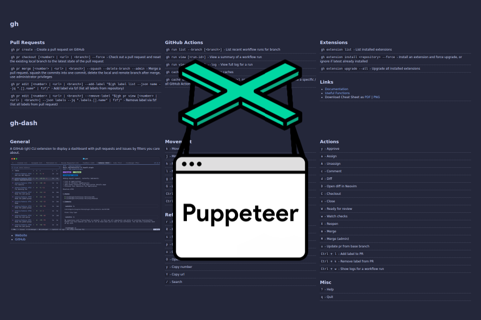

Today, I automated one of the final annoying tasks related to my new website. I
wanted to provide downloadable versions of the cheat sheets in PNG or PDF
format. Until now, I had to create the PNGs manually using the FireShot Safari
extension, which was quite frustrating. This process is now automated with
[Puppeteer](https://pptr.dev/). In the following sections, we will explore how
Puppeteer can be used to generate PDFs and PNGs from HTML sites.



## Create a New Node.js Project

Create a new folder for your project, navigate to the directory, and initialize
a new Node.js project:

```sh
mkdir html-to-pdf-png
cd html-to-pdf-png
npm init
```

## Install Puppeteer

Install Puppeteer as a dependency:

```sh
npm install puppeteer --save
```

This will create a `node_modules` directory in your project folder and add
Puppeteer as a dependency to your `package.json` file.

## Create a New File

In the same project, create an `index.js` file. This is where we will write our
code to convert HTML into PDF and PNG.

```sh
touch index.js
```

## Create a Browser Instance and a New Page

Inside the `index.js` file, we have to import `puppeteer` first. Afterwards we
can create a new browser instance and a new page:

```js
const puppeteer = require("puppeteer");

const browser = await puppeteer.launch({
  headless: true,
  args: ["--no-sandbox", "--disable-setuid-sandbox"],
});

const page = await browser.newPage();
```

The `headless` and `args` options are important for using it within a GitHub
Action; otherwise, we will encounter the following error:

```plaintext
Error: Failed to launch the browser process!
[2178:2178:0304/190806.915940:FATAL:zygote_host_impl_linux.cc(127)] No usable sandbox! If you are running on Ubuntu 23.10+ or another Linux distro that has disabled unprivileged user namespaces with AppArmor, see https://chromium.googlesource.com/chromium/src/+/main/docs/security/apparmor-userns-restrictions.md. Otherwise see https://chromium.googlesource.com/chromium/src/+/main/docs/linux/suid_sandbox_development.md for more information on developing with the (older) SUID sandbox. If you want to live dangerously and need an immediate workaround, you can try using --no-sandbox.
[0304/190806.925145:ERROR:file_io_posix.cc(145)] open /sys/devices/system/cpu/cpu0/cpufreq/scaling_cur_freq: No such file or directory (2)
[0304/190806.925188:ERROR:file_io_posix.cc(145)] open /sys/devices/system/cpu/cpu0/cpufreq/scaling_max_freq: No such file or directory (2)


TROUBLESHOOTING: https://pptr.dev/troubleshooting

    at ChildProcess.onClose (/home/runner/work/ricoberger/ricoberger/node_modules/@puppeteer/browsers/lib/cjs/launch.js:318:24)
    at ChildProcess.emit (node:events:530:35)
    at ChildProcess._handle.onexit (node:internal/child_process:293:12)
```

## Resize the Page and Navigate to a URL

In the next step, we will set the page size for our PDFs and PNGs, and then
navigate to the URL:

```js
await page.setViewport({ width: 1920, height: 1080, deviceScaleFactor: 1 });

await page.goto("https://ricoberger.de/cheat-sheets/gh/", {
  waitUntil: "networkidle0",
});
```

The value of `waitUntil` determines whether the navigation is considered
successful. The default value is `load`, which means navigation is deemed
complete when the `load` event fires. However, we want to wait until there are
no more than 0 network connections for at least 500ms by using the value
`networkidle0`.

## Configure the Output

By default, `page.pdf()` generates a PDF of the page using print CSS media. To
create a PDF that resembles what we see on the screen, we will use the screen
media. Add `page.emulateMediaType('screen')` before downloading the PDF:

```js
await page.evaluate((sel) => {
  var elements = document.querySelectorAll(sel);
  for (var i = 0; i < elements.length; i++) {
    elements[i].parentNode.removeChild(elements[i]);
  }
}, "#header");

await page.emulateMediaType("screen");

const pageHeight = await page.evaluate(
  () => document.documentElement.offsetHeight,
);
```

We remove the page header with the ID `#header` because it is unnecessary in the
downloadable version of the cheat sheet. Additionally, we need the page height
to use it as the height of the generated PDF page.

## Download the PDF

Next, call [`page.pdf()`](https://pptr.dev/api/puppeteer.page.pdf) to download
the PDF with the following options passed to the method:

```js
await page.pdf({
  path: "cheat-sheet.pdf",
  printBackground: true,
  width: "1920px",
  height: pageHeight + "px",
});
```

- `path`: This is the file path where the PDF will be saved, and it is
  mandatory. If we do not specify the path, the file will not be saved to the
  disk, and we will receive a buffer instead.
- `printBackground`: This parameter controls whether the background graphics of
  the web page are printed. The default value is `false`. You may want to set
  this to `true`, as some images will be missing in the PDF if it remains
  `false`.
- `width`: Sets the width of paper. You can pass in a number or a string with a
  unit.
- `height`: Sets the height of paper. You can pass in a number or a string with
  a unit.

## Download the PNG

Next we call
[`page.screenshot()`](https://pptr.dev/api/puppeteer.page.screenshot) to
download the PNG with the following options passed to the method:

```js
await page.screenshot({
  path: "cheat-sheet.png",
  fullPage: true,
  type: "png",
});
```

- `path`: The file path to save the image to. The screenshot type will be
  inferred from file extension. If path is a relative path, then it is resolved
  relative to current working directory. If no path is provided, the image won't
  be saved to the disk.
- `fullPage`: When `true`, takes a screenshot of the full page.

## Close the Browser

Finally, close the browser instance after downloading the PDF and PNG:

```js
await browser.close();
```

Our final code appears as follows:

```js
const puppeteer = require("puppeteer");

(async () => {
  const browser = await puppeteer.launch({
    headless: true,
    args: ["--no-sandbox", "--disable-setuid-sandbox"],
  });

  const page = await browser.newPage();

  await page.setViewport({ width: 1920, height: 1080, deviceScaleFactor: 1 });

  await page.goto("https://ricoberger.de/cheat-sheets/gh/", {
    waitUntil: "networkidle0",
  });

  await page.evaluate((sel) => {
    var elements = document.querySelectorAll(sel);
    for (var i = 0; i < elements.length; i++) {
      elements[i].parentNode.removeChild(elements[i]);
    }
  }, "#header");

  await page.emulateMediaType("screen");

  const pageHeight = await page.evaluate(
    () => document.documentElement.offsetHeight,
  );

  await page.pdf({
    path: "cheat-sheet.pdf",
    printBackground: true,
    width: "1920px",
    height: pageHeight + "px",
  });

  await page.screenshot({
    path: "cheat-sheet.png",
    fullPage: true,
    type: "png",
  });

  await browser.close();
})();
```

The adjusted code for our cheat sheets is available in the
[`build-cheat-sheets-assets.js`](https://github.com/ricoberger/ricoberger/blob/58e0e4f8dc04d989a7d32336543080835075ef16/templates/utils/build-cheat-sheets-assets.js)
file. You can find the usage within the GitHub Action in the
[`deploy.yml`](https://github.com/ricoberger/ricoberger/blob/58e0e4f8dc04d989a7d32336543080835075ef16/.github/workflows/deploy.yml#L51)
file.
