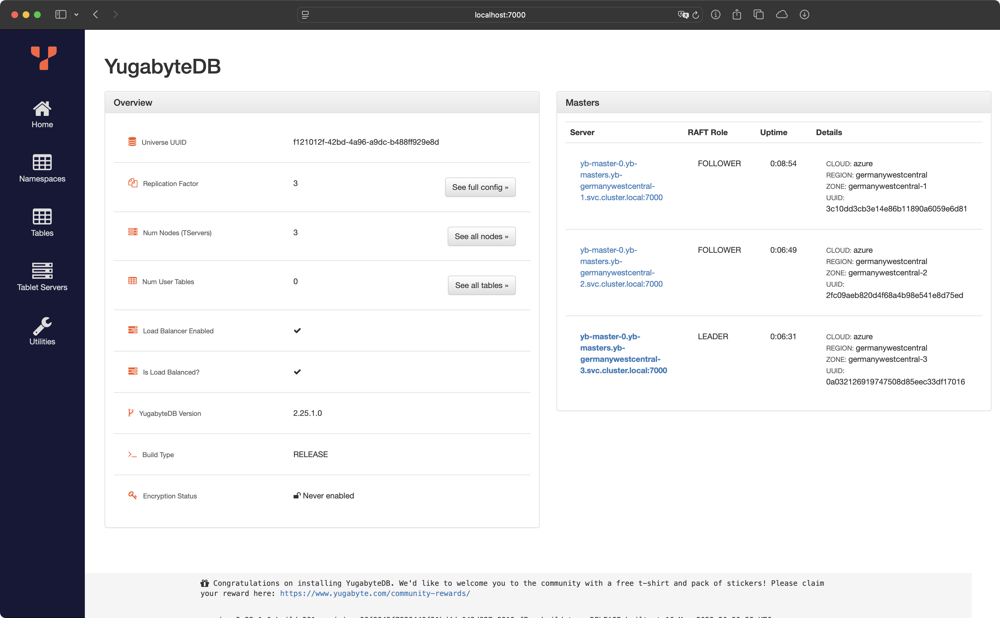
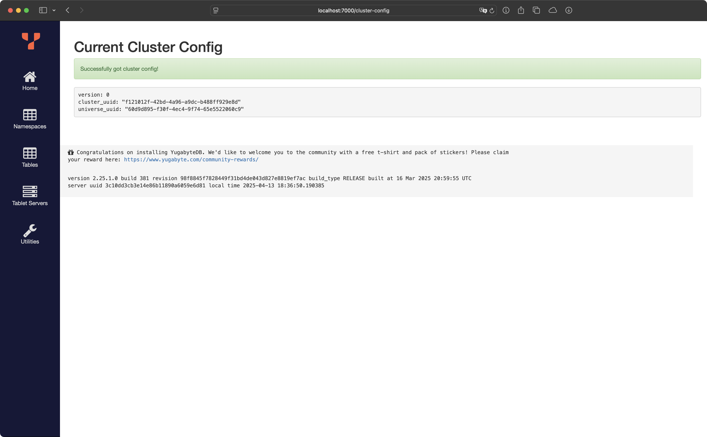

After getting started with YugabyteDB in the
[last blog post](http://ricoberger.de/blog/posts/getting-started-with-yugabytedb/),
I wanted to explore how to set up a zone-aware YugabyteDB cluster. To do this,
we will create a multi-zone AKS cluster and use the standard single-zone
YugabyteDB Helm Chart to deploy one-third of the nodes in the database cluster
across each of the three zones.

With the `commerce` schema from the last post, the final architecture will
appear as shown in the following graphic. We will have three StatefulSets for
the YB-Master and three StatefulSets for the YB-TServer. Each StatefulSet will
contain one Pod running in the specified AKS zone. The tablets for each table in
the `commerce` schema will be distributed across all Pods in the cluster. All
the configuration files we are using can be found in the
[ricoberger/playground](https://github.com/ricoberger/playground/tree/d07d42dfa25386737dd84edeee2f9b1054101edd/applications/deploy-yugabytedb-on-a-multi-zone-aks-cluster)
GitHub repository.


## Create a AKS Cluster

Create a AKS cluster, if you have not already done so, by running the following
command. Note that if you do not specify 3 zones in the zones parameter
explicitly then AKS may place the 3 nodes in only 2 zones.

```sh
az group create --name yugabyte --location germanywestcentral
az aks create --resource-group yugabyte --name yugabyte --node-count 3 --zones 1 2 3
```

We create a
[StorageClass](https://github.com/ricoberger/playground/tree/d07d42dfa25386737dd84edeee2f9b1054101edd/applications/deploy-yugabytedb-on-a-multi-zone-aks-cluster/storageclass.yaml).
We need to specify `WaitForFirstConsumer` mode for the `volumeBindingMode` so
that volumes will be provisioned according to pods zone affinities.

```sh
kubectl apply --server-side -f storageclass.yaml
```

## Create a YugabyteDB Cluster

Add the Helm chart repository and make sure that we have the latest updates to
the repository by running the following commands.

```sh
helm repo add yugabytedb https://charts.yugabyte.com
helm repo update
```

Before we can install the Helm charts, we have to create the 3 namespaces first.

```sh
kubectl create namespace yb-germanywestcentral-1
kubectl create namespace yb-germanywestcentral-2
kubectl create namespace yb-germanywestcentral-3
```

Now we create the overall YugabyteDB cluster in such a way that one third of the
nodes are hosted in each zone.

```sh
helm upgrade --install yb-germanywestcentral-1 yugabytedb/yugabyte --version 2.25.1 --namespace yb-germanywestcentral-1 --wait -f values-yb-germanywestcentral-1.yaml
helm upgrade --install yb-germanywestcentral-2 yugabytedb/yugabyte --version 2.25.1 --namespace yb-germanywestcentral-2 --wait -f values-yb-germanywestcentral-2.yaml
helm upgrade --install yb-germanywestcentral-3 yugabytedb/yugabyte --version 2.25.1 --namespace yb-germanywestcentral-3 --wait -f values-yb-germanywestcentral-3.yaml
```

## Check the Cluster Status

We can check the status of the cluster using various commands noted below.

Check the pods

```sh
kubectl get pods -A | grep yb-germanywestcentral
```

```sh
yb-germanywestcentral-1                     yb-master-0                                                      3/3     Running            0                7m18s
yb-germanywestcentral-1                     yb-tserver-0                                                     3/3     Running            0                7m18s
yb-germanywestcentral-2                     yb-master-0                                                      3/3     Running            0                5m55s
yb-germanywestcentral-2                     yb-tserver-0                                                     3/3     Running            0                5m55s
yb-germanywestcentral-3                     yb-master-0                                                      3/3     Running            0                4m53s
yb-germanywestcentral-3                     yb-tserver-0                                                     3/3     Running            0                4m53s
```

Check the services.

```sh
kubectl get service -A | grep yb-germanywestcentral
```

```sh
yb-germanywestcentral-1                     yb-masters                                      ClusterIP      None           <none>         7000/TCP,7100/TCP,15433/TCP                                                            8m6s
yb-germanywestcentral-1                     yb-tservers                                     ClusterIP      None           <none>         9000/TCP,12000/TCP,11000/TCP,13000/TCP,9100/TCP,6379/TCP,9042/TCP,5433/TCP,15433/TCP   8m6s
yb-germanywestcentral-2                     yb-masters                                      ClusterIP      None           <none>         7000/TCP,7100/TCP,15433/TCP                                                            6m42s
yb-germanywestcentral-2                     yb-tservers                                     ClusterIP      None           <none>         9000/TCP,12000/TCP,11000/TCP,13000/TCP,9100/TCP,6379/TCP,9042/TCP,5433/TCP,15433/TCP   6m42s
yb-germanywestcentral-3                     yb-masters                                      ClusterIP      None           <none>         7000/TCP,7100/TCP,15433/TCP                                                            5m40s
yb-germanywestcentral-3                     yb-tservers                                     ClusterIP      None           <none>         9000/TCP,12000/TCP,11000/TCP,13000/TCP,9100/TCP,6379/TCP,9042/TCP,5433/TCP,15433/TCP   5m40s
```

We can also access the YB-Master Admin UI for the cluster at
`http://localhost:7000`. Note that we can use any of the above three services
for this purpose as all of them will show the same cluster metadata.

```sh
kubectl port-forward --namespace yb-germanywestcentral-1 svc/yb-masters 7000
```



## Configure Zone-Aware Replica Placement

The default replica placement policy treats every yb-tserver as equal
irrespective of its `placement_*` setting. We go to
`http://localhost:7000/cluster-config` to confirm that the default configuration
is still in effect.



To make the replica placement zone-aware, so that one replica is placed in each
zone, we run the following command:

```sh
kubectl exec -it --namespace yb-germanywestcentral-1 yb-master-0 -- bash -c "/home/yugabyte/master/bin/yb-admin --master_addresses yb-master-0.yb-masters.yb-germanywestcentral-1.svc.cluster.local:7100,yb-master-0.yb-masters.yb-germanywestcentral-2.svc.cluster.local:7100,yb-master-0.yb-masters.yb-germanywestcentral-3.svc.cluster.local:7100 modify_placement_info azure.germanywestcentral.germanywestcentral-1,azure.germanywestcentral.germanywestcentral-2,azure.germanywestcentral.germanywestcentral-3 3"
```

To see the new configuration, we go to `http://localhost:7000/cluster-config`.


## Single Namespace

> The following section was added after the blog post was first published on
> April 14, 2025.

After publishing the first version of the blog post, I wondered if it was
possible to create a zone-aware YugabyteDB cluster within a single namespace,
allowing PodDisruptionBudgets to apply to the entire cluster. It turns out this
is achievable by setting the `oldNamingStyle` value to `false` in the Helm
chart. You can find the updated values files in the
[ricoberger/playground](https://github.com/ricoberger/playground/tree/3457e1927526849001fbc838d229cc7450f18afa/applications/deploy-yugabytedb-on-a-multi-zone-aks-cluster)
repository.

```sh
kubectl create namespace yugabytedb
```

```sh
helm upgrade --install yb-germanywestcentral-1 yugabytedb/yugabyte --version 2.25.1 --namespace yugabytedb --wait -f values-single-namespace-yb-germanywestcentral-1.yaml
helm upgrade --install yb-germanywestcentral-2 yugabytedb/yugabyte --version 2.25.1 --namespace yugabytedb --wait -f values-single-namespace-yb-germanywestcentral-2.yaml
helm upgrade --install yb-germanywestcentral-3 yugabytedb/yugabyte --version 2.25.1 --namespace yugabytedb --wait -f values-single-namespace-yb-germanywestcentral-3.yaml
```

```sh
kubectl exec -it --namespace yugabytedb yb-germanywestcentral-1-yb-master-0 -- bash -c "/home/yugabyte/master/bin/yb-admin --master_addresses yb-germanywestcentral-1-yb-master-0.yb-germanywestcentral-1-yb-masters.yugabytedb.svc.cluster.local:7100,yb-germanywestcentral-2-yb-master-0.yb-germanywestcentral-2-yb-masters.yugabytedb.svc.cluster.local:7100,yb-germanywestcentral-3-yb-master-0.yb-germanywestcentral-3-yb-masters.yugabytedb.svc.cluster.local:7100 modify_placement_info azure.germanywestcentral.germanywestcentral-1,azure.germanywestcentral.germanywestcentral-2,azure.germanywestcentral.germanywestcentral-3 3"
```
