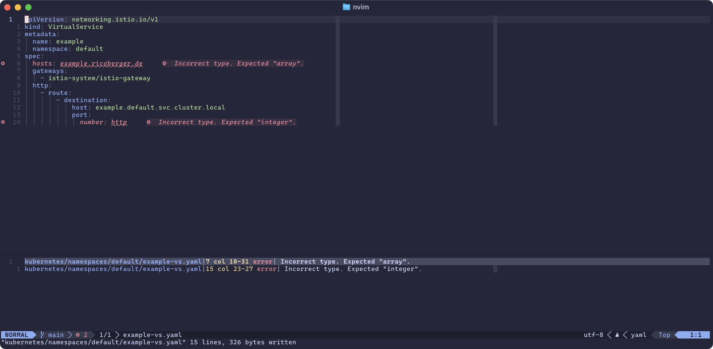

First, I want to apologize for the clickbait title. The
[YAML Language Server](https://github.com/redhat-developer/yaml-language-server)
is a great project, and I don't want to disrespect the maintainers. However,
while
[reworking my Neovim configuration](https://ricoberger.de/blog/posts/reworking-my-neovim-configuration/),
I encountered some issues with the YAML Language Server that I would like to
share with you, along with how I resolved them.



## Motivation

While reworking my Neovim configuration, I also decided to adjust the YAML
Language Server settings to support completion and validation for Kubernetes
manifests. I began with the following configuration:

```lua
yaml = {
  format = {
    enable = false,
  },
  completion = true,
  hover = true,
  validate = true,
  schemas = {
    kubernetes = {
      "/kubernetes/**/*.yml",
      "/kubernetes/**/*.yaml",
    },
  },
  schemaStore = {
    enable = false,
    url = "",
  },
},
```

This worked well for all standard Kubernetes manifests. The problems began when
I started working with CustomResourceDefinitions (CRDs), as I consistently
encountered the following error:

```plaintext
kubernetes/namespaces/default/example-vs.yaml|2 col 7-21 error   1| Value is not accepted. Valid values: "ValidatingAdmissionPolicy", "ValidatingAdmissionPolicyBinding", "MutatingAdmissionPolicy", "MutatingAdmissionPolicyBinding", "StorageVersion", "DaemonSet", "Deployment", "ReplicaSet", "StatefulSet", "TokenRequest", "TokenReview", "LocalSubjectAccessReview", "SelfSubjectAccessReview", "SelfSubjectRulesReview", "SubjectAccessReview", "HorizontalPodAutoscaler", "Scale", "CronJob", "Job", "CertificateSigningRequest", "ClusterTrustBundle", "Lease", "LeaseCandidate", "LimitRange", "Namespace", "Node", "PersistentVolume", "PersistentVolumeClaim", "Pod", "ReplicationController", "ResourceQuota", "Service", "FlowSchema", "PriorityLevelConfiguration", "Ingress", "IngressClass", "NetworkPolicy", "IPAddress", "ServiceCIDR", "PodDisruptionBudget", "DeviceClass", "ResourceClaim", "ResourceClaimTemplate", "ResourceSlice", "CSIDriver", "CSINode", "VolumeAttachment", "StorageVersionMigration", "CustomResourceDefinition", "APIService".
```

This was somewhat expected, as the YAML Language Server is unaware of the
CustomResourceDefinitions I am using. To resolve this, there are two options:

1. Add the schema for each CustomResourceDefinition to the YAML Language Server
   configuration. The issue with this approach is that I would need to define a
   unique pattern for each file, which is not feasible.

```lua
schemas = {
  kubernetes = {
    "*-deploy.yml",
    "*-deploy.yaml",
    ...
  },
  ["https://raw.githubusercontent.com/datreeio/CRDs-catalog/refs/heads/main/networking.istio.io/virtualservice_v1.json"] = {
    "*-vs.yml",
    "*-vs.yaml",
  }
}
```

2. Add an annotation to all CustomResourceDefinitions, which was also not a
   feasible solution for me.

```yaml
# yaml-language-server: $schema=https://raw.githubusercontent.com/datreeio/CRDs-catalog/refs/heads/main/networking.istio.io/virtualservice_v1.json
apiVersion: networking.istio.io/v1
kind: VirtualService
metadata:
  name: example
  namespace: default
spec: ...
```

After conducting some research, I decided to create
[my own JSON schema for Kubernetes](https://github.com/ricoberger/kubernetes-json-schema),
which includes the Kubernetes JSON schema and the schemas for all
CustomResourceDefinitions I am using. The configuration for the YAML Language
Server to utilize the new schema is as follows:

```lua
schemas = {
  ["https://raw.githubusercontent.com/ricoberger/kubernetes-json-schema/refs/heads/main/schemas/all.json"] = {
    "/kubernetes/**/*.yml",
    "/kubernetes/**/*.yaml",
  }
}
```

The problem with this approach is that the YAML Language Server has extensive
logic related to the default Kubernetes schema, which prevents it from
functioning as expected. With the configuration mentioned above, I consistently
received the following error:

```plaintext
kubernetes/namespaces/default/example-deploy.yaml|2 col 1-2 error| Matches multiple schemas when only one must validate.
```

This is a
[known issue](https://github.com/redhat-developer/yaml-language-server/issues/998)
with the YAML Language Server. At that point, I was so frustrated that I decided
[to fork the YAML Language Server](https://github.com/ricoberger/yaml-language-server)
to add an option to overwrite the default Kubernetes schema.

With this small change, everything is now functioning as expected. I receive
completion and validation for all Kubernetes manifests, including the
CustomResourceDefinitions I am using.

## Usage

In the following section, we will explore how to use the forked version of the
YAML Language Server and the custom Kubernetes JSON schema with Neovim.

First, we need to clone the repository, check out the branch with the modified
version, and build the YAML Language Server.

```sh
git clone git@github.com:ricoberger/yaml-language-server.git
cd yaml-language-server
git checkout add-option-to-overwrite-kubernetes-schema

npm install
npm run build
```

In the next step, we will create a bash script
[`yamlls`](https://github.com/ricoberger/dotfiles/blob/acb3f643129799906a33bf72a290ba21f1270190/.bin/yamlls)
in our `PATH` to set the `YAMLLS_KUBERNETES_SCHEMA_URL` environment variable and
to start our custom YAML Language Server.

```sh
#!/usr/bin/env bash

export YAMLLS_KUBERNETES_SCHEMA_URL="https://raw.githubusercontent.com/ricoberger/kubernetes-json-schema/refs/heads/main/schemas/all.json"

node /Users/ricoberger/Documents/GitHub/ricoberger/yaml-language-server/out/server/src/server.js $@
```

Lastly, we configure the YAML Language Server in Neovim
([`yamlls.lua`](https://github.com/ricoberger/dotfiles/blob/acb3f643129799906a33bf72a290ba21f1270190/.config/nvim/lsp/yamlls.lua))
to use our `yamlls` script for starting the server.

```lua
return {
  cmd = { "yamlls", "--stdio" },
  filetypes = {
    "yaml",
    "yaml.docker-compose",
    "yaml.gitlab",
    "yaml.helm-values",
  },
  single_file_support = true,
  settings = {
    redhat = {
      telemetry = {
        enabled = false,
      },
    },
    yaml = {
      format = {
        enable = false,
      },
      completion = true,
      hover = true,
      validate = true,
      schemas = {
        kubernetes = {
          "/kubernetes/**/*.yml",
          "/kubernetes/**/*.yaml",
        },
      },
      schemaStore = {
        enable = false,
        url = "",
      },
    },
  },
  on_init = function(client)
    client.server_capabilities.documentFormattingProvider = nil
    client.server_capabilities.documentRangeFormattingProvider = nil
  end,
}
```

If you are using the [Helm Language Server](https://github.com/mrjosh/helm-ls),
you can adjust the configuration in
[`helm_ls.lua`](https://github.com/ricoberger/dotfiles/blob/acb3f643129799906a33bf72a290ba21f1270190/.config/nvim/lsp/helm_ls.lua)
to also utilize the `yamlls` script for starting the YAML Language Server.

## Schema Generation

In the last section of this blog post, we will examine the
[ricoberger/kubernetes-json-schema](https://github.com/ricoberger/kubernetes-json-schema)
repository and explain how the generation of the JSON schema works.

The JSON schema is generated by the
[`generate.sh`](https://github.com/ricoberger/kubernetes-json-schema/blob/04a5c1e66245ca459ab518049cd822aa6c9985bd/utilities/generate.sh)
script. First, we create a new [`kind`](https://kind.sigs.k8s.io/) cluster and
apply all CustomResourceDefinitions (CRDs) from the
[`crds`](https://github.com/ricoberger/kubernetes-json-schema/tree/04a5c1e66245ca459ab518049cd822aa6c9985bd/crds)
directory. Next, we start a `kubectl proxy` to access the Kubernetes API of the
`kind` cluster.

```sh
kind create cluster --image=kindest/node:v1.34.0
kubectl apply --server-side -f crds/
kubectl proxy --port=5555 --accept-hosts='^.*'
```

The
[`openapi2jsonschema.py`](https://github.com/ricoberger/kubernetes-json-schema/blob/04a5c1e66245ca459ab518049cd822aa6c9985bd/utilities/openapi2jsonschema.py)
script is used to fetch the OpenAPI v2 definition from the `kind` cluster and
convert it to JSON schema. The generated JSON schema files are stored in the
[`schemas`](https://github.com/ricoberger/kubernetes-json-schema/tree/04a5c1e66245ca459ab518049cd822aa6c9985bd/schemas)
directory.

```sh
openapi2jsonschema.py "schemas" "http://127.0.0.1:5555/openapi/v2"
```

## Wrapping Up

I'm still unsure whether I'm missing something obvious or if the YAML Language
Server is simply not designed to handle this use case. The latter suggests that
there are several issues related to the handling of CustomResourceDefinitions
([824](https://github.com/redhat-developer/yaml-language-server/pull/824),
[#841](https://github.com/redhat-developer/yaml-language-server/pull/841),
[#962](https://github.com/redhat-developer/yaml-language-server/pull/962), and
[#1050](https://github.com/redhat-developer/yaml-language-server/pull/1050)). If
you have any suggestions or improvements, please let me know. I would be happy
to hear your thoughts.
