Hi and welcome to another blog post. Today, we will explore
[Vitess](https://vitess.io/). We will set up a simple Vitess cluster on
Kubernetes. Once the cluster is running, we will discuss how to move tables and
reshard the cluster. Finally, we will look at how to monitor a Vitess cluster
using Prometheus. Please note that I am not an expert in Vitess; I simply want
to experiment with it in this blog post.

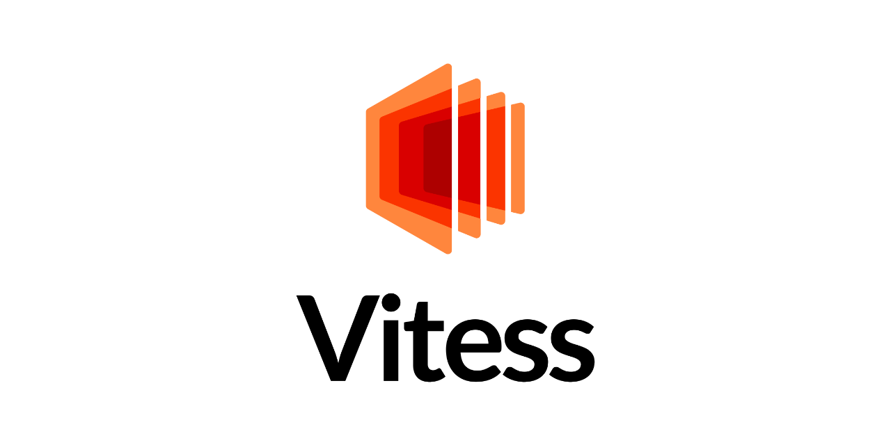

Before we begin setting up Vitess, we need a running Kubernetes cluster. If you
want to try this on your local machine, you can use a tool like
[kind](https://kind.sigs.k8s.io/) to create a local cluster. Additionally, we
need to install the
[MySQL Client](https://dev.mysql.com/doc/mysql-getting-started/en/) and
[vtctldclient](https://vitess.io/docs/get-started/local/#install-vitess)
locally:

```sh
go install vitess.io/vitess/go/cmd/vtctldclient@v0.21.3
brew install mysql@8.4
brew link mysql@8.4
```

If you are not familiar with the
[architecture](https://vitess.io/docs/21.0/overview/architecture/) and
[concepts](https://vitess.io/docs/21.0/concepts/) of Vitess, I recommend
reviewing the documentation before proceeding. All the configuration files we
are using can be found in the
[ricoberger/playground](https://github.com/ricoberger/playground/tree/ed7b9386c87abe65d5c0147f6cd8675f35ab3cef/applications/getting-started-with-vitess)
GitHub repository.

## Installation

We will create our Vitess cluster using the
[Vitess Operator](https://vitess.io/docs/21.0/get-started/operator/). To install
the operator, we will create a new namespace called `vitess`, install the CRDs,
and set up the operator using the following commands. Afterward, we can verify
that the operator is running by executing `kubectl get pods`.

```sh
kubectl apply --server-side -f 001_namespace.yaml
kubectl apply --server-side -f 002_crds.yaml
kubectl apply --server-side -f 003_operator.yaml
```

```plaintext
NAME                               READY   STATUS    RESTARTS   AGE
vitess-operator-7cc877ccc5-vdndl   1/1     Running   0          21s
```

Once the operator is running, we can launch our first Vitess cluster. The
cluster will use one cell (`zone1`) that includes all the control plane
components (VTAdmin, vtctld, Topology Store) and one keyspace named `commerce`,
which will contain one primary tablet and one replica tablet.

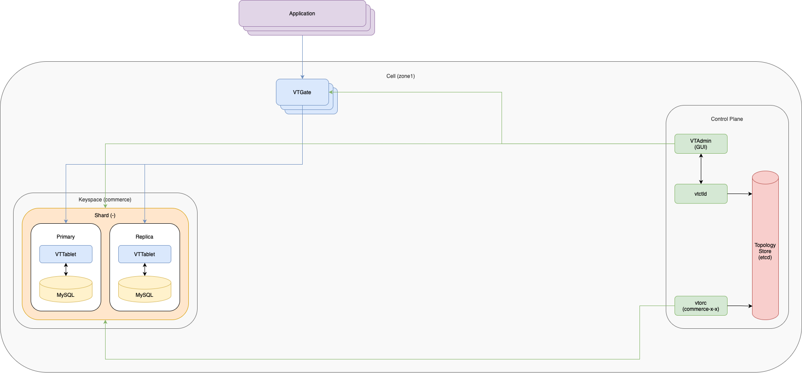

To bring up the cluster we can apply the `101_initial_cluster.yaml` manifest.
Afterwards we can check the state of the cluster using `kubectl get pods`. After
a few minutes, it should show that all pods are in the status of running.

```sh
kubectl apply --server-side -f 101_initial_cluster.yaml
```

```plaintext
NAME                                                         READY   STATUS    RESTARTS      AGE
example-commerce-x-x-zone1-vtorc-c13ef6ff-86bd96dfb4-kp8w5   1/1     Running   2 (59s ago)   71s
example-etcd-faf13de3-1                                      1/1     Running   0             72s
example-etcd-faf13de3-2                                      1/1     Running   0             72s
example-etcd-faf13de3-3                                      1/1     Running   0             72s
example-vttablet-zone1-2469782763-bfadd780                   3/3     Running   2 (46s ago)   71s
example-vttablet-zone1-2548885007-46a852d0                   3/3     Running   1 (46s ago)   71s
example-zone1-vtadmin-c03d7eae-68d845dbfd-wnlk9              2/2     Running   0             72s
example-zone1-vtctld-1d4dcad0-75f6fb7c6b-78rpv               1/1     Running   1 (51s ago)   72s
example-zone1-vtgate-bc6cde92-57fdc84bb6-cdj75               1/1     Running   2 (45s ago)   72s
vitess-operator-7cc877ccc5-vdndl                             1/1     Running   0             2m29s
```

For ease-of-use, Vitess provides a script to port-forward from Kubernetes to our
local machine. This script also recommends setting up aliases for `mysql` and
`vtctldclient`. Once the port-forward starts running, the VTAdmin UI will be
available at `http://localhost:14000/`.

```sh
alias vtctldclient="vtctldclient --server=localhost:15999"
alias mysql="mysql -h 127.0.0.1 -P 15306 -u user"
./pf.sh &
```

In the last step of the initial installation we will create our initial scheme,
which will deploy a single unsharded keyspace named `commerce`, with the
following tables:

- The `product` table contains the product information for all of the products.
- The `customer` table has a `customer_id` that has an `auto_increment`. A
  typical customer table would have a lot more columns, and sometimes additional
  detail tables.
- The `corder` table (named so because `order` is an SQL reserved word) has an
  `order_id` auto-increment column. It also has foreign keys into
  `customer(customer_id)` and `product(sku)`.

```sh
vtctldclient ApplySchema --sql-file="102_create_commerce_schema.sql" commerce
vtctldclient ApplyVSchema --vschema-file="103_vschema_commerce_initial.json" commerce
```

We should now be able to connect to the VTGate Server in our cluster by running
the `mysql` command.

```plaintext
mysql> show databases;
+--------------------+
| Database           |
+--------------------+
| commerce           |
| information_schema |
| mysql              |
| sys                |
| performance_schema |
+--------------------+
5 rows in set (0.02 sec)
```

## Move Tables

In the next step we will create a new keyspace named `customer` and move the
`customer` and `corder` tables to the newly created keyspace. This is the
recommended approach before splitting a single table across multiple servers
(sharding).

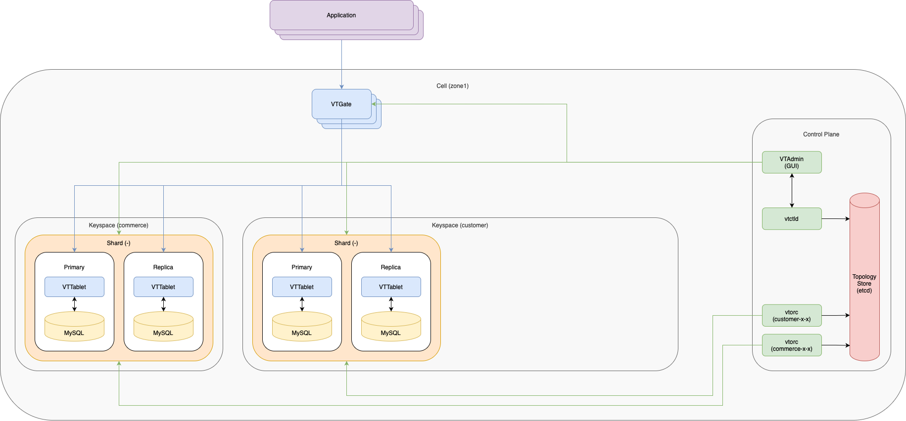

Let's start by loading some data into our created tables and looking at the data
we inserted. Notice that all of our tables are currently in the `commerce`
schema/keyspace here.

```sh
mysql < 201_insert_commerce_data.sql
mysql --table < 202_select_commerce_data.sql
```

```plaintext
Using commerce
Customer
+-------------+--------------------+
| customer_id | email              |
+-------------+--------------------+
|           1 | alice@domain.com   |
|           2 | bob@domain.com     |
|           3 | charlie@domain.com |
|           4 | dan@domain.com     |
|           5 | eve@domain.com     |
+-------------+--------------------+
Product
+----------+-------------+-------+
| sku      | description | price |
+----------+-------------+-------+
| SKU-1001 | Monitor     |   100 |
| SKU-1002 | Keyboard    |    30 |
+----------+-------------+-------+
COrder
+----------+-------------+----------+-------+
| order_id | customer_id | sku      | price |
+----------+-------------+----------+-------+
|        1 |           1 | SKU-1001 |   100 |
|        2 |           2 | SKU-1002 |    30 |
|        3 |           3 | SKU-1002 |    30 |
|        4 |           4 | SKU-1002 |    30 |
|        5 |           5 | SKU-1002 |    30 |
+----------+-------------+----------+-------+
```

When we list our tablets using the following command, we can see that we have
two tablets running: one primary and one replica.

```sh
mysql -e "show vitess_tablets"
```

```plaintext
+-------+----------+-------+------------+---------+------------------+--------------+----------------------+
| Cell  | Keyspace | Shard | TabletType | State   | Alias            | Hostname     | PrimaryTermStartTime |
+-------+----------+-------+------------+---------+------------------+--------------+----------------------+
| zone1 | commerce | -     | PRIMARY    | SERVING | zone1-2469782763 | 10.244.5.244 | 2025-04-10T06:08:22Z |
| zone1 | commerce | -     | REPLICA    | SERVING | zone1-2548885007 | 10.244.14.73 |                      |
+-------+----------+-------+------------+---------+------------------+--------------+----------------------+
```

Now it is time to deploy new tablets for our `customer` keyspace by applying the
`203_customer_tablets.yaml` manifest. After some minutes we should see the newly
created tablets in a running state. We should also see that a new vtorc instance
was created for the `customer` keyspace.

```sh
kubectl apply --server-side -f 203_customer_tablets.yaml
```

```plaintext
NAME                                                         READY   STATUS    RESTARTS        AGE
example-commerce-x-x-zone1-vtorc-c13ef6ff-86bd96dfb4-kp8w5   1/1     Running   2 (5m52s ago)   6m4s
example-customer-x-x-zone1-vtorc-53d270f6-7754f557c-bb87n    1/1     Running   0               72s
example-etcd-faf13de3-1                                      1/1     Running   0               6m5s
example-etcd-faf13de3-2                                      1/1     Running   0               6m5s
example-etcd-faf13de3-3                                      1/1     Running   0               6m5s
example-vttablet-zone1-1250593518-17c58396                   3/3     Running   0               72s
example-vttablet-zone1-2469782763-bfadd780                   3/3     Running   2 (5m39s ago)   6m4s
example-vttablet-zone1-2548885007-46a852d0                   3/3     Running   1 (5m39s ago)   6m4s
example-vttablet-zone1-3778123133-6f4ed5fc                   3/3     Running   2 (35s ago)     72s
example-zone1-vtadmin-c03d7eae-68d845dbfd-wnlk9              2/2     Running   0               6m5s
example-zone1-vtctld-1d4dcad0-75f6fb7c6b-78rpv               1/1     Running   1 (5m44s ago)   6m5s
example-zone1-vtgate-bc6cde92-57fdc84bb6-cdj75               1/1     Running   2 (5m38s ago)   6m5s
vitess-operator-7cc877ccc5-vdndl                             1/1     Running   0               7m22s
```

Before we continue we restart the port-forward after launching the pods has
completed. Afterwards we can list our tables again. We can see that we have four
tablets now. The two existing ones for the `commerce` keyspace and two new ones
for the `customer` keyspace.

```sh
killall kubectl
./pf.sh &
```

```sh
mysql -e "show vitess_tablets"
```

```plaintext
+-------+----------+-------+------------+---------+------------------+--------------+----------------------+
| Cell  | Keyspace | Shard | TabletType | State   | Alias            | Hostname     | PrimaryTermStartTime |
+-------+----------+-------+------------+---------+------------------+--------------+----------------------+
| zone1 | commerce | -     | PRIMARY    | SERVING | zone1-2469782763 | 10.244.5.244 | 2025-04-10T06:08:22Z |
| zone1 | commerce | -     | REPLICA    | SERVING | zone1-2548885007 | 10.244.14.73 |                      |
| zone1 | customer | -     | PRIMARY    | SERVING | zone1-1250593518 | 10.244.11.55 | 2025-04-10T06:13:10Z |
| zone1 | customer | -     | REPLICA    | SERVING | zone1-3778123133 | 10.244.8.170 |                      |
+-------+----------+-------+------------+---------+------------------+--------------+----------------------+
```

In the next step we will create a `MoveTables` workflow, which copies the tables
from the `commerce` keyspace into the `customer` keyspace. This operation does
not block any database activity.

```sh
vtctldclient MoveTables --target-keyspace customer --workflow commerce2customer create --source-keyspace commerce --tables 'customer,corder'
```

To see what happens under the covers, let's look at the
[routing rules](https://github.com/ricoberger/playground/blob/ed7b9386c87abe65d5c0147f6cd8675f35ab3cef/applications/getting-started-with-vitess/204_routing_rules_after_move_table.json)
that the MoveTables operation created. These are instructions used by a VTGate
to determine which backend keyspace to send requests to for a given table.

```sh
vtctldclient GetRoutingRules
```

We can monitor the progress of the `MoveTables` operation using the `status`
action. We can also validate its correctness by performing a logical diff
between the source and target to confirm that they are fully synced with the
`VDiff` command.

```sh
# Monitoring Progress
vtctldclient MoveTables --target-keyspace customer --workflow commerce2customer status --format=json

{
  "table_copy_state": {},
  "shard_streams": {
    "customer/-": {
      "streams": [
        {
          "id": 1,
          "tablet": {
            "cell": "zone1",
            "uid": 1250593518
          },
          "source_shard": "commerce/-",
          "position": "2a5c9b12-15d2-11f0-a7a3-a2742b031576:1-40",
          "status": "Running",
          "info": "VStream Lag: 0s"
        }
      ]
    }
  },
  "traffic_state": "Reads Not Switched. Writes Not Switched"
}

# Validate Correctness
vtctldclient VDiff --target-keyspace customer --workflow commerce2customer create
vtctldclient VDiff --format=json --target-keyspace customer --workflow commerce2customer show last --verbose

VDiff 1163c387-4284-4214-9896-74b3af6a0cef scheduled on target shards, use show to view progress
{
  "Workflow": "commerce2customer",
  "Keyspace": "customer",
  "State": "started",
  "UUID": "1163c387-4284-4214-9896-74b3af6a0cef",
  "RowsCompared": 0,
  "HasMismatch": false,
  "Shards": "-",
  "StartedAt": "2025-04-10 06:19:56",
  "TableSummary": {
    "corder": {
      "TableName": "corder",
      "State": "started",
      "RowsCompared": 0,
      "MatchingRows": 0,
      "MismatchedRows": 0,
      "ExtraRowsSource": 0,
      "ExtraRowsTarget": 0
    },
    "customer": {
      "TableName": "customer",
      "State": "pending",
      "RowsCompared": 0,
      "MatchingRows": 0,
      "MismatchedRows": 0,
      "ExtraRowsSource": 0,
      "ExtraRowsTarget": 0
    }
  },
  "Reports": {
    "corder": {
      "-": {
        "TableName": "",
        "ProcessedRows": 0,
        "MatchingRows": 0,
        "MismatchedRows": 0,
        "ExtraRowsSource": 0,
        "ExtraRowsTarget": 0
      }
    },
    "customer": {
      "-": {
        "TableName": "",
        "ProcessedRows": 0,
        "MatchingRows": 0,
        "MismatchedRows": 0,
        "ExtraRowsSource": 0,
        "ExtraRowsTarget": 0
      }
    }
  },
  "Progress": {
    "Percentage": 0
  }
}
```

Once the `MoveTables` operation is complete, the first step in making the
changes live is to switch all query serving traffic from the old `commerce`
keyspace to the `customer` keyspace for the tables we moved. Queries against the
other tables will continue to route to the `commerce` keyspace.

```sh
vtctldclient MoveTables --target-keyspace customer --workflow commerce2customer SwitchTraffic
```

If we now look at the
[routing rules](https://github.com/ricoberger/playground/blob/ed7b9386c87abe65d5c0147f6cd8675f35ab3cef/applications/getting-started-with-vitess/205_routing_rules_after_traffic_switch.json)
after the `SwitchTraffic` step, we will see that all queries against the
`customer` and `corder` tables will get routed to the `customer` keyspace.

```sh
vtctldclient GetRoutingRules
```

The final step is to complete the migration using the `Complete` action. This
will (by default) get rid of the routing rules that were created and `DROP` the
original tables in the source keyspace (`commerce`). Along with freeing up space
on the original tablets, this is an important step to eliminate potential future
confusion.

```sh
vtctldclient MoveTables --target-keyspace customer --workflow commerce2customer complete
```

## Resharding

In this step, we will divide our `customer` keyspace into two shards. The final
architecture will appear as shown in the graphic below.

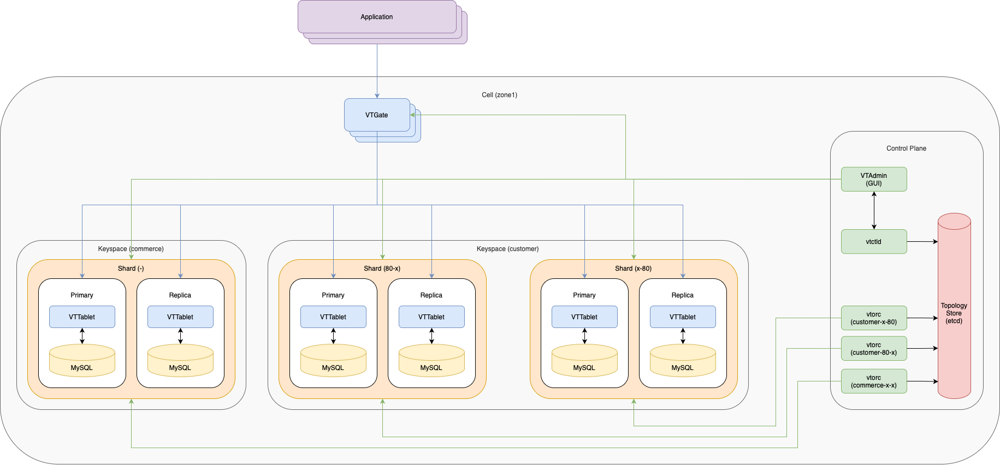

Before we can start we have to create a sequence table for our auto-increment
columns and we have to decide for sharding keys or Primary Vindexes within a
VSchema. More information regarding these two topic can be found in the Vitess
documentation[^1]. To create the sequence tables and VSchema we can run the
following commands:

```sh
vtctldclient ApplySchema --sql="$(cat 301_create_commerce_seq.sql)" commerce
vtctldclient ApplyVSchema --vschema="$(cat 302_vschema_commerce_seq.json)" commerce
vtctldclient ApplyVSchema --vschema="$(cat 303_vschema_customer_sharded.json)" customer
vtctldclient ApplySchema --sql="$(cat 304_create_customer_sharded.sql)" customer
```

At this point, you have finalized our sharded VSchema and vetted all the queries
to make sure they still work. Now, it’s time to reshard. To do this we will
create the target shards by applying the `305_new_shards.yaml` manifest.
Afterwards some minutes we should see four new tablets and two new vtorc pods
(via `kubectl get pods`) for the created target shards.

```sh
kubectl apply --server-side -f 305_new_shards.yaml

# Restart the port-forward afterwards:
killall kubectl
./pf.sh &
```

```plaintext
NAME                                                          READY   STATUS    RESTARTS      AGE
example-commerce-x-x-zone1-vtorc-c13ef6ff-86bd96dfb4-kp8w5    1/1     Running   2 (19m ago)   19m
example-customer-80-x-zone1-vtorc-836adff9-b67657589-ndpxq    1/1     Running   0             76s
example-customer-x-80-zone1-vtorc-2bf8b95e-86b8b56fbc-q69h4   1/1     Running   0             76s
example-customer-x-x-zone1-vtorc-53d270f6-7754f557c-bb87n     1/1     Running   0             14m
example-etcd-faf13de3-1                                       1/1     Running   0             19m
example-etcd-faf13de3-2                                       1/1     Running   0             19m
example-etcd-faf13de3-3                                       1/1     Running   0             19m
example-vttablet-zone1-0118374573-10d08e80                    3/3     Running   2 (35s ago)   76s
example-vttablet-zone1-0120139806-fed29577                    3/3     Running   0             76s
example-vttablet-zone1-1250593518-17c58396                    3/3     Running   0             14m
example-vttablet-zone1-2289928654-7de47379                    3/3     Running   0             76s
example-vttablet-zone1-2469782763-bfadd780                    3/3     Running   2 (19m ago)   19m
example-vttablet-zone1-2548885007-46a852d0                    3/3     Running   1 (19m ago)   19m
example-vttablet-zone1-3778123133-6f4ed5fc                    3/3     Running   2 (13m ago)   14m
example-vttablet-zone1-4277914223-0f04a9a6                    3/3     Running   0             76s
example-zone1-vtadmin-c03d7eae-68d845dbfd-wnlk9               2/2     Running   0             19m
example-zone1-vtctld-1d4dcad0-75f6fb7c6b-78rpv                1/1     Running   1 (19m ago)   19m
example-zone1-vtgate-bc6cde92-57fdc84bb6-cdj75                1/1     Running   2 (19m ago)   19m
vitess-operator-7cc877ccc5-vdndl                              1/1     Running   0             20m
```

Now we can start the `Reshard` operation. It occurs online, and will not block
any read or write operations to your database:

```sh
vtctldclient Reshard --target-keyspace customer --workflow cust2cust create --source-shards '-' --target-shards '-80,80-'
```

After the reshard is complete, we can use VDiff to check data integrity and
ensure our source and target shards are consistent:

```sh
vtctldclient VDiff --target-keyspace customer --workflow cust2cust create
vtctldclient VDiff --format=json --target-keyspace customer --workflow cust2cust show last

VDiff da8b1af8-eaf0-415b-9b63-4d3606798435 scheduled on target shards, use show to view progress
{
  "Workflow": "cust2cust",
  "Keyspace": "customer",
  "State": "started",
  "UUID": "da8b1af8-eaf0-415b-9b63-4d3606798435",
  "RowsCompared": 4,
  "HasMismatch": false,
  "Shards": "-80,80-",
  "StartedAt": "2025-04-10 06:29:57",
  "Progress": {
    "Percentage": 100,
    "ETA": "2025-04-10 06:29:57"
  }
}
```

After validating for correctness, the next step is to switch all traffic from
the source shards to the target shards:

```sh
vtctldclient Reshard --target-keyspace customer --workflow cust2cust SwitchTraffic
```

We should now be able to see the data that has been copied over to the new
shards:

```sh
mysql --table < 306_select_customer-80_data.sql
mysql --table < 307_select_customer80-_data.sql
```

```plaintext
Using customer/-80
Customer
+-------------+--------------------+
| customer_id | email              |
+-------------+--------------------+
|           1 | alice@domain.com   |
|           2 | bob@domain.com     |
|           3 | charlie@domain.com |
|           5 | eve@domain.com     |
+-------------+--------------------+
COrder
+----------+-------------+----------+-------+
| order_id | customer_id | sku      | price |
+----------+-------------+----------+-------+
|        1 |           1 | SKU-1001 |   100 |
|        2 |           2 | SKU-1002 |    30 |
|        3 |           3 | SKU-1002 |    30 |
|        5 |           5 | SKU-1002 |    30 |
+----------+-------------+----------+-------+

Using customer/80-
Customer
+-------------+----------------+
| customer_id | email          |
+-------------+----------------+
|           4 | dan@domain.com |
+-------------+----------------+
COrder
+----------+-------------+----------+-------+
| order_id | customer_id | sku      | price |
+----------+-------------+----------+-------+
|        4 |           4 | SKU-1002 |    30 |
+----------+-------------+----------+-------+
```

We can now complete the created `Reshard` workflow and remove the shard that is
no longer required:

```sh
vtctldclient Reshard --target-keyspace customer --workflow cust2cust complete
kubectl apply --server-side -f 308_down_shard_-.yaml
kubectl delete vitessshards.planetscale.com example-customer-x-x-dc880356
```

Afterwards the list of running pods should look as follows. As we can see the
two tablets for the old shard as well as the vtorc pod were removed.

```sh
NAME                                                          READY   STATUS    RESTARTS      AGE
example-commerce-x-x-zone1-vtorc-c13ef6ff-86bd96dfb4-kp8w5    1/1     Running   2 (33m ago)   33m
example-customer-80-x-zone1-vtorc-836adff9-b67657589-ndpxq    1/1     Running   0             15m
example-customer-x-80-zone1-vtorc-2bf8b95e-86b8b56fbc-q69h4   1/1     Running   0             15m
example-etcd-faf13de3-1                                       1/1     Running   0             33m
example-etcd-faf13de3-2                                       1/1     Running   0             33m
example-etcd-faf13de3-3                                       1/1     Running   0             33m
example-vttablet-zone1-0118374573-10d08e80                    3/3     Running   2 (14m ago)   15m
example-vttablet-zone1-0120139806-fed29577                    3/3     Running   0             15m
example-vttablet-zone1-2289928654-7de47379                    3/3     Running   0             15m
example-vttablet-zone1-2469782763-bfadd780                    3/3     Running   2 (33m ago)   33m
example-vttablet-zone1-2548885007-46a852d0                    3/3     Running   1 (33m ago)   33m
example-vttablet-zone1-4277914223-0f04a9a6                    3/3     Running   0             15m
example-zone1-vtadmin-c03d7eae-68d845dbfd-wnlk9               2/2     Running   0             33m
example-zone1-vtctld-1d4dcad0-75f6fb7c6b-78rpv                1/1     Running   1 (33m ago)   33m
example-zone1-vtgate-bc6cde92-57fdc84bb6-cdj75                1/1     Running   2 (33m ago)   33m
vitess-operator-7cc877ccc5-vdndl                              1/1     Running   0             34m
```

## Monitoring

To monitor our Vitess cluster we will use Prometheus and Grafana. We will not go
through the setup of Prometheus and Grafana within this post and assume that we
already have a running Prometheus and Grafana instance. To monitor our Vitess
cluster with Prometheus and Grafana we will create a scrape configuration for
Prometheus and import some dashboards[^2] into Grafana.

```sh
kubectl apply --server-side -f 401_monitoring.yaml
```

- [Vitess Misc](https://github.com/ricoberger/playground/blob/ed7b9386c87abe65d5c0147f6cd8675f35ab3cef/applications/getting-started-with-vitess/402_dashboard_misc.json)
- [Vitess Queries](https://github.com/ricoberger/playground/blob/ed7b9386c87abe65d5c0147f6cd8675f35ab3cef/applications/getting-started-with-vitess/403_dashboard_queries.json)
- [Vitess Query Details](https://github.com/ricoberger/playground/blob/ed7b9386c87abe65d5c0147f6cd8675f35ab3cef/applications/getting-started-with-vitess/404_dashboard_query_details.json)
- [Vitess Transactions](https://github.com/ricoberger/playground/blob/ed7b9386c87abe65d5c0147f6cd8675f35ab3cef/applications/getting-started-with-vitess/405_dashboard_transactions.json)

Once we get some data in the dashboards, we can also generate some load by
running the example application. The following command will create customers in
our `customer` table. We can increase the load after some time by restarting the
command with the `-goroutines` flag.

```sh
go run . -create-customers
go run . -create-customers -goroutines=20
```

<div class="grid grid-cols-2 md:grid-cols-4 gap-4">
  <div>
    <a href="./assets/dashboard-create-customers-1.png">
      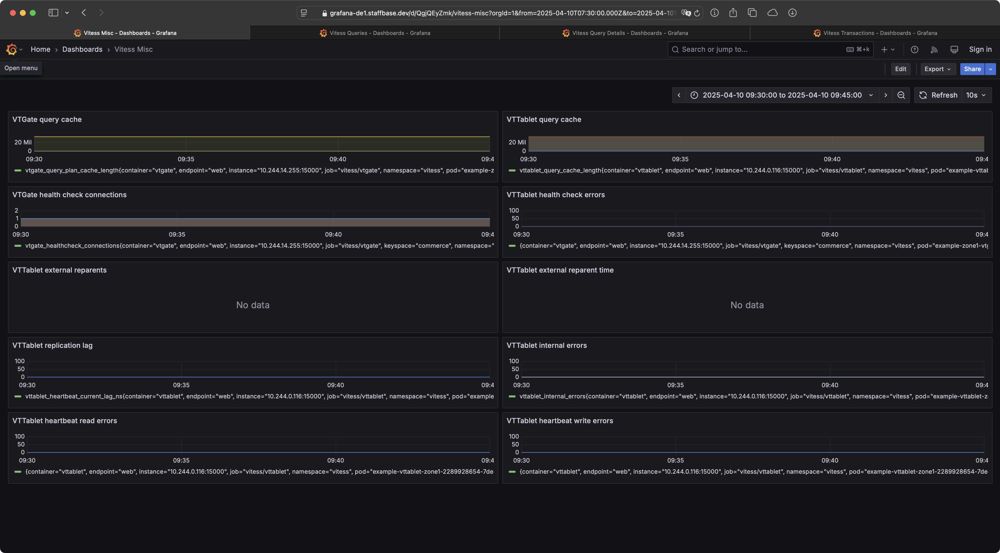
    </a>
  </div>
  <div>
    <a href="./assets/dashboard-create-customers-2.png">
      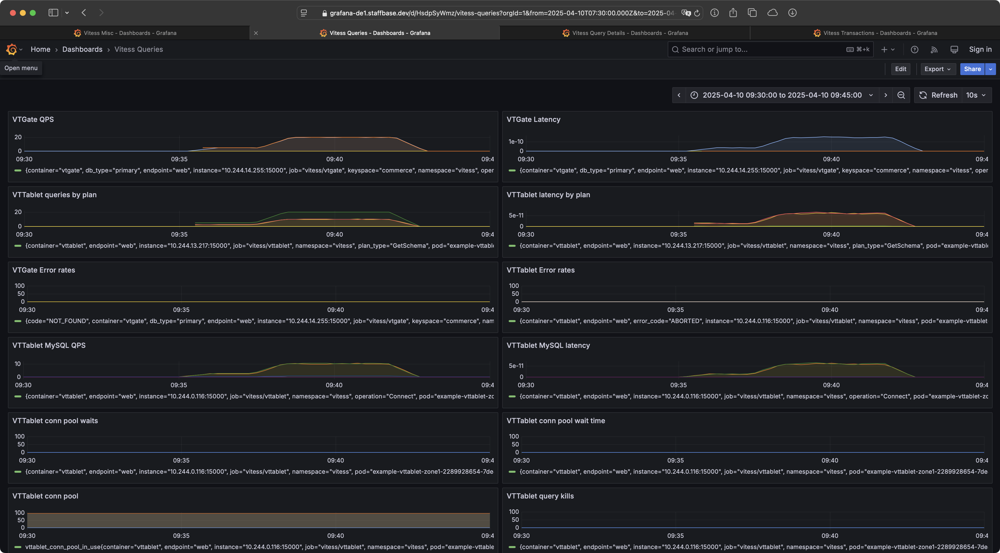
    </a>
  </div>
  <div>
    <a href="./assets/dashboard-create-customers-3.png">
      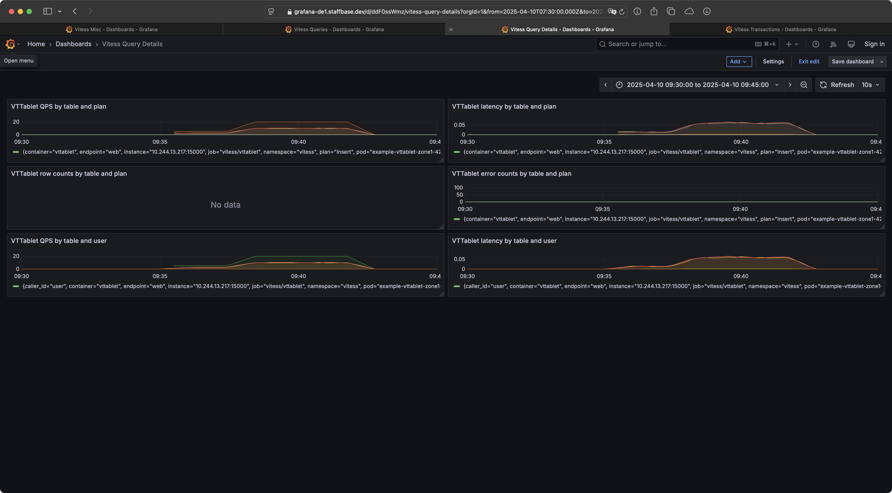
    </a>
  </div>
  <div>
    <a href="./assets/dashboard-create-customers-4.png">
      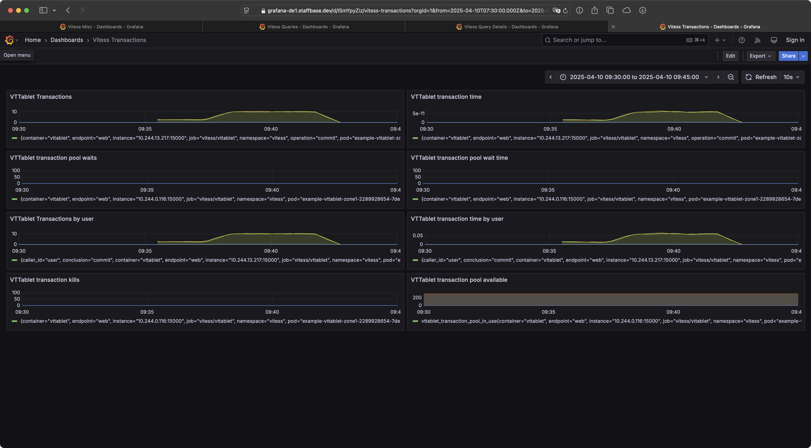
    </a>
  </div>
</div>

The following commands will create some orders in our `corders` table. To create
a new order we select a random customer, all products and create a new order for
the selected customer and one of the selected products.

```sh
go run . -create-orders -goroutines=10
go run . -create-orders -goroutines=100
```

<div class="grid grid-cols-2 md:grid-cols-4 gap-4">
  <div>
    <a href="./assets/dashboard-create-orders-1.png">
      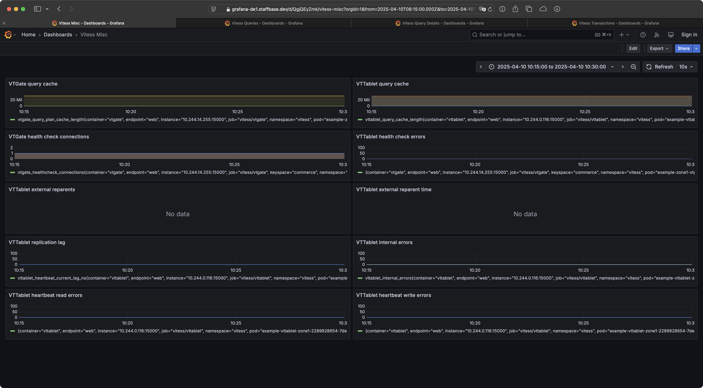
    </a>
  </div>
  <div>
    <a href="./assets/dashboard-create-orders-2.png">
      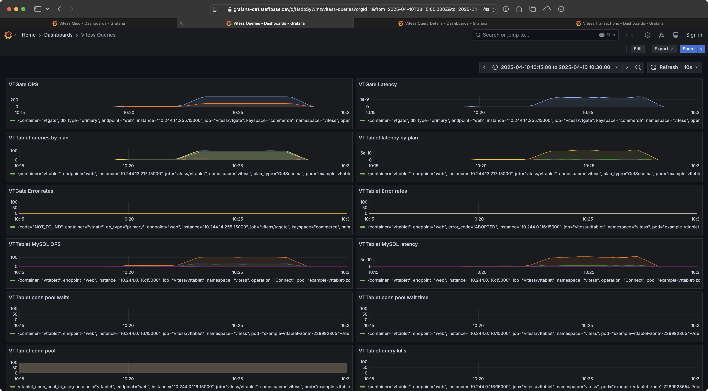
    </a>
  </div>
  <div>
    <a href="./assets/dashboard-create-orders-3.png">
      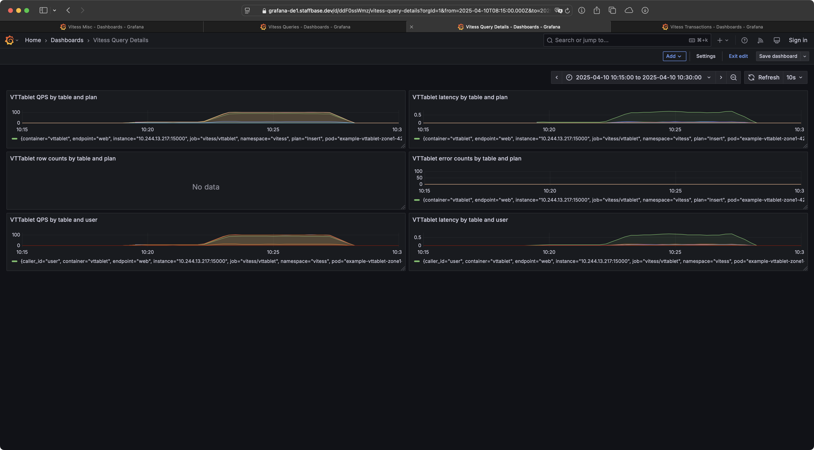
    </a>
  </div>
  <div>
    <a href="./assets/dashboard-create-orders-4.png">
      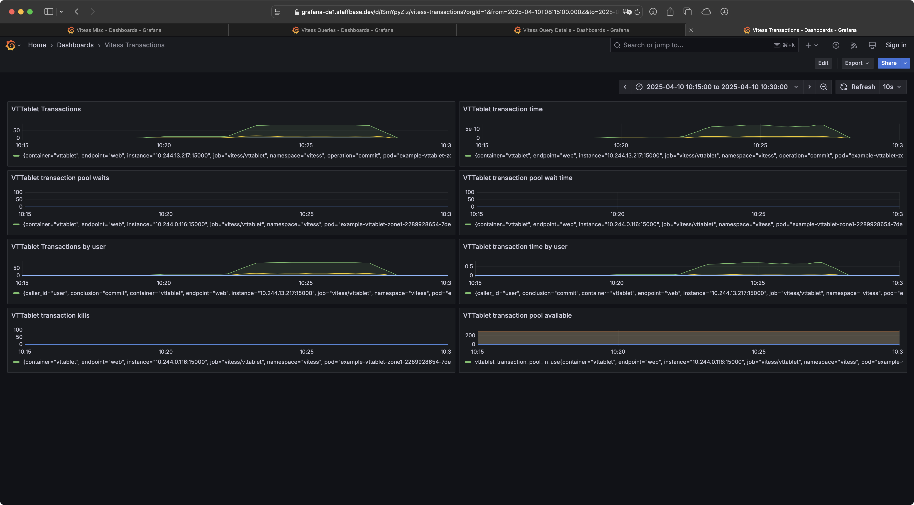
    </a>
  </div>
</div>

Now we can also restart some tablets and monitor the behaviour of Vitess via the
created dashboards. In teh following we test the following scenarios:

- Delete the primary tablet for the `commerce` keyspace
- Delete the replica for shard `80-` in the `customer` keyspace
- Delete the primary for shard `80-` in the `customer` keyspace

<div class="grid grid-cols-2 md:grid-cols-4 gap-4">
  <div>
    <a href="./assets/dashboard-restart-1.png">
      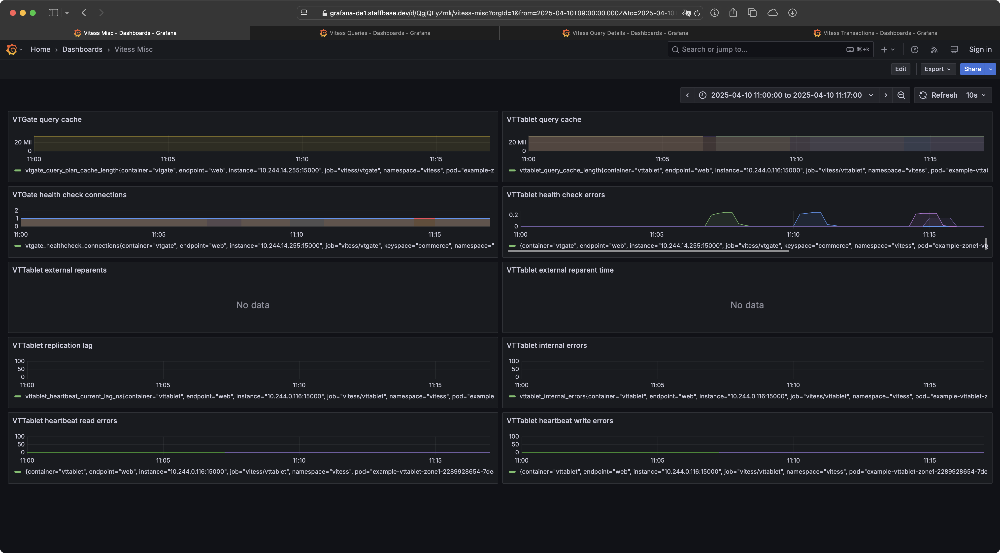
    </a>
  </div>
  <div>
    <a href="./assets/dashboard-restart-2.png">
      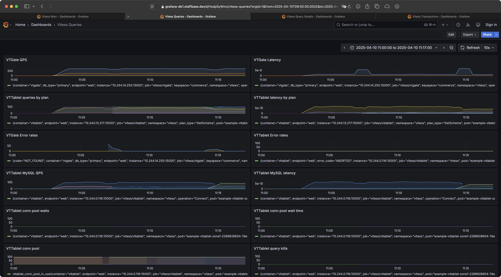
    </a>
  </div>
  <div>
    <a href="./assets/dashboard-restart-3.png">
      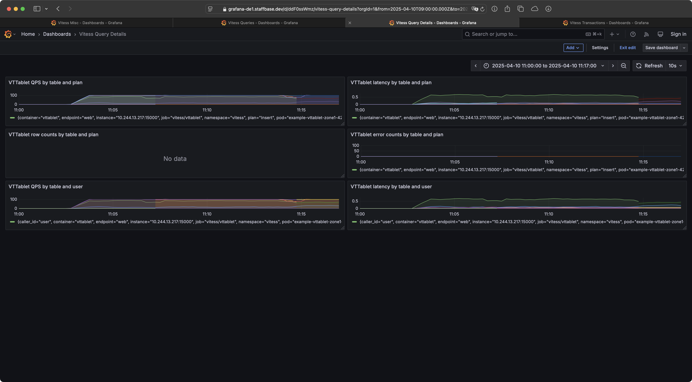
    </a>
  </div>
  <div>
    <a href="./assets/dashboard-restart-4.png">
      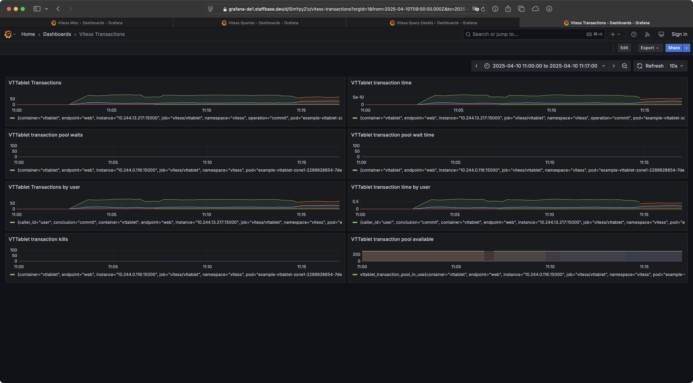
    </a>
  </div>
</div>

Last but not least, we can monitor a single tablet by creating a port forward
and opening `http://localhost:15005` in our browser. The dashboard displays the
number of queries per second, the current query and transaction log, real-time
queries, and much more.

```sh
kubectl port-forward example-vttablet-zone1-4277914223-0f04a9a6 15005:15000
```

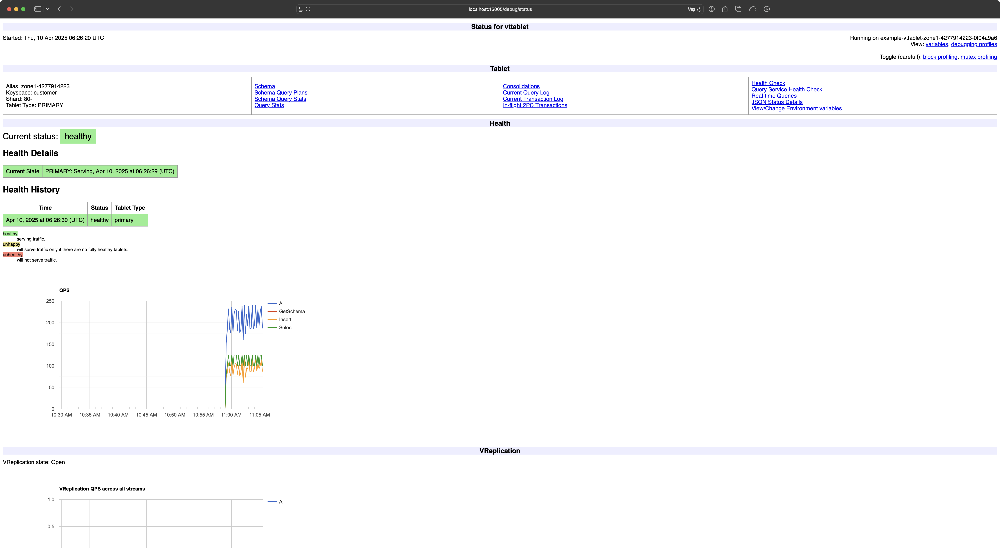

That's it for today's post. I had a lot of fun playing around with Vitess and
hopefully gained a better understanding of how it works. I hope you also enjoyed
the post, and I'll see you next time.

[^1]:
    Docuemntation for
    [Sequences](https://vitess.io/docs/21.0/user-guides/configuration-advanced/resharding/#sequences)
    and
    [Vindexes](https://vitess.io/docs/21.0/user-guides/configuration-advanced/resharding/#vindexes)

[^2]:
    We will use the dashboards from the following
    [Gist](https://gist.github.com/sougou/09d53531c5aa6baeb417cf50476dbe89)
