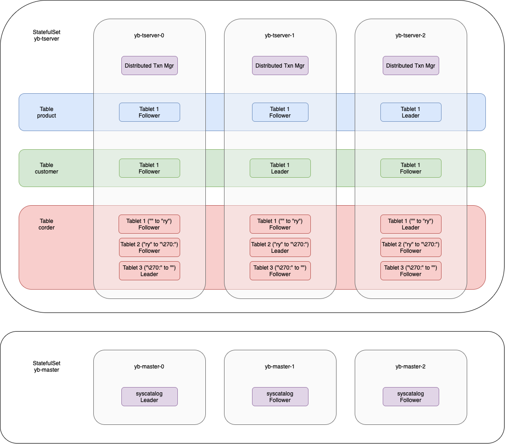

Hi and welcome to another database blog post. Last time, we explored Vitess;
this time, we will look at Yugabyte. We will set up a simple Yugabyte cluster on
Kubernetes. Once the cluster is running, we will create the `commerce` schema
from the
"[Getting Started with Vitess](http://ricoberger.de/blog/posts/getting-started-with-vitess/)"
blog post and experiment with the cluster. Finally, we will examine how to
monitor a Yugabyte cluster using Prometheus. Please note that I am not an expert
in YugabyteDB; I simply want to experiment with it in this blog post.


Before we begin setting up YugabyteDB, we need a running Kubernetes cluster. If
you want to try this on your local machine, you can use a tool like
[kind](https://kind.sigs.k8s.io/) to create a local cluster.

If you are not familar with the
[architecture](https://docs.yugabyte.com/preview/architecture/) and
[key concepts](https://docs.yugabyte.com/preview/architecture/key-concepts/) of
YugabyteDB, I recommend reviewing the documentation before proceeding. All the
configuration files we are using can be found in the
[ricoberger/playground](https://github.com/ricoberger/playground/tree/84a9d0dcf439bce2394d70f51d9088ec35ed3392/applications/getting-started-with-yugabytedb)
GitHub repository.

## Installation

We will create our YugabyteDB cluster using the
[Helm chart](https://github.com/yugabyte/charts). To install the Helm chart, we
will create a new namespace called `yugabytedb` and set up a new cluster using
the
[`002_values.yaml`](https://github.com/ricoberger/playground/tree/84a9d0dcf439bce2394d70f51d9088ec35ed3392/applications/getting-started-with-yugabytedb/002_values.yaml)
values file. Afterward, we can verify that the cluster is running by executing
`kubectl get pods`.

```sh
kubectl apply --server-side -f 001_namespace.yaml

helm repo add yugabytedb https://charts.yugabyte.com
helm repo update

helm upgrade --install yugabytedb yugabytedb/yugabyte --version 2.25.1 --namespace yugabytedb --wait -f 002_values.yaml
```

```plaintext
NAME           READY   STATUS    RESTARTS   AGE
yb-master-0    3/3     Running   0          2m4s
yb-master-1    3/3     Running   0          2m4s
yb-master-2    3/3     Running   0          2m4s
yb-tserver-0   3/3     Running   0          2m4s
yb-tserver-1   3/3     Running   0          2m4s
yb-tserver-2   3/3     Running   0          2m4s
```

After a few minutes, it should show that all pods are in the status of running.
At the point we can also check the state of the cluster using the `yb_servers()`
database function:

```sh
# Password: mypassword
kubectl exec -it -n yugabytedb yb-tserver-0 -- ysqlsh --dbname yugabyte --username yugabyte --password -c "select * from yb_servers();"
```

```plaintext
                         host                          | port | num_connections | node_type | cloud  |   region    | zone  |                       public_ip                       |               uuid
-------------------------------------------------------+------+-----------------+-----------+--------+-------------+-------+-------------------------------------------------------+----------------------------------
 yb-tserver-0.yb-tservers.yugabytedb.svc.cluster.local | 5433 |               0 | primary   | cloud1 | datacenter1 | rack1 | yb-tserver-0.yb-tservers.yugabytedb.svc.cluster.local | 416a684d83e74d96962b95b2128b9870
 yb-tserver-2.yb-tservers.yugabytedb.svc.cluster.local | 5433 |               0 | primary   | cloud1 | datacenter1 | rack1 | yb-tserver-2.yb-tservers.yugabytedb.svc.cluster.local | 579810f2f1cc46adab7ed05ce00dde64
 yb-tserver-1.yb-tservers.yugabytedb.svc.cluster.local | 5433 |               0 | primary   | cloud1 | datacenter1 | rack1 | yb-tserver-1.yb-tservers.yugabytedb.svc.cluster.local | 7119b812c43448bc8d72e6b5580cdff8
(3 rows)
```

## Create a User, Database and Schema

Now that we have a running YugabyteDB cluster, we can create a user, a database,
and the schema for our `commerce` application. We create a database named
`commerce` and a user named `commerceuser`. The user gets all priveleges to
access the database and schema.

```sh
# Password: mypassword
kubectl exec -it -n yugabytedb yb-tserver-0 -- ysqlsh --dbname yugabyte --username yugabyte --password
```

```sql
-- Create database
create database commerce;

-- Create user
create role commerceuser login password 'commercepassword';

-- Grant priveleges to user con database
grant all on database commerce to commerceuser;

-- Connect to database
\c commerce

-- Grant priveleges to user on schema in database
grant all on schema public to commerceuser;
```

Now we can log in to the `commerce` database using the newly created user.

```sh
# Password: commercepassword
kubectl exec -it -n yugabytedb yb-tserver-0 -- ysqlsh --dbname commerce --username commerceuser --password
```

Once we connect to the `commerce` database, we can create the schema and insert
data into the tables we create.

```sql
-- Create schema
create table if not exists product(
  sku varchar(128),
  description varchar(128),
  price bigint,
  primary key(sku)
);

create table if not exists customer(
  customer_id bigserial,
  email varchar(128),
  primary key(customer_id)
);

create table if not exists corder(
  order_id bigserial,
  customer_id bigint,
  sku varchar(128),
  price bigint,
  primary key(order_id)
);

-- Load data
insert into product(sku, description, price) values('SKU-1001', 'Monitor', 100);
insert into product(sku, description, price) values('SKU-1002', 'Keyboard', 30);

-- Show relations
\d

-- Close database session
\q
```

At this point, we have our initial schema, and it's time to examine the created
pods, tables, and tablets. As shown in the graphic below, we created two
StatefulSets during the installation of the YugabyteDB cluster. The `yb-master`
contains three YB-Master pods. We can check which of the three is the current
leader using the `yb-admin list_all_masters` command. In our case, the leader is
the `yb-master-0` pod.

Additionally, we can see that one tablet was created for each table using the
`yb_admin list_tablets <keyspace-type>.<keyspace-name> <table>` and
`yb-admin list_tablet_servers <tablet-id>` commands. For example, the leader of
the `product` table is `yb-tserver-0`, while the other two pods are followers.

Additionally, the `yb-tserver` StatefulSet contains three YB-TServer pods. Using
the `yb_admin list_tablets <keyspace-type>.<keyspace-name> <table>` and
`yb-admin list_tablet_servers <tablet-id>` commands we can see how our created
tables are splitted into tablets and how the tablets are distributed. For
example for the `product` table one tablet was created, which is
[replicated three times](https://docs.yugabyte.com/preview/architecture/docdb-replication/replication/).
The leader is running on `yb-tserver-2`.

> **Note:** For you the architecture could slightly different:
>
> - The YB-Master leader could be on another pod
> - The leader for each tablet could be on another YB-TServer pod


<details>
<summary>Details</summary>

To generate the architecture diagram above, the following commands where used:

```sh
kubectl exec -it -n yugabytedb yb-tserver-0 -- bash
```

```plaintext
$ yb-admin -master_addresses yb-master-0.yb-masters.yugabytedb.svc.cluster.local:7100,yb-master-1.yb-masters.yugabytedb.svc.cluster.local:7100,yb-master-2.yb-masters.yugabytedb.svc.cluster.local:7100 list_all_masters
Master UUID                             RPC Host/Port           State           Role    Broadcast Host/Port
39151c52cc5140d1bfb560a9bd079d6f        yb-master-0.yb-masters.yugabytedb.svc.cluster.local:7100        ALIVE           LEADER  yb-master-0.yb-masters.yugabytedb.svc.cluster.local:7100
259542fbc93e4c8694f78ce0e5d65085        yb-master-1.yb-masters.yugabytedb.svc.cluster.local:7100        ALIVE           FOLLOWER        yb-master-1.yb-masters.yugabytedb.svc.cluster.local:7100
f04da599708f46eba331d10ff2732125        yb-master-2.yb-masters.yugabytedb.svc.cluster.local:7100        ALIVE           FOLLOWER        yb-master-2.yb-masters.yugabytedb.svc.cluster.local:7100

$ yb-admin -master_addresses yb-master-0.yb-masters.yugabytedb.svc.cluster.local:7100,yb-master-1.yb-masters.yugabytedb.svc.cluster.local:7100,yb-master-2.yb-masters.yugabytedb.svc.cluster.local:7100 list_tablets ysql.commerce product
Tablet-UUID                             Range                                                           Leader-IP               Leader-UUID
9a57c185f18448e1902d961068f4c763        partition_key_start: "" partition_key_end: ""                   yb-tserver-2.yb-tservers.yugabytedb.svc.cluster.local:9100      579810f2f1cc46adab7ed05ce00dde64

$ yb-admin -master_addresses yb-master-0.yb-masters.yugabytedb.svc.cluster.local:7100,yb-master-1.yb-masters.yugabytedb.svc.cluster.local:7100,yb-master-2.yb-masters.yugabytedb.svc.cluster.local:7100 list_tablet_servers 9a57c185f18448e1902d961068f4c763
Server UUID                             RPC Host/Port           Role
7119b812c43448bc8d72e6b5580cdff8        yb-tserver-1.yb-tservers.yugabytedb.svc.cluster.local:9100      FOLLOWER
579810f2f1cc46adab7ed05ce00dde64        yb-tserver-2.yb-tservers.yugabytedb.svc.cluster.local:9100      LEADER
416a684d83e74d96962b95b2128b9870        yb-tserver-0.yb-tservers.yugabytedb.svc.cluster.local:9100      FOLLOWER

$ yb-admin -master_addresses yb-master-0.yb-masters.yugabytedb.svc.cluster.local:7100,yb-master-1.yb-masters.yugabytedb.svc.cluster.local:7100,yb-master-2.yb-masters.yugabytedb.svc.cluster.local:7100 list_tablets ysql.commerce customer
Tablet-UUID                             Range                                                           Leader-IP               Leader-UUID
251ba609612948f085bf149e430e607f        partition_key_start: "" partition_key_end: ""                   yb-tserver-1.yb-tservers.yugabytedb.svc.cluster.local:9100      7119b812c43448bc8d72e6b5580cdff8

$ yb-admin -master_addresses yb-master-0.yb-masters.yugabytedb.svc.cluster.local:7100,yb-master-1.yb-masters.yugabytedb.svc.cluster.local:7100,yb-master-2.yb-masters.yugabytedb.svc.cluster.local:7100 list_tablet_servers 251ba609612948f085bf149e430e607f
Server UUID                             RPC Host/Port           Role
7119b812c43448bc8d72e6b5580cdff8        yb-tserver-1.yb-tservers.yugabytedb.svc.cluster.local:9100      LEADER
579810f2f1cc46adab7ed05ce00dde64        yb-tserver-2.yb-tservers.yugabytedb.svc.cluster.local:9100      FOLLOWER
416a684d83e74d96962b95b2128b9870        yb-tserver-0.yb-tservers.yugabytedb.svc.cluster.local:9100      FOLLOWER

$ yb-admin -master_addresses yb-master-0.yb-masters.yugabytedb.svc.cluster.local:7100,yb-master-1.yb-masters.yugabytedb.svc.cluster.local:7100,yb-master-2.yb-masters.yugabytedb.svc.cluster.local:7100 list_tablets ysql.commerce corder
Tablet-UUID                             Range                                                           Leader-IP               Leader-UUID
5692cde127c9421aaa7aea8b8eed67c1        partition_key_start: "" partition_key_end: ""                   yb-tserver-2.yb-tservers.yugabytedb.svc.cluster.local:9100      579810f2f1cc46adab7ed05ce00dde64

$ yb-admin -master_addresses yb-master-0.yb-masters.yugabytedb.svc.cluster.local:7100,yb-master-1.yb-masters.yugabytedb.svc.cluster.local:7100,yb-master-2.yb-masters.yugabytedb.svc.cluster.local:7100 list_tablet_servers 5692cde127c9421aaa7aea8b8eed67c1
Server UUID                             RPC Host/Port           Role
7119b812c43448bc8d72e6b5580cdff8        yb-tserver-1.yb-tservers.yugabytedb.svc.cluster.local:9100      FOLLOWER
579810f2f1cc46adab7ed05ce00dde64        yb-tserver-2.yb-tservers.yugabytedb.svc.cluster.local:9100      LEADER
416a684d83e74d96962b95b2128b9870        yb-tserver-0.yb-tservers.yugabytedb.svc.cluster.local:9100      FOLLOWER
```

We can also use the `yb_table_properties` function to determine the number of
tablets per table and the `yb_local_tablets` view to get metadata for
YSQL/YCQL/system tablets on a server.

```sh
# Password: mypassword
kubectl exec -it -n yugabytedb yb-tserver-0 -- ysqlsh --dbname yugabyte --username yugabyte --password
```

```plaintext
yugabyte=# \c commerce
Password:
You are now connected to database "commerce" as user "yugabyte".
commerce=# select * from yb_table_properties('product'::regclass);
 num_tablets | num_hash_key_columns | is_colocated | tablegroup_oid | colocation_id
-------------+----------------------+--------------+----------------+---------------
           1 |                    1 | f            |                |
(1 row)

commerce=# select * from yb_table_properties('customer'::regclass);
 num_tablets | num_hash_key_columns | is_colocated | tablegroup_oid | colocation_id
-------------+----------------------+--------------+----------------+---------------
           1 |                    1 | f            |                |
(1 row)

commerce=# select * from yb_table_properties('corder'::regclass);
 num_tablets | num_hash_key_columns | is_colocated | tablegroup_oid | colocation_id
-------------+----------------------+--------------+----------------+---------------
           1 |                    1 | f            |                |
(1 row)

commerce=# select * from yb_local_tablets where namespace_name = 'commerce';
            tablet_id             |             table_id             | table_type | namespace_name | ysql_schema_name | table_name | partition_key_start | partition_key_end |       state
----------------------------------+----------------------------------+------------+----------------+------------------+------------+---------------------+-------------------+-------------------
 5692cde127c9421aaa7aea8b8eed67c1 | 0000400000003000800000000000400d | YSQL       | commerce       | public           | corder     |                     |                   | TABLET_DATA_READY
 251ba609612948f085bf149e430e607f | 00004000000030008000000000004006 | YSQL       | commerce       | public           | customer   |                     |                   | TABLET_DATA_READY
 9a57c185f18448e1902d961068f4c763 | 00004000000030008000000000004000 | YSQL       | commerce       | public           | product    |                     |                   | TABLET_DATA_READY
(3 rows)

commerce=#
```

</details>

## Monitoring

To monitor our YugabyteDB cluster we will use Prometheus and Grafana. We will
not go through the setup of Prometheus and Grafana within this post and assume
that we already have a running Prometheus and Grafana instance. To monitor our
YugabyteDB cluster with Prometheus and Grafana we will create a scrape
configuration for Prometheus and import a dashboard[^1] into Grafana.

```sh
kubectl apply --server-side -f 101_monitoring.yaml
```

- [YugabyteDB](https://github.com/ricoberger/playground/tree/84a9d0dcf439bce2394d70f51d9088ec35ed3392/applications/getting-started-with-yugabytedb/102_dashboard_yugabytedb.json)
- [Kubernetes / Compute Resources / Pod](https://github.com/ricoberger/playground/tree/84a9d0dcf439bce2394d70f51d9088ec35ed3392/applications/getting-started-with-yugabytedb/103_dashboard_resources.json)

We can also monitor the YugabyteDB cluster via port forward to the YB-Master
server and opening `http://localhost:7000` in our browser.

<div class="grid grid-cols-2 md:grid-cols-2 gap-4">
  <div>
    <a href="./assets/dashboard-yugabytedb-1.png">
      
    </a>
  </div>
  <div>
    <a href="./assets/yb-master-dashboard.png">
      
    </a>
  </div>
</div>

## Insert Data

In the next step, it's time to insert data into our `commerce` database. We can
do this by running the following commands:

```sh
kubectl port-forward -n yugabytedb svc/yb-tservers 5433

go run . -create-customers -goroutines=20
go run . -create-orders -goroutines=100
```


When we insert a lot of data, the CPU usage increases heavily, we can increase
the CPU requests and limits by applying the `201_values.yaml` file and monitor
the database behaviour via the YugabyteDB dashboard during the rollout.

```sh
helm upgrade --install yugabytedb yugabytedb/yugabyte --version 2.25.1 --namespace yugabytedb --wait -f 201_values.yaml
```


Once we have inserted enough data, we can see that YugabyteDB splits our
`corder` table into two tablets:

- The partion for the first tablets starts at `""` and ends at `"\270:"`. The
  leader for this tablet is `yb-tserver-1`
- The partion for the first tablets starts at `"\270:"` and ends at `""`. The
  leader for this tablet is `yb-tserver-0`


<details>
<summary>Details</summary>

To generate the architecture diagram above, the following commands where used:

```sh
kubectl exec -it -n yugabytedb yb-tserver-0 -- bash
```

```plaintext
$ yb-admin -master_addresses yb-master-0.yb-masters.yugabytedb.svc.cluster.local:7100,yb-master-1.yb-masters.yugabytedb.svc.cluster.local:7100,yb-master-2.yb-masters.yugabytedb.svc.cluster.local:7100 list_tablets ysql.commerce product
Tablet-UUID                             Range                                                           Leader-IP               Leader-UUID
9a57c185f18448e1902d961068f4c763        partition_key_start: "" partition_key_end: ""                   yb-tserver-2.yb-tservers.yugabytedb.svc.cluster.local:9100      579810f2f1cc46adab7ed05ce00dde64

$ yb-admin -master_addresses yb-master-0.yb-masters.yugabytedb.svc.cluster.local:7100,yb-master-1.yb-masters.yugabytedb.svc.cluster.local:7100,yb-master-2.yb-masters.yugabytedb.svc.cluster.local:7100 list_tablet_servers 9a57c185f18448e1902d961068f4c763
Server UUID                             RPC Host/Port           Role
7119b812c43448bc8d72e6b5580cdff8        yb-tserver-1.yb-tservers.yugabytedb.svc.cluster.local:9100      FOLLOWER
579810f2f1cc46adab7ed05ce00dde64        yb-tserver-2.yb-tservers.yugabytedb.svc.cluster.local:9100      LEADER
416a684d83e74d96962b95b2128b9870        yb-tserver-0.yb-tservers.yugabytedb.svc.cluster.local:9100      FOLLOWER

$ yb-admin -master_addresses yb-master-0.yb-masters.yugabytedb.svc.cluster.local:7100,yb-master-1.yb-masters.yugabytedb.svc.cluster.local:7100,yb-master-2.yb-masters.yugabytedb.svc.cluster.local:7100 list_tablets ysql.commerce customer
Tablet-UUID                             Range                                                           Leader-IP               Leader-UUID
251ba609612948f085bf149e430e607f        partition_key_start: "" partition_key_end: ""                   yb-tserver-1.yb-tservers.yugabytedb.svc.cluster.local:9100      7119b812c43448bc8d72e6b5580cdff8

$ yb-admin -master_addresses yb-master-0.yb-masters.yugabytedb.svc.cluster.local:7100,yb-master-1.yb-masters.yugabytedb.svc.cluster.local:7100,yb-master-2.yb-masters.yugabytedb.svc.cluster.local:7100 list_tablet_servers 251ba609612948f085bf149e430e607f
Server UUID                             RPC Host/Port           Role
7119b812c43448bc8d72e6b5580cdff8        yb-tserver-1.yb-tservers.yugabytedb.svc.cluster.local:9100      LEADER
579810f2f1cc46adab7ed05ce00dde64        yb-tserver-2.yb-tservers.yugabytedb.svc.cluster.local:9100      FOLLOWER
416a684d83e74d96962b95b2128b9870        yb-tserver-0.yb-tservers.yugabytedb.svc.cluster.local:9100      FOLLOWER

$ yb-admin -master_addresses yb-master-0.yb-masters.yugabytedb.svc.cluster.local:7100,yb-master-1.yb-masters.yugabytedb.svc.cluster.local:7100,yb-master-2.yb-masters.yugabytedb.svc.cluster.local:7100 list_tablets ysql.commerce corder
Tablet-UUID                             Range                                                           Leader-IP               Leader-UUID
e62b819a818b451dbd3305e2daf74832        partition_key_start: "" partition_key_end: "\270:"              yb-tserver-1.yb-tservers.yugabytedb.svc.cluster.local:9100      7119b812c43448bc8d72e6b5580cdff8
f6988d5b198f44a4826200c436c69260        partition_key_start: "\270:" partition_key_end: ""              yb-tserver-0.yb-tservers.yugabytedb.svc.cluster.local:9100      416a684d83e74d96962b95b2128b9870

$ yb-admin -master_addresses yb-master-0.yb-masters.yugabytedb.svc.cluster.local:7100,yb-master-1.yb-masters.yugabytedb.svc.cluster.local:7100,yb-master-2.yb-masters.yugabytedb.svc.cluster.local:7100 list_tablet_servers e62b819a818b451dbd3305e2daf74832
Server UUID                             RPC Host/Port           Role
416a684d83e74d96962b95b2128b9870        yb-tserver-0.yb-tservers.yugabytedb.svc.cluster.local:9100      FOLLOWER
579810f2f1cc46adab7ed05ce00dde64        yb-tserver-2.yb-tservers.yugabytedb.svc.cluster.local:9100      FOLLOWER
7119b812c43448bc8d72e6b5580cdff8        yb-tserver-1.yb-tservers.yugabytedb.svc.cluster.local:9100      LEADER

$ yb-admin -master_addresses yb-master-0.yb-masters.yugabytedb.svc.cluster.local:7100,yb-master-1.yb-masters.yugabytedb.svc.cluster.local:7100,yb-master-2.yb-masters.yugabytedb.svc.cluster.local:7100 list_tablet_servers f6988d5b198f44a4826200c436c69260
Server UUID                             RPC Host/Port           Role
416a684d83e74d96962b95b2128b9870        yb-tserver-0.yb-tservers.yugabytedb.svc.cluster.local:9100      LEADER
579810f2f1cc46adab7ed05ce00dde64        yb-tserver-2.yb-tservers.yugabytedb.svc.cluster.local:9100      FOLLOWER
7119b812c43448bc8d72e6b5580cdff8        yb-tserver-1.yb-tservers.yugabytedb.svc.cluster.local:9100      FOLLOWER
```

</details>

If we insert even more data, the `corder` table might be split again. If we then
add more YB-TServer instance the tablets are redistributed as shown in the two
graphics below.

```sh
helm upgrade --install yugabytedb yugabytedb/yugabyte --version 2.25.1 --namespace yugabytedb --wait -f 202_values.yaml
```

<div class="grid grid-cols-2 md:grid-cols-2 gap-4">
  <div>
    <a href="./assets/architecture-insert-data-3-tablets.png">
      
    </a>
  </div>
  <div>
    <a href="./assets/architecture-insert-data-3-tablets-5-pods.png">
      
    </a>
  </div>
</div>

<details>
<summary>Details</summary>

To generate the architecture diagram above, the following commands where used:

```sh
kubectl exec -it -n yugabytedb yb-tserver-0 -- bash
```

```plaintext
$ yb-admin -master_addresses yb-master-0.yb-masters.yugabytedb.svc.cluster.local:7100,yb-master-1.yb-masters.yugabytedb.svc.cluster.local:7100,yb-master-2.yb-masters.yugabytedb.svc.cluster.local:7100 list_tablets ysql.commerce product
Tablet-UUID                             Range                                                           Leader-IP               Leader-UUID
9a57c185f18448e1902d961068f4c763        partition_key_start: "" partition_key_end: ""                   yb-tserver-2.yb-tservers.yugabytedb.svc.cluster.local:9100      579810f2f1cc46adab7ed05ce00dde64

$ yb-admin -master_addresses yb-master-0.yb-masters.yugabytedb.svc.cluster.local:7100,yb-master-1.yb-masters.yugabytedb.svc.cluster.local:7100,yb-master-2.yb-masters.yugabytedb.svc.cluster.local:7100 list_tablet_servers 9a57c185f18448e1902d961068f4c763
Server UUID                             RPC Host/Port           Role
7119b812c43448bc8d72e6b5580cdff8        yb-tserver-1.yb-tservers.yugabytedb.svc.cluster.local:9100      FOLLOWER
579810f2f1cc46adab7ed05ce00dde64        yb-tserver-2.yb-tservers.yugabytedb.svc.cluster.local:9100      LEADER
416a684d83e74d96962b95b2128b9870        yb-tserver-0.yb-tservers.yugabytedb.svc.cluster.local:9100      FOLLOWER

$ yb-admin -master_addresses yb-master-0.yb-masters.yugabytedb.svc.cluster.local:7100,yb-master-1.yb-masters.yugabytedb.svc.cluster.local:7100,yb-master-2.yb-masters.yugabytedb.svc.cluster.local:7100 list_tablets ysql.commerce customer
Tablet-UUID                             Range                                                           Leader-IP               Leader-UUID
251ba609612948f085bf149e430e607f        partition_key_start: "" partition_key_end: ""                   yb-tserver-1.yb-tservers.yugabytedb.svc.cluster.local:9100      7119b812c43448bc8d72e6b5580cdff8

$ yb-admin -master_addresses yb-master-0.yb-masters.yugabytedb.svc.cluster.local:7100,yb-master-1.yb-masters.yugabytedb.svc.cluster.local:7100,yb-master-2.yb-masters.yugabytedb.svc.cluster.local:7100 list_tablet_servers 251ba609612948f085bf149e430e607f
Server UUID                             RPC Host/Port           Role
7119b812c43448bc8d72e6b5580cdff8        yb-tserver-1.yb-tservers.yugabytedb.svc.cluster.local:9100      LEADER
579810f2f1cc46adab7ed05ce00dde64        yb-tserver-2.yb-tservers.yugabytedb.svc.cluster.local:9100      FOLLOWER
416a684d83e74d96962b95b2128b9870        yb-tserver-0.yb-tservers.yugabytedb.svc.cluster.local:9100      FOLLOWER

$ yb-admin -master_addresses yb-master-0.yb-masters.yugabytedb.svc.cluster.local:7100,yb-master-1.yb-masters.yugabytedb.svc.cluster.local:7100,yb-master-2.yb-masters.yugabytedb.svc.cluster.local:7100 list_tablets ysql.commerce corder
Tablet-UUID                             Range                                                           Leader-IP               Leader-UUID
81c479b9629f4d988ced1f31d85d54fb        partition_key_start: "" partition_key_end: "ry"                 yb-tserver-2.yb-tservers.yugabytedb.svc.cluster.local:9100      579810f2f1cc46adab7ed05ce00dde64
bfb33782498d41259b80cebdb3c64414        partition_key_start: "ry" partition_key_end: "\270:"            yb-tserver-1.yb-tservers.yugabytedb.svc.cluster.local:9100      7119b812c43448bc8d72e6b5580cdff8
f6988d5b198f44a4826200c436c69260        partition_key_start: "\270:" partition_key_end: ""              yb-tserver-0.yb-tservers.yugabytedb.svc.cluster.local:9100      416a684d83e74d96962b95b2128b9870

$ yb-admin -master_addresses yb-master-0.yb-masters.yugabytedb.svc.cluster.local:7100,yb-master-1.yb-masters.yugabytedb.svc.cluster.local:7100,yb-master-2.yb-masters.yugabytedb.svc.cluster.local:7100 list_tablet_servers 81c479b9629f4d988ced1f31d85d54fb
Server UUID                             RPC Host/Port           Role
416a684d83e74d96962b95b2128b9870        yb-tserver-0.yb-tservers.yugabytedb.svc.cluster.local:9100      FOLLOWER
579810f2f1cc46adab7ed05ce00dde64        yb-tserver-2.yb-tservers.yugabytedb.svc.cluster.local:9100      LEADER
7119b812c43448bc8d72e6b5580cdff8        yb-tserver-1.yb-tservers.yugabytedb.svc.cluster.local:9100      FOLLOWER

$ yb-admin -master_addresses yb-master-0.yb-masters.yugabytedb.svc.cluster.local:7100,yb-master-1.yb-masters.yugabytedb.svc.cluster.local:7100,yb-master-2.yb-masters.yugabytedb.svc.cluster.local:7100 list_tablet_servers bfb33782498d41259b80cebdb3c64414
7119b812c43448bc8d72e6b5580cdff8        yb-tserver-1.yb-tservers.yugabytedb.svc.cluster.local:9100      LEADER
579810f2f1cc46adab7ed05ce00dde64        yb-tserver-2.yb-tservers.yugabytedb.svc.cluster.local:9100      FOLLOWER
416a684d83e74d96962b95b2128b9870        yb-tserver-0.yb-tservers.yugabytedb.svc.cluster.local:9100      FOLLOWER

$ yb-admin -master_addresses yb-master-0.yb-masters.yugabytedb.svc.cluster.local:7100,yb-master-1.yb-masters.yugabytedb.svc.cluster.local:7100,yb-master-2.yb-masters.yugabytedb.svc.cluster.local:7100 list_tablet_servers f6988d5b198f44a4826200c436c69260
Server UUID                             RPC Host/Port           Role
416a684d83e74d96962b95b2128b9870        yb-tserver-0.yb-tservers.yugabytedb.svc.cluster.local:9100      LEADER
579810f2f1cc46adab7ed05ce00dde64        yb-tserver-2.yb-tservers.yugabytedb.svc.cluster.local:9100      FOLLOWER
7119b812c43448bc8d72e6b5580cdff8        yb-tserver-1.yb-tservers.yugabytedb.svc.cluster.local:9100      FOLLOWER
```

```plaintext
$ yb-admin -master_addresses yb-master-0.yb-masters.yugabytedb.svc.cluster.local:7100,yb-master-1.yb-masters.yugabytedb.svc.cluster.local:7100,yb-master-2.yb-masters.yugabytedb.svc.cluster.local:7100 list_tablets ysql.commerce product
Tablet-UUID                             Range                                                           Leader-IP               Leader-UUID
9a57c185f18448e1902d961068f4c763        partition_key_start: "" partition_key_end: ""                   yb-tserver-2.yb-tservers.yugabytedb.svc.cluster.local:9100      579810f2f1cc46adab7ed05ce00dde64

$ yb-admin -master_addresses yb-master-0.yb-masters.yugabytedb.svc.cluster.local:7100,yb-master-1.yb-masters.yugabytedb.svc.cluster.local:7100,yb-master-2.yb-masters.yugabytedb.svc.cluster.local:7100 list_tablet_servers 9a57c185f18448e1902d961068f4c763
7119b812c43448bc8d72e6b5580cdff8        yb-tserver-1.yb-tservers.yugabytedb.svc.cluster.local:9100      FOLLOWER
579810f2f1cc46adab7ed05ce00dde64        yb-tserver-2.yb-tservers.yugabytedb.svc.cluster.local:9100      LEADER
416a684d83e74d96962b95b2128b9870        yb-tserver-0.yb-tservers.yugabytedb.svc.cluster.local:9100      FOLLOWER

$ yb-admin -master_addresses yb-master-0.yb-masters.yugabytedb.svc.cluster.local:7100,yb-master-1.yb-masters.yugabytedb.svc.cluster.local:7100,yb-master-2.yb-masters.yugabytedb.svc.cluster.local:7100 list_tablets ysql.commerce customer
Tablet-UUID                             Range                                                           Leader-IP               Leader-UUID
251ba609612948f085bf149e430e607f        partition_key_start: "" partition_key_end: ""                   yb-tserver-1.yb-tservers.yugabytedb.svc.cluster.local:9100      7119b812c43448bc8d72e6b5580cdff8

$ yb-admin -master_addresses yb-master-0.yb-masters.yugabytedb.svc.cluster.local:7100,yb-master-1.yb-masters.yugabytedb.svc.cluster.local:7100,yb-master-2.yb-masters.yugabytedb.svc.cluster.local:7100 list_tablet_servers 251ba609612948f085bf149e430e607f
Server UUID                             RPC Host/Port           Role
b9d541b6befe450d985c990b8710ec94        yb-tserver-3.yb-tservers.yugabytedb.svc.cluster.local:9100      FOLLOWER
a22363a123624ab2ab57ed1e0ec0a555        yb-tserver-4.yb-tservers.yugabytedb.svc.cluster.local:9100      FOLLOWER
7119b812c43448bc8d72e6b5580cdff8        yb-tserver-1.yb-tservers.yugabytedb.svc.cluster.local:9100      LEADER

$ yb-admin -master_addresses yb-master-0.yb-masters.yugabytedb.svc.cluster.local:7100,yb-master-1.yb-masters.yugabytedb.svc.cluster.local:7100,yb-master-2.yb-masters.yugabytedb.svc.cluster.local:7100 list_tablets ysql.commerce corder
Tablet-UUID                             Range                                                           Leader-IP               Leader-UUID
81c479b9629f4d988ced1f31d85d54fb        partition_key_start: "" partition_key_end: "ry"                 yb-tserver-3.yb-tservers.yugabytedb.svc.cluster.local:9100      b9d541b6befe450d985c990b8710ec94
bfb33782498d41259b80cebdb3c64414        partition_key_start: "ry" partition_key_end: "\270:"            yb-tserver-1.yb-tservers.yugabytedb.svc.cluster.local:9100      7119b812c43448bc8d72e6b5580cdff8
f6988d5b198f44a4826200c436c69260        partition_key_start: "\270:" partition_key_end: ""              yb-tserver-0.yb-tservers.yugabytedb.svc.cluster.local:9100      416a684d83e74d96962b95b2128b9870

$ yb-admin -master_addresses yb-master-0.yb-masters.yugabytedb.svc.cluster.local:7100,yb-master-1.yb-masters.yugabytedb.svc.cluster.local:7100,yb-master-2.yb-masters.yugabytedb.svc.cluster.local:7100 list_tablet_servers 81c479b9629f4d988ced1f31d85d54fb
Server UUID                             RPC Host/Port           Role
b9d541b6befe450d985c990b8710ec94        yb-tserver-3.yb-tservers.yugabytedb.svc.cluster.local:9100      LEADER
a22363a123624ab2ab57ed1e0ec0a555        yb-tserver-4.yb-tservers.yugabytedb.svc.cluster.local:9100      FOLLOWER
416a684d83e74d96962b95b2128b9870        yb-tserver-0.yb-tservers.yugabytedb.svc.cluster.local:9100      FOLLOWER

$ yb-admin -master_addresses yb-master-0.yb-masters.yugabytedb.svc.cluster.local:7100,yb-master-1.yb-masters.yugabytedb.svc.cluster.local:7100,yb-master-2.yb-masters.yugabytedb.svc.cluster.local:7100 list_tablet_servers bfb33782498d41259b80cebdb3c64414
Server UUID                             RPC Host/Port           Role
b9d541b6befe450d985c990b8710ec94        yb-tserver-3.yb-tservers.yugabytedb.svc.cluster.local:9100      FOLLOWER
7119b812c43448bc8d72e6b5580cdff8        yb-tserver-1.yb-tservers.yugabytedb.svc.cluster.local:9100      LEADER
579810f2f1cc46adab7ed05ce00dde64        yb-tserver-2.yb-tservers.yugabytedb.svc.cluster.local:9100      FOLLOWER

$ yb-admin -master_addresses yb-master-0.yb-masters.yugabytedb.svc.cluster.local:7100,yb-master-1.yb-masters.yugabytedb.svc.cluster.local:7100,yb-master-2.yb-masters.yugabytedb.svc.cluster.local:7100 list_tablet_servers f6988d5b198f44a4826200c436c69260
Server UUID                             RPC Host/Port           Role
a22363a123624ab2ab57ed1e0ec0a555        yb-tserver-4.yb-tservers.yugabytedb.svc.cluster.local:9100      FOLLOWER
579810f2f1cc46adab7ed05ce00dde64        yb-tserver-2.yb-tservers.yugabytedb.svc.cluster.local:9100      FOLLOWER
416a684d83e74d96962b95b2128b9870        yb-tserver-0.yb-tservers.yugabytedb.svc.cluster.local:9100      LEADER
```

</details>

That's it for today's post. I had a lot of fun exploring YugabyteDB and
hopefully gained a better understanding of how it works. Compared to Vitess, the
sharding feels like magic, and I'm not sure if I like it 😅. I hope you enjoyed
the post as well, and I'll see you next time.

[^1]:
    We will use the dashboard from the following
    [GitHub repository](https://github.com/yugabyte/yugabyte-db/tree/master/cloud/grafana)
