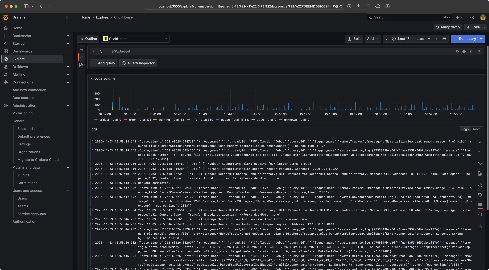
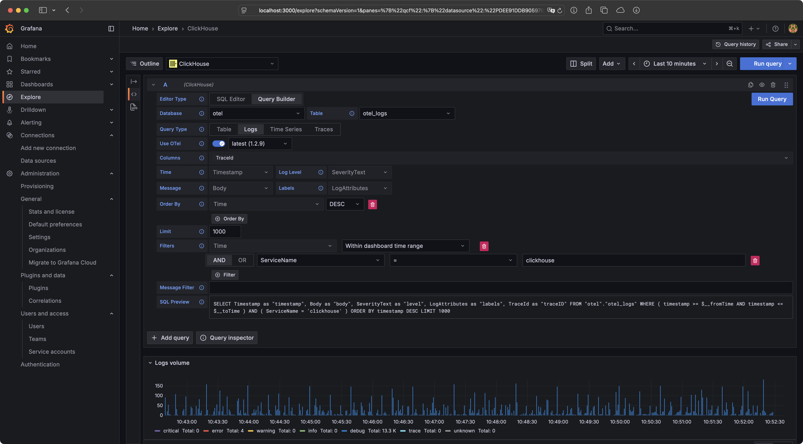
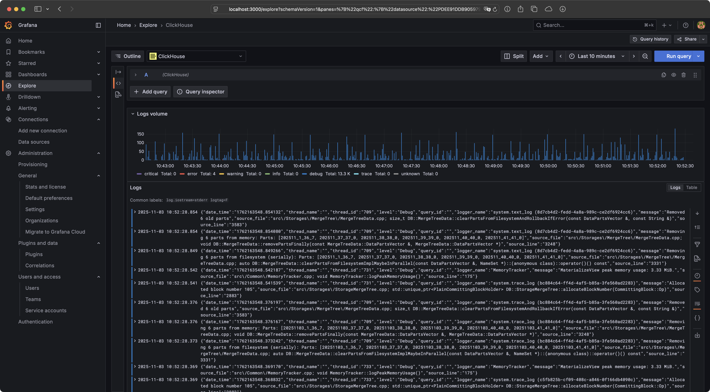
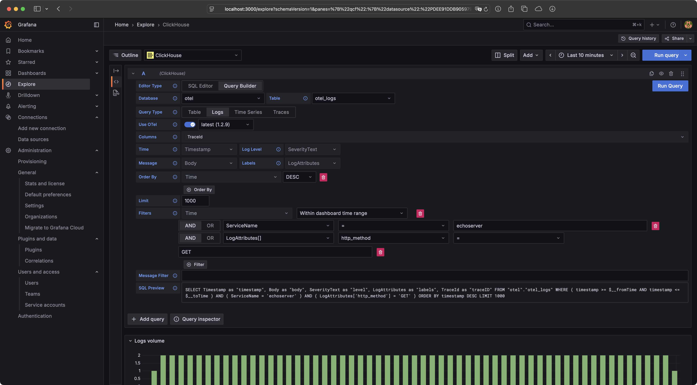
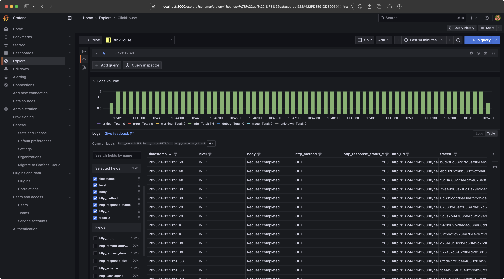

In today's blog post, we will deploy ClickHouse and the OpenTelemetry Collector
in a Kubernetes cluster to collect the cluster's logs. Finally, we will deploy
Grafana to explore the logs stored in ClickHouse.



## ClickHouse

In the first step, we need to create a new ClickHouse cluster. In this blog
post, we will use the
[ClickHouse Operator](https://github.com/Altinity/clickhouse-operator) for this
purpose. The operator can be deployed using the following commands:

```sh
kubectl create namespace clickhouse-operator
kubectl apply -f https://raw.githubusercontent.com/ricoberger/playground/6b942ebe1df3b121b09042274f6598485d159826/kubernetes/kubernetes-logging-with-clickhouse-and-opentelemetry/clickhouse/clickhouse-operator.yaml
```

```plaintext
NAME                                   READY   STATUS    RESTARTS   AGE
clickhouse-operator-6bcc776b68-77xf6   2/2     Running   0          14s
```

Once the ClickHouse operator is running, we can create a ClickHouse cluster.
Since we want a cluster with three shards, we also need to deploy ClickHouse
Keeper. To deploy ClickHouse Keeper and create the ClickHouse cluster afterward,
we can use the following commands:

```sh
kubectl create namespace otel
kubectl apply -f https://raw.githubusercontent.com/ricoberger/playground/6b942ebe1df3b121b09042274f6598485d159826/kubernetes/kubernetes-logging-with-clickhouse-and-opentelemetry/clickhouse/clickhouse-keeper.yaml
kubectl apply -f https://raw.githubusercontent.com/ricoberger/playground/6b942ebe1df3b121b09042274f6598485d159826/kubernetes/kubernetes-logging-with-clickhouse-and-opentelemetry/clickhouse/clickhouse.yaml
```

```plaintext
NAME                               READY   STATUS    RESTARTS   AGE
chi-clickhouse-otel-0-0-0          1/1     Running   0          18s
chi-clickhouse-otel-1-0-0          1/1     Running   0          19s
chi-clickhouse-otel-2-0-0          1/1     Running   0          19s
chk-clickhouse-keeper-otel-0-0-0   1/1     Running   0          70s
chk-clickhouse-keeper-otel-0-1-0   1/1     Running   0          63s
chk-clickhouse-keeper-otel-0-2-0   1/1     Running   0          56s
```

## OpenTelemetry Collector

In the next step, we need to deploy the
[OpenTelemetry Collector](https://opentelemetry.io/docs/collector/). The
OpenTelemetry project provides pre-built distributions of the collector.
However, since it is recommended to build a custom Docker image, we will choose
this option instead of using one of the pre-built distributions.

We will use the following
[Dockerfile](https://raw.githubusercontent.com/ricoberger/playground/6b942ebe1df3b121b09042274f6598485d159826/kubernetes/kubernetes-logging-with-clickhouse-and-opentelemetry/otel-collector/Dockerfile)
and
[builder manifest](https://raw.githubusercontent.com/ricoberger/playground/6b942ebe1df3b121b09042274f6598485d159826/kubernetes/kubernetes-logging-with-clickhouse-and-opentelemetry/otel-collector/builder-config.yaml)
to build our custom Docker image
`registry.homelab.ricoberger.dev/otel-collector:v0.138.0` using the following
command:

```sh
docker buildx build --platform=linux/arm64,linux/amd64 -f ./Dockerfile -t registry.homelab.ricoberger.dev/otel-collector:v0.138.0 --push .
```

```yaml
receivers:
  # Configure the OTLP receiver, so that the OpenTelementry Collector can
  # receive logs via gRPC or HTTP using OTLP format.
  otlp:
    protocols:
      grpc:
        endpoint: ${env:MY_POD_IP}:4317
      http:
        endpoint: ${env:MY_POD_IP}:4318
  # Configure the Filelog receiver, which is responsible for collecting the logs
  # from all Pods. Because we are using the Filelog receiver we also have to
  # deploy the OpenTelemetry Collector as DaemonSet in our Kubernetes cluster.
  filelog:
    include: [/var/log/pods/*/*/*.log]
    start_at: beginning
    storage: file_storage
    include_file_path: true
    include_file_name: false
    # The following operator will perform some simple tasks on the collected log
    # lines:
    # - The container operator parses logs in docker, cri-o and containerd
    #   formats and is responsible for parsing the timestamp and attributes.
    # - The json_parser operator parses the string-type field selected by
    #   parse_from as JSON. This means it will parse the body of all log lines
    #   as attributes and sets the severity for each log line from the parsed
    #   result.
    # - The trace_parser operator sets the trace on an entry by parsing a value
    #   from the body.
    operators:
      - id: container_parser
        type: container
      - id: json_parser
        type: json_parser
        on_error: send_quiet
        severity:
          parse_from: attributes.level
      - id: trace_parser
        type: trace_parser
        trace_id:
          parse_from: attributes.trace_id
        span_id:
          parse_from: attributes.span_id
        trace_flags:
          parse_from: attributes.trace_flags
        on_error: send_quiet

exporters:
  # Configure the ClickHouse exporter. We are mostly using the default
  # configureation, the only exception is that we disable the creation of the
  # schema. This is required because we want to use multiple shards, which is
  # is not supported in the default schema.
  clickhouse:
    endpoint: clickhouse://clickhouse-clickhouse.otel.svc.cluster.local:9000?dial_timeout=10s&compress=lz4
    database: otel
    username: "${env:CLICKHOUSE_USERNAME}"
    password: "${env:CLICKHOUSE_PASSWORD}"
    create_schema: false
    async_insert: true
    logs_table_name: otel_logs
    traces_table_name: otel_traces
    metrics_table_name: otel_metrics
    timeout: 5s
    retry_on_failure:
      enabled: true
      initial_interval: 5s
      max_interval: 30s
      max_elapsed_time: 300s

processors:
  # To improve the ingestion performance of our logs into ClickHouse we batch
  # the log lines, before sending them over to ClickHouse.
  batch:
    send_batch_size: 10000
    timeout: 10s
  memory_limiter:
    check_interval: 5s
    limit_mib: 400
    spike_limit_mib: 100
  # The Kubernetes attributes processor will automatically expand the resource
  # attributes of our logs with Kubernetes metadata, such as the Pod name,
  # container name, etc.
  k8sattributes:
    passthrough: false
    pod_association:
      - sources:
          - from: resource_attribute
            name: k8s.pod.ip
      - sources:
          - from: resource_attribute
            name: k8s.pod.uid
      - sources:
          - from: connection
    extract:
      metadata:
        - "k8s.namespace.name"
        - "k8s.deployment.name"
        - "k8s.statefulset.name"
        - "k8s.daemonset.name"
        - "k8s.cronjob.name"
        - "k8s.job.name"
        - "k8s.node.name"
        - "k8s.pod.name"
        - "k8s.pod.uid"
        - "k8s.pod.start_time"
      labels:
        - tag_name: $$1
          key_regex: (.*)
          from: pod
      annotations:
        - tag_name: $$1
          key_regex: (.*)
          from: pod
  # The last processor we are using is the transform processor, to add the
  # service name for each log line, based on the container name added by the
  # Kubernetes attributes processor.
  transform/logs:
    error_mode: silent
    log_statements:
      - context: log
        conditions:
          - IsMap(resource.attributes) and
            resource.attributes["k8s.container.name"] != nil
        statements:
          - set(resource.attributes["service.name"],
            resource.attributes["k8s.container.name"])

# Add extensions, for health checks, zPages and file storage. The file storage
# extension is used within the Filelog receiver, to store the offset for all log
# files, so the receiver can pick up where it left off in the case of a
# collector restart
extensions:
  file_storage:
    directory: /var/lib/otel-collector
  health_check:
    endpoint: ${env:MY_POD_IP}:13133
  zpages:
    endpoint: ${env:MY_POD_IP}:55679

service:
  extensions:
    - file_storage
    - health_check
    - zpages
  pipelines:
    logs:
      receivers:
        - otlp
        - filelog
      processors:
        - batch
        - memory_limiter
        - k8sattributes
        - transform/logs
      exporters:
        - clickhouse
```

Now that we have defined our OpenTelemetry Collector configuration, we can
deploy the OpenTelemetry Collector as a DaemonSet. Since we have disabled schema
creation in the ClickHouse exporter, we will also create and run a CronJob to
establish the schema in ClickHouse. The following commands can be used to deploy
the CronJob and DaemonSet:

```sh
kubectl apply -f https://raw.githubusercontent.com/ricoberger/playground/6b942ebe1df3b121b09042274f6598485d159826/kubernetes/kubernetes-logging-with-clickhouse-and-opentelemetry/otel-collector/otel-collector-create-schema.yaml
kubectl create job --from=cronjob/otel-collector-create-schema otel-collector-create-schema-manual

kubectl apply -f https://raw.githubusercontent.com/ricoberger/playground/6b942ebe1df3b121b09042274f6598485d159826/kubernetes/kubernetes-logging-with-clickhouse-and-opentelemetry/otel-collector/otel-collector.yaml
```

```plaintext
chi-clickhouse-otel-0-0-0                   1/1     Running     0          3h16m
chi-clickhouse-otel-1-0-0                   1/1     Running     0          3h16m
chi-clickhouse-otel-2-0-0                   1/1     Running     0          3h16m
chk-clickhouse-keeper-otel-0-0-0            1/1     Running     0          3h31m
chk-clickhouse-keeper-otel-0-1-0            1/1     Running     0          3h31m
chk-clickhouse-keeper-otel-0-2-0            1/1     Running     0          3h31m
otel-collector-create-schema-manual-twxtq   0/1     Completed   0          3h15m
otel-collector-ggt92                        1/1     Running     0          3h14m
otel-collector-wsj6n                        1/1     Running     0          3h14m
```

## Demo Application

We now have a functioning OpenTelemetry Collector that gathers all the logs from
our Kubernetes cluster using the Filelog receiver and stores them in our
ClickHouse cluster via the ClickHouse exporter.

In the next step, we will deploy the
[echoserver](https://github.com/ricoberger/echoserver), which is configured to
send logs to the OpenTelemetry Collector using the OTLP format. You can use the
following commands to install the echoserver.

```sh
kubectl create namespace echoserver
helm upgrade --install echoserver oci://ghcr.io/ricoberger/charts/echoserver --version 1.1.0 -f https://raw.githubusercontent.com/ricoberger/playground/6b942ebe1df3b121b09042274f6598485d159826/kubernetes/kubernetes-logging-with-clickhouse-and-opentelemetry/echoserver/values-otlp.yaml --namespace echoserver
```

```plaintext
NAME                          READY   STATUS    RESTARTS   AGE
echoserver-57d88d558f-hzmvw   1/1     Running   0          14m
```

We can now use the echoserver to generate logs for testing the filtering of logs
later.

```sh
kubectl port-forward -n echoserver svc/echoserver 8080

curl -vvv "http://localhost:8080/"
curl -vvv "http://localhost:8080/panic"
curl -vvv "http://localhost:8080/status"
curl -vvv "http://localhost:8080/status?status=400"
curl -vvv "http://localhost:8080/timeout?timeout=10s"
curl -vvv "http://localhost:8080/headersize?size=100"
curl -vvv -X POST -d '{"method": "POST", "url": "http://localhost:8080/", "body": "test", "headers": {"x-test": "test"}}' http://localhost:8080/request
curl -vvv "http://localhost:8080/fibonacci?n=100"
```

## Grafana

In the final section of this blog post, we will deploy Grafana with a
pre-configured
[ClickHouse datasource](https://grafana.com/grafana/plugins/grafana-clickhouse-datasource/)
to view our logs.

```sh
kubectl create namespace grafana
helm upgrade --install grafana oci://ghcr.io/grafana/helm-charts/grafana --version 10.1.4 -f https://raw.githubusercontent.com/ricoberger/playground/6b942ebe1df3b121b09042274f6598485d159826/kubernetes/kubernetes-logging-with-clickhouse-and-opentelemetry/grafana/values.yaml --namespace grafana
```

```plaintext
NAME                       READY   STATUS    RESTARTS   AGE
grafana-55b587fdc8-4cg6t   1/1     Running   0          13m
```

Afterward, we can access our Grafana instance using the following port-forward
command with the username `admin` and the password `admin`.

```sh
kubectl port-forward -n grafana svc/grafana 3000:80
```

When we navigate to the **Explore** section and select the **ClickHouse**
datasource, we can view the logs. For instance, we can filter the logs of our
ClickHouse cluster by using **ServiceName** with the value **clickhouse**.

<div class="grid grid-cols-2 md:grid-cols-2 gap-4">
  <div>
    <a href="./assets/grafana-clickhouse-query.png">
      
    </a>
  </div>
  <div>
    <a href="./assets/grafana-clickhouse-result.png">
      
    </a>
  </div>
</div>

We can also filter the logs using the **LogAttributes**. In the following
example, we will view all **GET** requests for the **echoserver**.

<div class="grid grid-cols-2 md:grid-cols-2 gap-4">
  <div>
    <a href="./assets/grafana-echoserver-query.png">
      
    </a>
  </div>
  <div>
    <a href="./assets/grafana-echoserver-result.png">
      
    </a>
  </div>
</div>

## Wrapping Up

That's it for today's blog post. We have successfully deployed the OpenTelemetry
Collector to gather logs in our Kubernetes cluster and store them in ClickHouse.
Finally, we have deployed and configured Grafana to explore our stored logs. If
you enjoyed the blog post, feel free to follow me on my social media channels.
