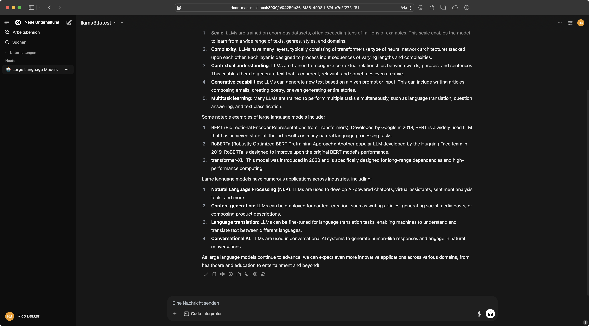

In today's blog post, we will explore how to run a local AI server on a Mac
mini. We will use Ollama to run a large language model locally and Open WebUI as
the web interface to access Ollama.


## Ollama

[Ollama](https://ollama.com/)[^1] is a lightweight, extensible framework
designed for running large language models locally. It enables users to easily
set up and run models such as Llama 3.3, facilitating tasks like code generation
and natural language processing. To install and run Ollama via Homebrew on macOS
we can use the following commands:

```sh
brew install ollama
brew services start ollama
```

Once Ollama is running we can pull a model via the `ollama pull` command. In the
following we are using `Llama 3`, but every other model should also work. A list
of all available models can be found
[Ollama website](https://ollama.com/search).

```sh
ollama pull llama3
```

```plaintext
pulling manifest
pulling 6a0746a1ec1a... 100% ▕███████████████████████████████████████████████████████████████████████████████████████████████████████████████████████████████████████████████████████████████████████████████████████████████████████████████████████████████████████████████████████████████████████████████████████████████████████████████████████████▏ 4.7 GB
pulling 4fa551d4f938... 100% ▕███████████████████████████████████████████████████████████████████████████████████████████████████████████████████████████████████████████████████████████████████████████████████████████████████████████████████████████████████████████████████████████████████████████████████████████████████████████████████████████▏  12 KB
pulling 8ab4849b038c... 100% ▕███████████████████████████████████████████████████████████████████████████████████████████████████████████████████████████████████████████████████████████████████████████████████████████████████████████████████████████████████████████████████████████████████████████████████████████████████████████████████████████▏  254 B
pulling 577073ffcc6c... 100% ▕███████████████████████████████████████████████████████████████████████████████████████████████████████████████████████████████████████████████████████████████████████████████████████████████████████████████████████████████████████████████████████████████████████████████████████████████████████████████████████████▏  110 B
pulling 3f8eb4da87fa... 100% ▕███████████████████████████████████████████████████████████████████████████████████████████████████████████████████████████████████████████████████████████████████████████████████████████████████████████████████████████████████████████████████████████████████████████████████████████████████████████████████████████▏  485 B
verifying sha256 digest
writing manifest
success
```

When the model is pulled, we can begin chatting with it using the `ollama run`
command:

```sh
ollama run llama3
```

```plaintext
>>> What are large language models?
Large language models (LLMs) are a type of artificial intelligence (AI) that have revolutionized the field of natural language processing (NLP). They're incredibly powerful AI systems that can process, understand, and generate human-like language at unprecedented scales.

Here's what makes them so remarkable:

1. **Scale**: LLMs are trained on massive datasets, often consisting of billions or even trillions of tokens (words, phrases, sentences) from various sources, such as books, articles, conversations, and more.
2. **Complexity**: These models use complex algorithms, such as transformer architectures, to process and analyze the vast amounts of text data. This enables them to capture subtle patterns, relationships, and nuances in language.
3. **Generative capabilities**: LLMs can generate new text based on a given prompt or context, which is known as natural language generation (NLG). They can produce coherent, context-specific responses, such as chatbot conversations, summaries, or even entire stories.

Some key features of large language models include:

1. **Attention mechanism**: This allows the model to focus on specific parts of the input text that are relevant to the current task.
2. **Self-supervised learning**: LLMs can learn from unlabeled data, which enables them to develop a deep understanding of language without explicit human feedback.
3. **Multi-turn dialogue generation**: They can engage in conversations that span multiple turns, responding to context and previous utterances.

Large language models have many applications, such as:

1. **Chatbots**: Conversational AI for customer service, entertainment, or education.
2. **Language translation**: Machine translation systems that can translate text from one language to another.
3. **Summarization**: Automatic summarization of long texts into concise summaries.
4. **Text generation**: Generating text based on a prompt or context for various purposes (e.g., creative writing, content creation).
5. **Question answering**: Answering complex questions by analyzing large amounts of text data.

Some notable examples of large language models include:

1. BERT (Bidirectional Encoder Representations from Transformers)
2. RoBERTa (Robustly Optimized BERT Pretraining Approach)
3. transformers
4. XLNet

These models have the potential to transform various industries, such as education, healthcare, marketing, and more, by enabling more accurate language understanding and generation capabilities.

Would you like to know more about a specific aspect of large language models or their applications?
```

## Open WebUI

Until now, we have only been able to access our large language model via the
command line. In the next step, we will install
[Open WebUI](https://openwebui.com/)[^2] to enable access through our browser.

Open WebUI is an extensible, feature-rich, and user-friendly self-hosted AI
platform designed to operate entirely offline. It supports various LLM runners
like Ollama and OpenAI-compatible APIs, with built-in inference engine for RAG,
making it a powerful AI deployment solution. To run Open WebUI via Docker the
following command can be used:

```sh
docker run -d -p 3000:8080 --add-host=host.docker.internal:host-gateway -v open-webui:/app/backend/data --name open-webui --restart always ghcr.io/open-webui/open-webui:main
```

Alternatively, we can start Open WebUI using the following Docker Compose file
by running `docker-compose up`:

```yaml
name: open-webui

services:
  open-webui:
    ports:
      - 3000:8080
    extra_hosts:
      - host.docker.internal:host-gateway
    volumes:
      - open-webui:/app/backend/data
    container_name: open-webui
    restart: always
    image: ghcr.io/open-webui/open-webui:main

volumes:
  open-webui:
    external: true
    name: open-webui
```

Now we can open our browser to access Open WebUI, in my case the Mac mini is
reachable via `ricos-mac-mini.local`, so that the Open WebUI can be accessed via
`http://ricos-mac-mini.local:3000`. When Open WebUI is opened the first time we
have to create a admin user, afterwards we can start using our large language
model through the web interface provided by Open WebUI.



That's it! We now have our local AI server running, accessible from any device
on our home network. In the next blog post, we will explore how to access our
local AI server from anywhere, even when we are outside our home network.

[^1]: [Ollama GitHub Repository](https://github.com/ollama/ollama)

[^2]: [Open WebUI GitHub Repository](https://github.com/open-webui/open-webui)
