Until now, my home server setup was powered by a Raspberry Pi, which had its
limits since I also used it for watching TV in my office. I decided to replace
it with a Mac mini, and I was fortunate to find the current M4 base model at a
low price. In the following post, I will discuss the basic setup to enable
remote access to the Mac mini and prepare it for the various server workloads we
want to run.

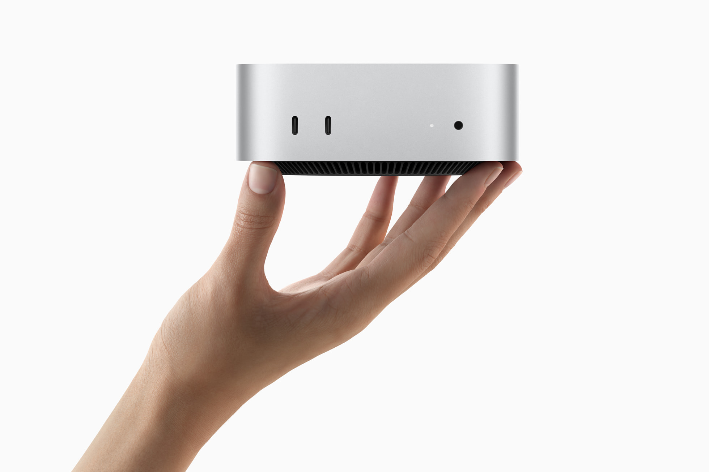

## Why a Mac mini

I choosed the Mac mini M4 base model, which features 10 CPU and GPU cores, 16 GB
of memory, and a 256 GB SSD. There are a few reasons why a Mac mini would make a
good server:

- **Energy Efficiency** - The M series chip falls between a Raspberry Pi and a
  15W x86 chip.
- **Powerful Performance** - The M series chip delivers powerful performance,
  easily handling various server tasks. It is also well-suited for running
  smaller AI tasks.
- **Silence** - Silence is important because our home server is located in our
  office.
- **Content Caching** - With multiple Macs, iPads, iPhones, and an Apple TV in
  the house, we have several devices that can utilize local caching.

## Setup

In the following, we will examine the settings needed to reduce the power
consumption of the Mac mini, enable remote access, and provide the basic tools
for initial hacking. We will use the following system settings:

- System Settings -> Bluetooth -> **Disabled**
- System Settings -> Firewall -> **Enabled**
- System Settings -> Energy -> Prevent automatic sleeping when the disply is off
  (**Enabled**) / Wake for network access (**Enabled**) / Start up automatically
  after power failure (**Enabled**)
- System Settings -> Apple Intelligence & Siri -> **Disabled**
- System Settings -> Spotlight -> **Disable all Options**
- System Settings -> Notifications -> Show previews (**Never**) / Allow
  notifications when then display is sleeping (**Disabled**) / Allow
  notifications when the screen is locked (**Disabled**) / Allow notifications
  when mirroring or sharing the display (**Disabled**)
- System Settings -> Sound -> Play sound on startup (**Disabled**) / Play user
  interface sound effects (**Disabled**) / Play feedback when volume is changed
  (**Disabled**)
- System Settings -> Lock Screen - Start screen saver when inactive (**Never**)
  / Turn display off when inactive (**10 Minutes**) / Require password after
  screen saver begins or display is turned off (**Never**) / Show large clock
  (**Never**)
- System Settings -> Privacy & Security -> Location Services -> **Disabled**
- System Settings -> Login Password -> Automatically log in after a restart ->
  **Enabled**
- System Settings -> Users & Groups -> Automatically log in as user
- System Settings -> Game Center -> **Disabled**
- System Settings -> General -> Sharing -> Advanced -> Remote Management
  (**Enabled**) / Remote Login (**Enabled**) / Remote Application Scripting
  (**Enabled**) / Local hostname (**ricos-mac-mini.local**)
  - Remote Management: Always show remote management status in the menu bar
    (**Enabled**) / Anyone may request permission to control screen
    (**Enabled**) / Allow access for (**All users**) / Options (**Enable all**)
  - Remote Login: Allow full disk access for remote users (**Enabled**) / Allow
    access for (**All users**)
  - Remote Application Scripting: Allow access for (**All users**)

<div class="grid grid-cols-2 md:grid-cols-4 gap-4">
  <div>
    <a href="./assets/screenshot-1-about.png">
      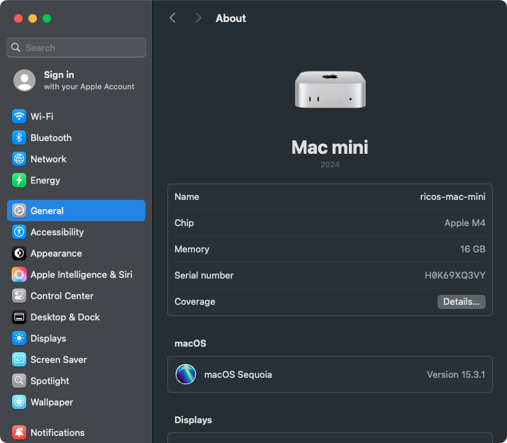
    </a>
  </div>
  <div>
    <a href="./assets/screenshot-2-bluetooth.png">
      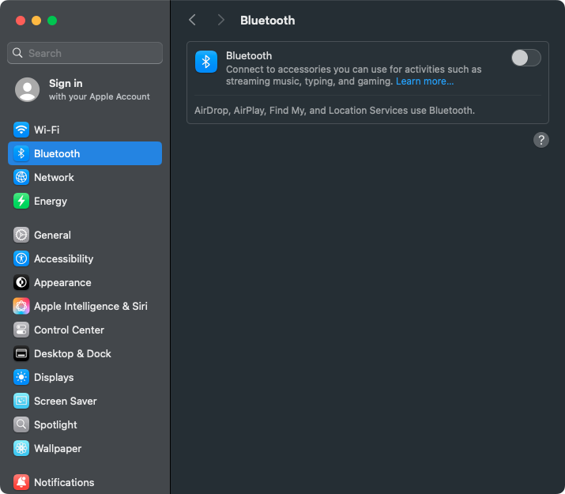
    </a>
  </div>
  <div>
    <a href="./assets/screenshot-3-firewall.png">
      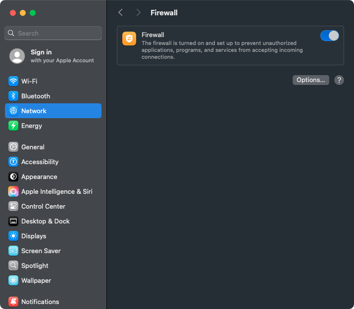
    </a>
  </div>
  <div>
    <a href="./assets/screenshot-4-energy.png">
      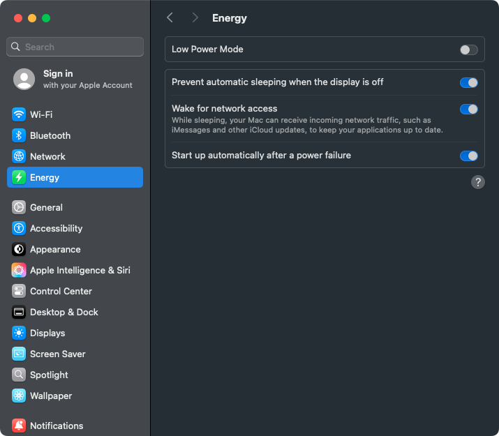
    </a>
  </div>
  <div>
    <a href="./assets/screenshot-5-apple-intelligence-and-siri.png">
      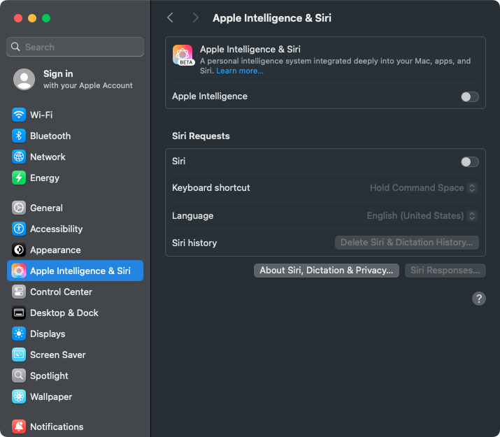
    </a>
  </div>
  <div>
    <a href="./assets/screenshot-6-spotlight.png">
      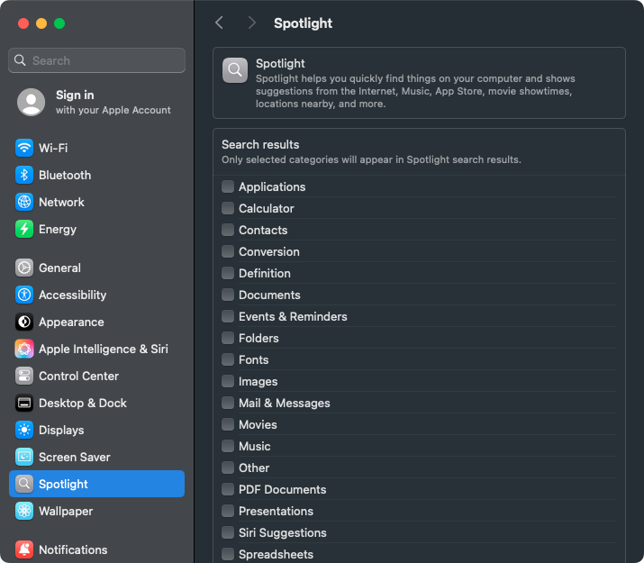
    </a>
  </div>
  <div>
    <a href="./assets/screenshot-7-notifications.png">
      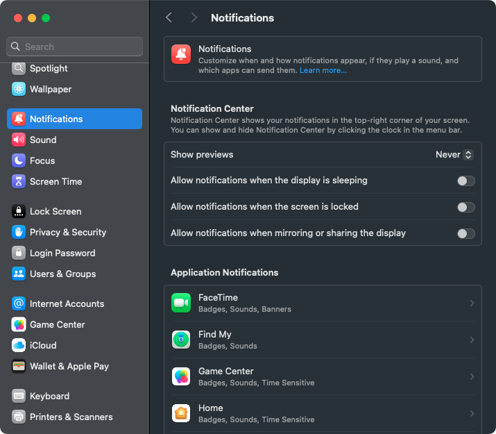
    </a>
  </div>
  <div>
    <a href="./assets/screenshot-8-sound.png">
      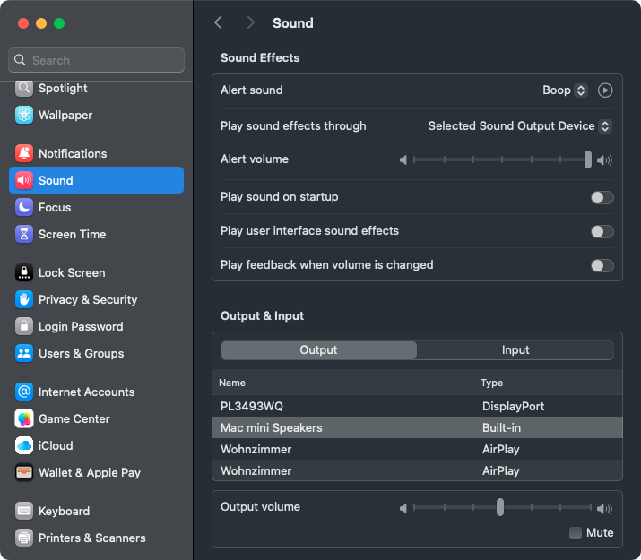
    </a>
  </div>
  <div>
    <a href="./assets/screenshot-9-lock-screen.png">
      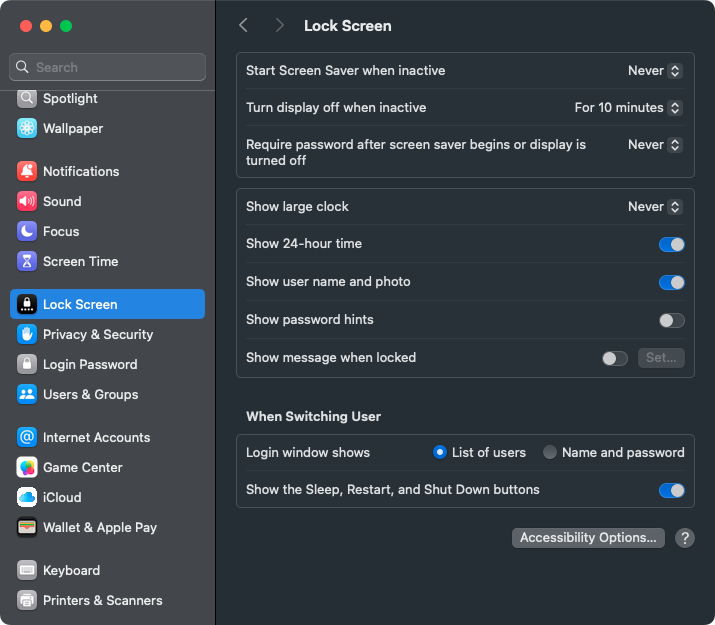
    </a>
  </div>
  <div>
    <a href="./assets/screenshot-10-privacy-and-security.png">
      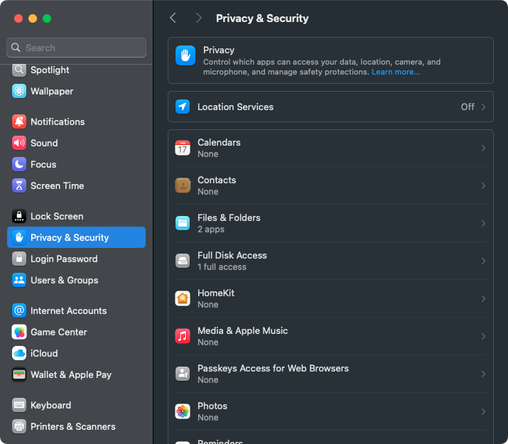
    </a>
  </div>
  <div>
    <a href="./assets/screenshot-11-login-password.png">
      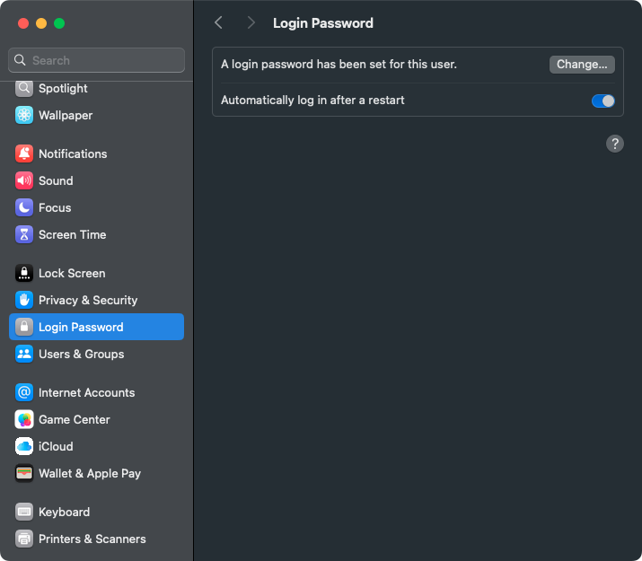
    </a>
  </div>
  <div>
    <a href="./assets/screenshot-12-users-and-groups.png">
      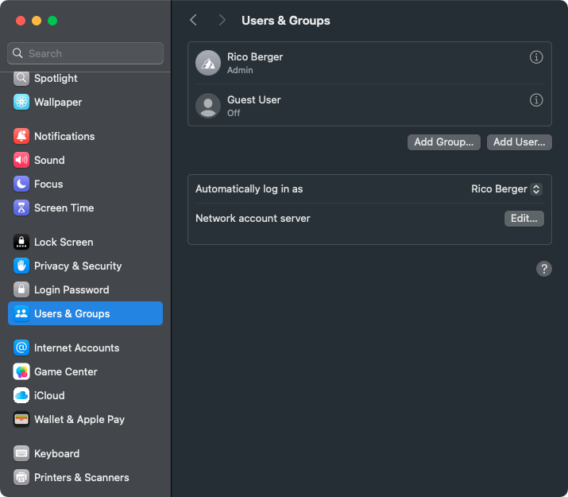
    </a>
  </div>
  <div>
    <a href="./assets/screenshot-13-game-center.png">
      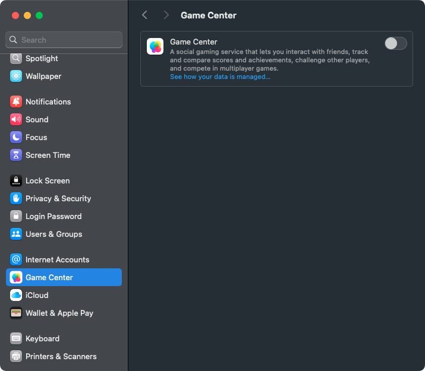
    </a>
  </div>
  <div>
    <a href="./assets/screenshot-14-sharing-1.png">
      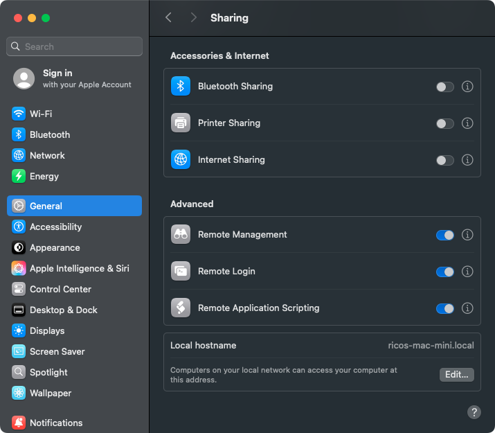
    </a>
  </div>
  <div>
    <a href="./assets/screenshot-15-sharing-2.png">
      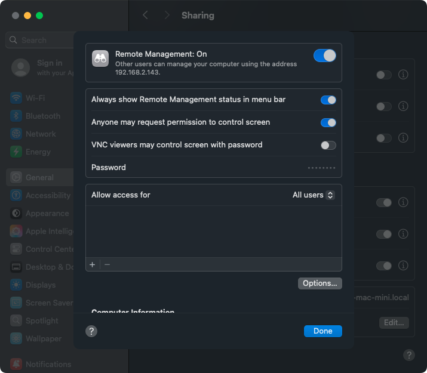
    </a>
  </div>
  <div>
    <a href="./assets/screenshot-16-sharing-3.png">
      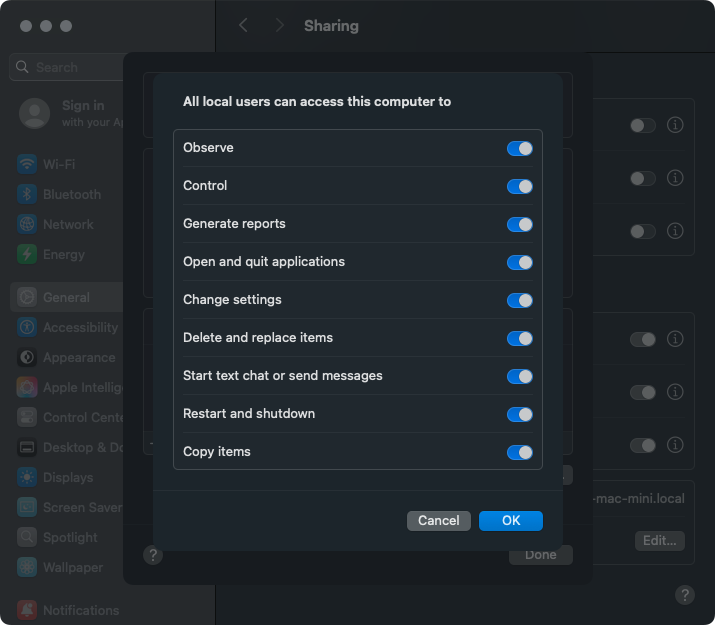
    </a>
  </div>
  <div>
    <a href="./assets/screenshot-17-sharing-4.png">
      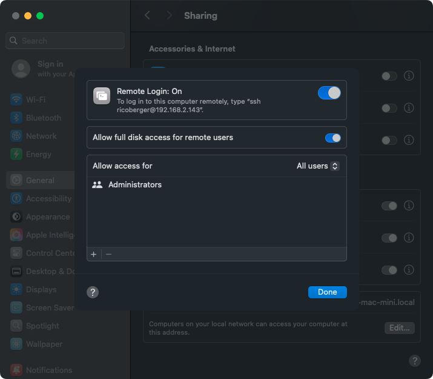
    </a>
  </div>
  <div>
    <a href="./assets/screenshot-18-sharing-5.png">
      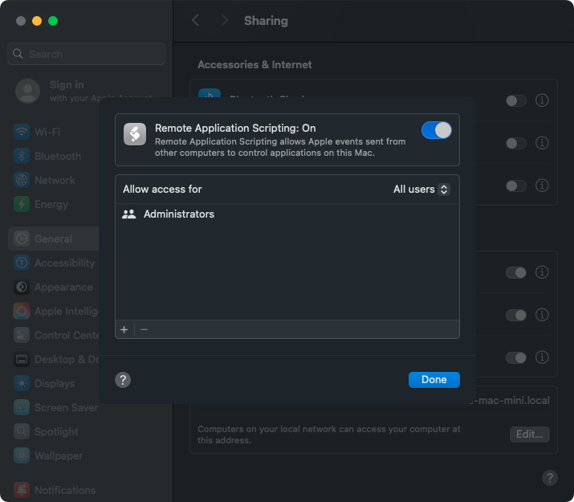
    </a>
  </div>
  <div>
    <a href="./assets/screenshot-19-screen-sharing.png">
      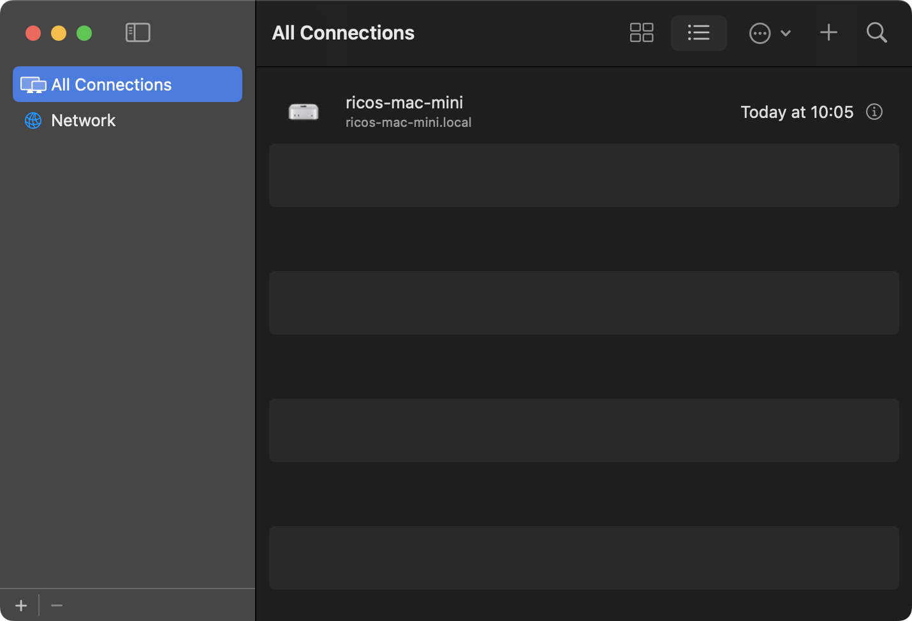
    </a>
  </div>
</div>

At this point, we can log in to our Mac mini via the **Screen Sharing**
application and SSH. Before we continue, we will copy Ghostty's terminfo entry
and our SSH key to the Mac mini:

```sh
infocmp -x | ssh ricos-mac-mini.local -- tic -x -

ssh-copy-id -i /Users/ricoberger/.ssh/id_rsa.pub ricoberger@ricos-mac-mini.local
scp /Users/ricoberger/.ssh/id_rsa ricoberger@ricos-mac-mini.local:/Users/ricoberger/.ssh/id_rsa
scp /Users/ricoberger/.ssh/id_rsa.pub ricoberger@ricos-mac-mini.local:/Users/ricoberger/.ssh/id_rsa.pub
```

Now we can log in to the Mac mini (`ssh ricoberger@ricos-mac-mini.local`) and
adjust the SSH configuration to allow logins only via the copied SSH key. For
this, we add the following lines to the configuration file at
`/etc/ssh/sshd_config`:

```plaintext
PermitRootLogin no
PasswordAuthentication no
PermitEmptyPasswords no
ChallengeResponseAuthentication no
```

To match the configuration on my MacBook Pro, we will install the Xcode Command
Line Tools, [Homebrew](https://brew.sh/) and our dotfiles from
[ricoberger/dotfiles](https://github.com/ricoberger/dotfiles).

```sh
xcode-select --install
/bin/bash -c "$(curl -fsSL https://raw.githubusercontent.com/Homebrew/install/HEAD/install.sh)"

mkdir -p /Users/ricoberger/Documents/GitHub/ricoberger
cd /Users/ricoberger/Documents/GitHub/ricoberger
git clone git@github.com:ricoberger/dotfiles.git

brew bundle install --file=Brewfile

sudo sh -c "echo $(which zsh) >> /etc/shells"
chsh -s $(which zsh)

./install.sh && source ~/.zshrc
```

We installed [Colima](https://github.com/abiosoft/colima) as our container
runtime through the Brewfile because we want to deploy most of our services
using Docker. To autostart Colima and our services, use
`brew services start colima`. We can also increase the resources of the VM
created by Colima by adjusting the following values in the Colima configuration
file at `~/.colima/default/colima.yaml`:

```plaintext
# Number of CPUs to be allocated to the virtual machine.
cpu: 8

# Size of the disk in GiB to be allocated to the virtual machine.
disk: 100

# Size of the memory in GiB to be allocated to the virtual machine.
memory: 12
```

That's it! Now we are ready to experiment with our new Mac mini home server.
