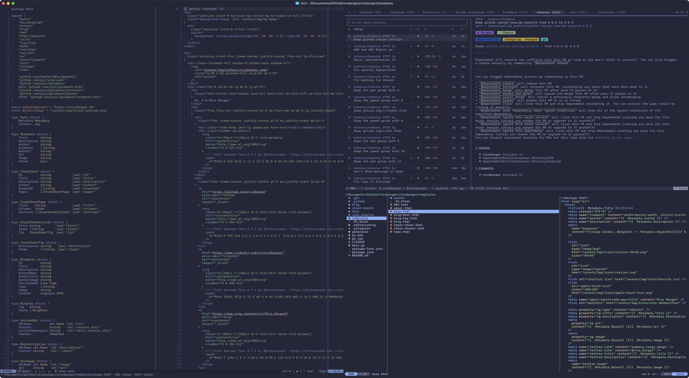

In this blog post, I'll take you through my complete
[dotfiles](https://github.com/ricoberger/dotfiles), detailing the tools and
configurations that empower my development process. From my terminal choice to
the editor I rely on, and even the GitHub CLI commands that simplify my
workflow, I'll share insights and tips that might just inspire you to optimize
your own environment. Whether you're a seasoned developer or just starting,
there's something here for everyone looking to enhance their macOS experience.
Let's dive in!



## OS Setup

I'm using macOS as my daily development environment, and together with
[Raycast](https://www.raycast.com/), I couldn't be happier with it. Raycast
allows me to quickly create notes and reminders, view my calendar entries,
GitHub pull requests and issues, and Jira tickets. I'm also using it as a
replacement for the built-in Spotlight search and for managing spaces[^1] and
windows.

## Terminal

By the end of last year, I switched from [Alacritty](https://alacritty.org/) to
[Ghostty](https://ghostty.org/) as my go-to terminal emulator (yes, the hype
caught me 😅). Ghostty provides most of the features out of the box that I used
tmux for in the past, such as multiple windows, tabs, and panes. It is super
fast, and the available configuration options are on point (not too much, not
too little). The only thing I would wish for is an API so that windows, tabs,
and panes can be created programmatically, which is currently only possible via
AppleScript. In my Ghostty configuration[^2] I set my prefered
[color scheme](https://catppuccin.com),
[font](https://github.com/microsoft/cascadia-code) and some key bindings.

As my shell[^3], I'm using [Zsh](https://www.zsh.org/) with
[Zinit](https://github.com/zdharma-continuum/zinit) to manage the following
plugins:

- [zsh-users/zsh-completions](https://github.com/zsh-users/zsh-completions):
  Additional completion definitions for Zsh
- [zsh-users/zsh-autosuggestions](https://github.com/zsh-users/zsh-autosuggestions):
  Fish-like fast/unobtrusive autosuggestions for Zsh
- [Aloxaf/fzf-tab](https://github.com/Aloxaf/fzf-tab): Replace Zsh's default
  completion selection menu with fzf

For the customization of my prompt[^4], I'm using
[Starship](https://starship.rs/) to show the current OS and user, the directory
I'm working in, the Git branch and status, the exit status of the last command,
the Kubernetes context and namespace, and the current time.

Other important tools I'm using are:

- [tmux](http://tmux.github.io/)[^5]: tmux is a terminal multiplexer, and while
  I replaced most of its functionality with Ghostty, I'm still using it on
  servers where the benefit of persistent sessions is unmatched.
- [fzf](https://github.com/junegunn/fzf): fzf is a command-line fuzzy finder.
- [ripgrep](https://github.com/BurntSushi/ripgrep): ripgrep is a line-oriented
  search tool that recursively searches the current directory for a regex
  pattern.
- [Yazi](https://yazi-rs.github.io/)[^6]: Yazi is a blazing fast terminal file
  manager written in Rust, based on async I/O. It is fairly new in my workflow,
  but I want to try it out more to stay within the terminal when doing file
  oeprations instead of running `open .` and doing these operations via the
  Finder.

## Editor

[Neovim](https://neovim.io/) has become my daily editor of choice due to its
powerful features and flexibility. As an extensible text editor based on Vim, it
allows me to tailor it to my specific workflow, whether I'm coding, writing, or
debugging issues. Spending most of my time within the terminal, it is also
faster and feels more natural to stay within the terminal when editing files
instead of opening Visual Studio Code.


Currently, I'm using the following plugins for tasks such as fuzzy searching
files, Git integrations, code completion, formatting, linting, and some AI
features:

- [lazy.nvim](https://github.com/folke/lazy.nvim): A modern plugin manager for
  Neovim
- [catppuccin](https://github.com/catppuccin/nvim): Soothing pastel theme for
  Neovim
- [lualine.nvim](https://github.com/nvim-lualine/lualine.nvim): A blazing fast
  and easy to configure Neovim statusline plugin written in pure lua
- [snacks.nvim](https://github.com/folke/snacks.nvim): A collection of QoL
  plugins for Neovim
- [gitsigns.nvim](https://github.com/lewis6991/gitsigns.nvim): Git integration
  for buffers
- [diffview.nvim](https://github.com/sindrets/diffview.nvim): Single tabpage
  interface for easily cycling through diffs for all modified files for any git
  rev
- [nvim-treesitter](https://github.com/nvim-treesitter/nvim-treesitter): Nvim
  Treesitter configurations and abstraction layer
- [nvim-treesitter-context](https://github.com/nvim-treesitter/nvim-treesitter-context):
  Show code context
- [nvim-treesitter-textobjects](https://github.com/nvim-treesitter/nvim-treesitter-textobjects):
  Syntax aware text-objects, select, move, swap, and peek support
- [nvim-lspconfig](https://github.com/neovim/nvim-lspconfig): Quickstart configs
  for Nvim LSP
- [vim-helm](https://github.com/towolf/vim-helm): Vim syntax for helm templates
  (yaml + gotmpl + sprig + custom)
- [conform.nvim](https://github.com/stevearc/conform.nvim): Lightweight yet
  powerful formatter plugin for Neovim
- [nvim-lint](https://github.com/mfussenegger/nvim-lint): An asynchronous linter
  plugin for Neovim complementary to the built-in Language Server Protocol
  support
- [blink.cmp](https://github.com/Saghen/blink.cmp): Performant,
  batteries-included completion plugin for Neovim
- [blink-copilot](https://github.com/fang2hou/blink-copilot): Configurable
  GitHub Copilot blink.cmp source for Neovim
- [friendly-snippets](https://github.com/rafamadriz/friendly-snippets): Set of
  preconfigured snippets for different languages
- [multicursor.nvim](https://github.com/jake-stewart/multicursor.nvim): Multiple
  cursors in Neovim
- [todo-comments.nvim](https://github.com/folke/todo-comments.nvim): Highlight,
  list and search todo comments in your projects.
- [copilot.lua](https://github.com/zbirenbaum/copilot.lua): Fully featured &
  enhanced replacement for copilot.vim complete with API for interacting with
  Github Copilot
- [CopilotChat.nvim](https://github.com/CopilotC-Nvim/CopilotChat.nvim): Chat
  with GitHub Copilot in Neovim

While all the plugins mentioned above are awesome and fulfill a specific need, I
want to give a special shoutout to
[multicursor.nvim](https://github.com/jake-stewart/multicursor.nvim), which was
the last missing plugin for me to fully abandon Visual Studio Code.

## GitHub CLI

Last but not least, I also want to take a look at my workflow with GitHub
because it is an important part of my daily work, and I'm a bit proud of it. I'm
a heavy user of the [GitHub CLI](https://cli.github.com/) (`gh`) and the
[gh-dash](https://github.com/dlvhdr/gh-dash) extension, because it allows me to
stay for most of my work within the terminal.

I use the GitHub CLI to create pull requests via the `gh pr create` command, to
add / remove labels, to view the workflow runs for a pull request and to merge
them. All with the help of some nice helper functions which can be found in the
[`.bin`](https://github.com/ricoberger/dotfiles/tree/main/.bin) directory in my
dotfiles.

```sh
# Add a label to the pull request, by selecting the label via fzf from a list of
# all available labels in the repository
gh pr edit $1 --add-label "$(gh label list --json name --jq ".[].name" | fzf)"

# Delete a label from the pull request, by selecting the label via fzf from a
# a list of all labels from the pull request
gh pr edit $1 --remove-label "$(gh pr view $1 --json labels --jq ".labels.[].name" | fzf)"

# View the logs of a workflow run, by selecting the workflow run via fzf
branch=$(git rev-parse --abbrev-ref HEAD)
workflow=$(gh run list --branch $branch --json databaseId,workflowName,createdAt,status --template '{{range .}}{{printf "%.0f" .databaseId}}{{"\t"}}{{.status}}{{"\t"}}{{.createdAt}}{{"\t"}}{{.workflowName}}{{"\n"}}{{end}}' | fzf)
gh run view "$(echo $workflow | awk '{print $1}')" --log

# Squash the commits into one commit and merge it into the base branch, also
# delete the local and remote branch after merge
gh pr merge $1 --squash --delete-branch --admin
```

These commands are also integrated into my gh-dash configuration[^7]. gh-dash is
an extension for the GitHub CLI to display a dashboard with pull requests and
issues. It integrates beautifully with tmux and Neovim:

- Open the diff of a pull request in Neovim
  [diffview.nvim](https://github.com/sindrets/diffview.nvim) via
  `cd {{.RepoPath}} && gh pr checkout {{.PrNumber}} && nvim -c ":DiffviewOpen origin/HEAD...HEAD --imply-local"`
  or with tmux via
  `tmux new-window -n "{{.RepoName}}/{{.PrNumber}}" -c {{.RepoPath}} 'gh pr checkout {{.PrNumber}} && nvim -c ":DiffviewOpen origin/HEAD...HEAD --imply-local"'`
- Open a pull request in Neovim
  [octo.nvim](https://github.com/pwntester/octo.nvim) via
  `cd {{.RepoPath}} && nvim -c ":Octo pr edit {{.PrNumber}}"` or with tmux via
  `tmux new-window -n "{{.RepoName}}/{{.PrNumber}}" -c {{.RepoPath}} 'nvim -c ":Octo pr edit {{.PrNumber}}"'`
- Open an issue in Neovim [octo.nvim](https://github.com/pwntester/octo.nvim)
  via `cd {{.RepoPath}} && nvim -c ":Octo issue edit {{.IssueNumber}}"` or with
  tmux via
  `tmux new-window -n "{{.RepoName}}/{{.IssueNumber}}" -c {{.RepoPath}} 'nvim -c ":Octo issue edit {{.IssueNumber}}"'`


[^1]:
    [Create new Spaces via AppleScript](https://github.com/ricoberger/dotfiles/blob/main/.bin/raycast/create-new-space.applescript)

[^2]:
    [Ghostty Configuration](https://github.com/ricoberger/dotfiles/blob/main/.config/ghostty/config)

[^3]:
    [Zsh Configuration](https://github.com/ricoberger/dotfiles/blob/main/.zshrc)

[^4]:
    [Starship Configuration](https://github.com/ricoberger/dotfiles/blob/main/.config/starship.toml)

[^5]:
    [tmux Configuration](https://github.com/ricoberger/dotfiles/blob/main/.tmux.conf)

[^6]:
    [Yazi Configuration](https://github.com/ricoberger/dotfiles/tree/main/.config/yazi)

[^7]:
    [gh-dash Configuration](https://github.com/ricoberger/dotfiles/blob/main/.config/gh-dash/config.yml)
