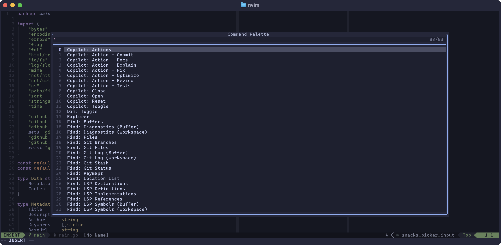

Welcome to another blog post about
[my dotfiles](https://ricoberger.de/blog/posts/my-dotfiles/). Today, I will
briefly discuss how to implement a custom picker using
[snacks.nvim](https://github.com/folke/snacks.nvim). Inspired by a Reddit post,
I wanted to create my own command palette, similar to the one in Visual Studio
Code. Below, I will share the result.



One feature I have always liked about Visual Studio Code is the command palette,
which allows you to quickly change a file's type, run code formatting, and more.
Inspired by a
[Reddit post](https://www.reddit.com/r/neovim/comments/1ircbgt/handy_toolbox_using_snacks_custom_picker/),
I wanted to create my own command palette in Neovim, which allows me to run
commands without creating a keymap, as I don't use them frequently enough.

The commands for the command palette are defined in a table, where each entry
has a name and an action. The action can be a command if it starts with `:`, a
keymap if it's a string not starting with `:` or a function if it's a function,
similar to the actions in the
[snacks.nvim dashboard](https://github.com/folke/snacks.nvim/blob/main/docs/dashboard.md#section-actions).

The commands are passed as `items` to the `Snacks.picker`. When a command is
selected, the `confirm` function is executed, which runs the corresponding
action in a similar way to how it is done in the
[snacks.nvim dashboard](https://github.com/folke/snacks.nvim/blob/acedb16ad76ba0b5d4761372ca71057aa9486adb/lua/snacks/dashboard.lua#L292).

The command palette is exported as a module and registered in the keys section
of the snacks.nvim plugin, so that the command palette can be opened via
`leader` + `p`.

```lua
return {
  {
    "folke/snacks.nvim",
    priority = 1000,
    lazy = false,
    keys = {
      {
        "<leader>p",
        function()
          require("command-palette").show_commands()
        end,
        desc = "Command Palette",
      },
    },
  },
}
```

```lua
local M = {}

M.commands = {
  {
    name = "Copilot: Actions",
    action = "<leader>ca",
  },
  {
    name = "Dim: Toggle",
    action = function()
      local snacks_dim = require("snacks").dim
      if snacks_dim.enabled then
        snacks_dim.disable()
      else
        snacks_dim.enable()
      end
    end,
  },
  {
    name = "Tab: Close",
    action = ":tabclose",
  },
  {
    name = "Tab: New",
    action = ":tabnew",
  },
  {
    name = "Todo Comments: Quickfix List",
    action = ":TodoQuickFix",
  },
  {
    name = "Todo Comments: Location List",
    action = ":TodoLocList",
  },
}

function M.show_commands()
  local items = {}

  for idx, command in ipairs(M.commands) do
    local item = {
      idx = idx,
      name = command.name,
      text = command.name,
      action = command.action,
    }
    table.insert(items, item)
  end

  Snacks.picker({
    title = "Command Palette",
    layout = {
      preset = "default",
      preview = false,
    },
    items = items,
    format = function(item, _)
      return {
        { item.text, item.text_hl },
      }
    end,
    confirm = function(picker, item)
      if type(item.action) == "string" then
        if item.action:find("^:") then
          picker:close()
          return picker:norm(function()
            picker:close()
            vim.cmd(item.action:sub(2))
          end)
        else
          return picker:norm(function()
            picker:close()
            local keys = vim.api.nvim_replace_termcodes(item.action, true, true, true)
            vim.api.nvim_input(keys)
          end)
        end
      end

      return picker:norm(function()
        picker:close()
        item.action()
      end)
    end,
  })
end

return M
```
