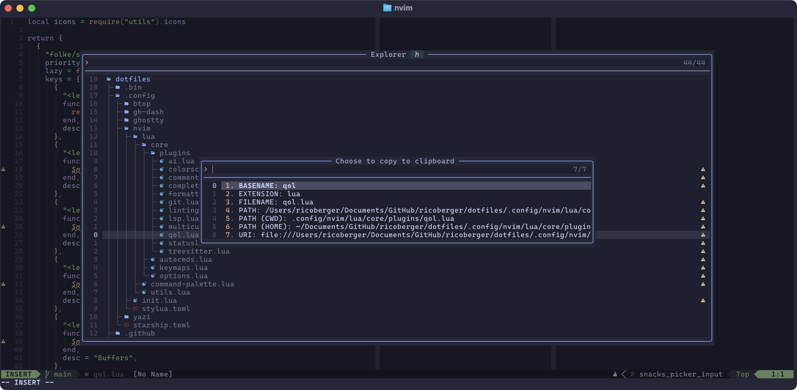

In today's blog post, I want to take a quick look at the
[snacks.nvim](https://github.com/folke/snacks.nvim) explorer and how I extended
it with some useful actions, so that I can search within a directory, diff
selected files, and provide multiple copy options.



The first action `copy_file_path` is used to provide multiple copy options for
the file under the cursor. The function returns a selection menu from which I
can select whether I want to copy the basename, extension, filename, path, the
relative path from the working directory or home directory, or the file URI.

The second action `search_in_directory` is used to search within the directory
under the cursor. It opens a new snacks.nvim picker where the working directory
is set to the selected directory from the explorer and allows me to search for
all files with a specific search term.

The third action `diff` is used to compare two selected files. In the explorer,
two files can be selected with `Tab` or `Shift` + `Tab`, and afterwards, a diff
between these two files is opened in a new tab.

The code for the mentioned actions can be found in the following code snippet.
If you want to know more about my Neovim configuration you can have a look at my
[dotfiles repository](https://github.com/ricoberger/dotfiles) or
[my last blog post](https://ricoberger.de/blog/posts/my-dotfiles/). If you have
some useful addtions to the snacks.nvim explorer please let me know.

```lua
return {
  {
    "folke/snacks.nvim",
    priority = 1000,
    lazy = false,
    opts = {
      picker = {
        enabled = true,
        sources = {
          explorer = {
            auto_close = true,
            hidden = true,
            layout = {
              preset = "default",
              preview = false,
            },
            actions = {
              copy_file_path = {
                action = function(_, item)
                  if not item then
                    return
                  end

                  local vals = {
                    ["BASENAME"] = vim.fn.fnamemodify(item.file, ":t:r"),
                    ["EXTENSION"] = vim.fn.fnamemodify(item.file, ":t:e"),
                    ["FILENAME"] = vim.fn.fnamemodify(item.file, ":t"),
                    ["PATH"] = item.file,
                    ["PATH (CWD)"] = vim.fn.fnamemodify(item.file, ":."),
                    ["PATH (HOME)"] = vim.fn.fnamemodify(item.file, ":~"),
                    ["URI"] = vim.uri_from_fname(item.file),
                  }

                  local options = vim.tbl_filter(function(val)
                    return vals[val] ~= ""
                  end, vim.tbl_keys(vals))
                  if vim.tbl_isempty(options) then
                    vim.notify("No values to copy", vim.log.levels.WARN)
                    return
                  end
                  table.sort(options)
                  vim.ui.select(options, {
                    prompt = "Choose to copy to clipboard:",
                    format_item = function(list_item)
                      return ("%s: %s"):format(list_item, vals[list_item])
                    end,
                  }, function(choice)
                    local result = vals[choice]
                    if result then
                      vim.fn.setreg("+", result)
                      Snacks.notify.info("Yanked `" .. result .. "`")
                    end
                  end)
                end,
              },
              search_in_directory = {
                action = function(_, item)
                  if not item then
                    return
                  end
                  local dir = vim.fn.fnamemodify(item.file, ":p:h")
                  Snacks.picker.grep({
                    cwd = dir,
                    cmd = "rg",
                    args = {
                      "-g",
                      "!.git",
                      "-g",
                      "!node_modules",
                      "-g",
                      "!dist",
                      "-g",
                      "!build",
                      "-g",
                      "!coverage",
                      "-g",
                      "!.DS_Store",
                      "-g",
                      "!.docusaurus",
                      "-g",
                      "!.dart_tool",
                    },
                    show_empty = true,
                    hidden = true,
                    ignored = true,
                    follow = false,
                    supports_live = true,
                  })
                end,
              },
              diff = {
                action = function(picker)
                  picker:close()
                  local sel = picker:selected()
                  if #sel > 0 and sel then
                    Snacks.notify.info(sel[1].file)
                    vim.cmd("tabnew " .. sel[1].file)
                    vim.cmd("vert diffs " .. sel[2].file)
                    Snacks.notify.info("Diffing " .. sel[1].file .. " against " .. sel[2].file)
                    return
                  end

                  Snacks.notify.info("Select two entries for the diff")
                end,
              },
            },
            win = {
              list = {
                keys = {
                  ["y"] = "copy_file_path",
                  ["s"] = "search_in_directory",
                  ["D"] = "diff",
                },
              },
            },
          },
        },
      },
    },
  },
}
```
