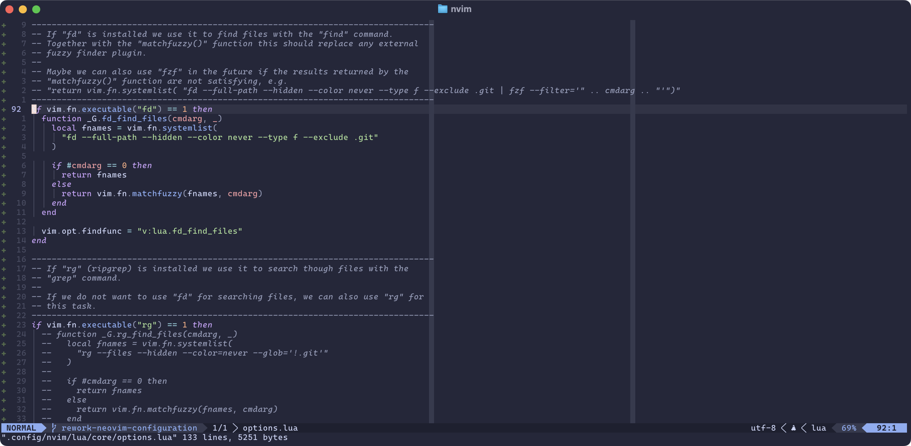

It has been a while since I last shared my Neovim configuration. Over time, I've
made several adjustments to enhance my workflow. Recently, I decided to
streamline my setup by removing some plugins and replacing them with built-in
alternatives. In this post, I'll walk you through the changes I've made and my
current Neovim configuration.



## Managing Plugins

Until now, I have used `lazy.nvim` to manage my plugins. While `lazy.nvim` is an
excellent plugin manager, I wanted to simplify my setup by using the
[built-in plugin manager](https://neovim.io/doc/user/pack.html#_plugin-manager).

Adding plugins with the built-in plugin manager is straightforward. We can do
this by calling `vim.pack.add()`. For example, to add my favorite color scheme,
`catppuccin`, we can simply include the following lines in our `init.lua` file:

```lua
vim.pack.add({
  { src = "https://github.com/catppuccin/nvim", name = "catppuccin" },
}, { load = true })

require("catppuccin").setup({...})
vim.cmd.colorscheme("catppuccin")
```

While exploring the built-in plugin manager, I found this
[Reddit post](https://www.reddit.com/r/neovim/comments/1mc5taa/experimenting_with_lazy_loading_in_neovims_new/)
about implementing lazy loading. For instance, I'm using `CopilotChat.nvim` for
AI assistance. To load this plugin only when needed, we can use the following
configuration:

```lua
vim.keymap.set("n", "<leader>co", "<cmd>CopilotChatOpen<cr>")

vim.api.nvim_create_autocmd("CmdUndefined", {
  group = vim.api.nvim_create_augroup( "lazy-load-copilotchat", { clear = true }),
  pattern = { "CopilotChat*" },
  callback = function()
    vim.pack.add({
      { src = "https://github.com/nvim-lua/plenary.nvim", },
      { src = "https://github.com/CopilotC-Nvim/CopilotChat.nvim", name = "CopilotChat", },
    }, { load = true })

    require("CopilotChat").setup({...})
  end,
  once = true,
})
```

This will load the plugin only when we use the `:CopilotChatOpen` command or any
other command provided by the plugin.

## File Explorer

Since its release, I've been using the
[`snacks.nvim` explorer](https://github.com/folke/snacks.nvim/blob/main/docs/explorer.md).
I primarily use it to switch between files in the same directory and to copy,
move, rename, and delete files. I accomplish these tasks with the following
keymaps:

```lua
vim.keymap.set("n", "<leader>ee", function() local dir = vim.fn.expand("%:.:h") if dir == "." or dir == "" then return ":edit " end return ":edit " .. vim.fn.expand("%:.:h") .. "/" end, { expr = true })
vim.keymap.set("n", "<leader>ec", function() return ":!cp " .. vim.fn.expand("%:.") .. " " .. vim.fn.expand("%:.") end, { expr = true })
vim.keymap.set("n", "<leader>em", function() return ":!mv " .. vim.fn.expand("%:.") .. " " .. vim.fn.expand("%:.") end, { expr = true })
vim.keymap.set("n", "<leader>er", function() return ":!rm " .. vim.fn.expand("%:.") end, { expr = true })
vim.keymap.set("n", "<leader>ey", function() vim.fn.setreg("+", vim.fn.expand("%:.")) end)
```

## Finding Files

My go-to plugin for opening files has been the
[`snacks.nvim` picker](https://github.com/folke/snacks.nvim/blob/main/docs/picker.md).
However, after reading this
[Reddit post](https://www.reddit.com/r/neovim/comments/1n10xdb/an_experiment_around_a_fuzzy_finder_without/),
I wanted to explore the built-in capabilities of Neovim for this purpose.

With the Neovim nightly version, we can use the `findfunc` option to define a
custom function for finding files, the `wildtrigger()` function to initiate
wildcard expansion in the command line, and the `matchfuzzy()` function to
enable fuzzy matching.

To use [`fd`](https://github.com/sharkdp/fd) for finding files with the `:find`
command and to fuzzy match these files with the provided argument, we can add
the following code to our `init.lua` file:

```lua
if vim.fn.executable("fd") == 1 then
  function _G.fd_find_files(cmdarg, _)
    local fnames = vim.fn.systemlist("fd --full-path --hidden --color never --type f --exclude .git")

    if #cmdarg == 0 then
      return fnames
    else
      return vim.fn.matchfuzzy(fnames, cmdarg)
    end
  end

  vim.opt.findfunc = "v:lua.fd_find_files"
end
```

To automatically enable autocompletion when typing the `:find` command, we can
add the following `autocmd`:

```lua
vim.api.nvim_create_autocmd({ "CmdlineChanged", "CmdlineLeave" }, {
  pattern = { "*" },
  group = vim.api.nvim_create_augroup( "cmdline-autocompletion", { clear = true }),
  callback = function(ev)
    local function should_enable_autocomplete()
      local cmdline_cmd = vim.fn.split(vim.fn.getcmdline(), " ")[1]
      return cmdline_cmd == "find"
    end

    if ev.event == "CmdlineChanged" and should_enable_autocomplete() then
      vim.opt.wildmode = "noselect:lastused,full"
      vim.fn.wildtrigger()
    end

    if ev.event == "CmdlineLeave" then
      vim.opt.wildmode = "full"
    end
  end,
})
```

Other features I utilized from the `snacks.nvim` picker include finding recently
used files, sending found files to the quickfix list, locating buffers, and
identifying marks. I achieved these functionalities with custom functions and
keymaps, which can be found in my
[dotfiles repository](https://github.com/ricoberger/dotfiles/blob/8ccaa830538c5c2eb6f02b8c2d795fb5f7025220/.config/nvim/init.lua#L424-L489).

## Searching Through Files

The last feature I used from `snacks.nvim` was searching through files. To
replace this functionality, I decided to use the built-in `:grep` command along
with [`rg`](https://github.com/BurntSushi/ripgrep). To set this up, we can add
the following configuration to our `init.lua` file:

```lua
if vim.fn.executable("rg") == 1 then
  vim.opt.grepprg = "rg --vimgrep --smart-case --hidden --color=never --glob='!.git'"
  vim.opt.grepformat = "%f:%l:%c:%m"
end
```

Together with the following keymaps, I replicated the search functionality I had
with `snacks.nvim` and added some useful search commands. These include
searching in the directory of the current file, searching in the current file,
searching for the word under the cursor, searching for visually selected text,
and searching for todo comments like `TODO`, `FIXME`, and `BUG`. The last keymap
also replaces the
[`todo-comments.nvim`](https://github.com/folke/todo-comments.nvim) plugin for
me.

```lua
vim.keymap.set("n", "<leader>ss", ":silent grep!<space>")
vim.keymap.set("n", "<leader>sc", function() return ":silent grep! --glob='" .. vim.fn.expand("%:.:h") .. "/**' " end, { expr = true })
vim.keymap.set("n", "<leader>s/", function() return ":silent grep! --glob='" .. vim.fn.expand("%:.") .. "' " end, { expr = true })
vim.keymap.set("n", "<leader>sw", ":silent grep!<space><c-r><c-w>")
vim.keymap.set("v", "<leader>sv", 'y:silent grep!<space><c-r>"')
vim.keymap.set("n", "<leader>st", ":silent grep! -e='todo:' -e='warn:' -e='info:' -e='xxx:' -e='bug:' -e='fixme:' -e='fixit:' -e='bug:' -e='issue:'<cr>")
```

## LSP, Linting and Formatting

With the recently added support for
[inline completion](https://github.com/neovim/neovim/pull/33972) in Neovim's
built-in LSP client, I decided to remove the
[`copilot.lua`](https://github.com/zbirenbaum/copilot.lua) plugin and use the
[`@github/copilot-language-server`](https://www.npmjs.com/package/@github/copilot-language-server)
instead. Along with the following `autocmd`, I can now utilize the inline
completion feature provided by GitHub Copilot. I also set up a keymap to accept
suggestions with `<c-cr>`.

```lua
vim.api.nvim_create_autocmd("LspAttach", {
  callback = function(event)
    local client = vim.lsp.get_client_by_id(event.data.client_id)
    local buffer = event.buf

    if client then
      if client:supports_method( vim.lsp.protocol.Methods.textDocument_inlineCompletion) then
        vim.lsp.inline_completion.enable(true)
        vim.keymap.set("i", "<c-cr>", function()
          if not vim.lsp.inline_completion.get() then
            return "<c-cr>"
          end
        end, {
          expr = true,
          replace_keycodes = true,
        })
      end
    end
  end,
})
```

I also added the [efm-langserver](https://github.com/mattn/efm-langserver) to
replace [`nvim-lint`](https://github.com/mfussenegger/nvim-lint) and
[`conform.nvim`](https://github.com/stevearc/conform.nvim) for linting and
formatting. You can find the configuration for `efm-langserver` in my
[dotfiles](https://github.com/ricoberger/dotfiles/blob/8ccaa830538c5c2eb6f02b8c2d795fb5f7025220/.config/nvim/lsp/efm.lua).

<details>
<summary>Formatting Using Automatic Commands</summary>

While replacing `conform.nvim`, I also came across this
[blog post](https://blog.erikwastaken.dev/posts/2023-05-06-a-case-for-neovim-without-plugins.html)
on implementing formatting using `autocmd`. I tried this for `golangci-lint`,
but then I decided to use `efm-langserver` and `golangci_lint_ls` language
server instead.

```lua
local function run_golangcilint()
  vim.fn.jobstart({
    "golangci-lint",
    "run",
    "--output.json.path=stdout",
    "--output.text.path=",
    "--output.tab.path=",
    "--output.html.path=",
    "--output.checkstyle.path=",
    "--output.code-climate.path=",
    "--output.junit-xml.path=",
    "--output.teamcity.path=",
    "--output.sarif.path=",
    "--issues-exit-code=0",
    "--show-stats=false",
  }, {
    stdout_buffered = true,
    on_stdout = function(_, data)
      local output = vim.trim(table.concat(data, "\n"))
      local ns = vim.api.nvim_create_namespace("golangcilint")
      vim.diagnostic.reset(ns)

      if output == "" then
        return
      end
      local decoded = vim.json.decode(output)
      if decoded["Issues"] == nil or type(decoded["Issues"]) == "userdata" then
        return
      end

      local severities = {
        error = vim.diagnostic.severity.ERROR,
        warning = vim.diagnostic.severity.WARN,
        refactor = vim.diagnostic.severity.INFO,
        convention = vim.diagnostic.severity.HINT,
      }

      local diagnostics = {}
      for _, item in ipairs(decoded["Issues"]) do
        if vim.fn.expand("%") == item.Pos.Filename then
          local sv = severities[item.Severity] or severities.warning
          table.insert(diagnostics, {
            lnum = item.Pos.Line > 0 and item.Pos.Line - 1 or 0,
            col = item.Pos.Column > 0 and item.Pos.Column - 1 or 0,
            end_lnum = item.Pos.Line > 0 and item.Pos.Line - 1 or 0,
            end_col = item.Pos.Column > 0 and item.Pos.Column - 1 or 0,
            severity = sv,
            source = item.FromLinter,
            message = item.Text,
          })
        end

        vim.diagnostic.set(ns, 0, diagnostics, {})
        vim.diagnostic.show()
      end
    end,
  })
end

vim.api.nvim_create_autocmd({ "BufEnter", "BufWritePost" }, {
  group = vim.api.nvim_create_augroup("linting-go", { clear = true }),
  callback = function(opts)
    if vim.bo[opts.buf].filetype == "go" then
      run_golangcilint()
    end
  end,
})
```

</details>

## Completion

Until now, I've been using [`blink.cmp`](https://github.com/Saghen/blink.cmp).
While it is a great plugin, I wanted to explore Neovim's
[built-in completion](https://github.com/neovim/neovim/pull/27339) capabilities.
To enable the built-in completion, we can add the following configuration to our
`LspAttach` autocmd:

```lua
vim.api.nvim_create_autocmd("LspAttach", {
  callback = function(event)
    local client = vim.lsp.get_client_by_id(event.data.client_id)
    local buffer = event.buf

    if client then
      if client:supports_method(vim.lsp.protocol.Methods.textDocument_completion) then
        vim.lsp.completion.enable(true, client.id, buffer, { autotrigger = true })
        vim.keymap.set("i", "<c-space>", function() vim.lsp.completion.get() end)
      end
    end
  end,
})
```

This will request completions when a trigger character is typed or when `Ctrl` +
`Space` is pressed. For me, this is more than enough since I primarily use
autocompletion results from the LSP, rather than the other sources I had with
`blink.cmp`, such as snippets, buffer, or path completions.

## Reviewing Pull Requests

For reviewing pull requests, I used to rely on
[`diffview.nvim`](https://github.com/sindrets/diffview.nvim). However, since I
already had the ability to view changes in the current file with
[`gitsigns.nvim`](https://github.com/lewis6991/gitsigns.nvim), using another
plugin solely for pull request reviews seemed unnecessary. Therefore, I created
my own command, `:GitDiff`, to utilize `gitsigns.nvim` for this purpose.

```lua
vim.api.nvim_create_user_command("GitDiff", function(opts)
  if #vim.fn.split(opts.args, " ") ~= 2 then
    return
  end

  local base = vim.fn.split(opts.args, " ")[1]
  local head = vim.fn.split(opts.args, " ")[2]

  local result = vim.system({ "git", "merge-base", base, head }):wait()
  if result.code ~= 0 then
    return
  end

  local commit = vim.fn.trim(result.stdout)

  local gitsigns = require("gitsigns")
  gitsigns.change_base(commit, true)
  gitsigns.setqflist("all")
end, { nargs = "*" })
```

The `:GitDiff` command requires two arguments: the base branch and the pull
request branch. It identifies the common ancestor commit of both branches and
uses this commit as the base for `gitsigns.nvim`. The command then populates the
quickfix list with all changes between the two branches.

I'm actively using [gh-dash](https://github.com/dlvhdr/gh-dash) and have added a
custom keymap to automatically trigger the command when opening a pull request.

```yaml
keybindings:
  prs:
    - name: diff (nvim)
      key: D
      command: |
        cd {{.RepoPath}} && git checkout {{.BaseRefName}} && git pull && gh pr checkout {{.PrNumber}} && nvim -c ":GitDiff {{.BaseRefName}} {{.HeadRefName}}"
```

## Wrapping Up

With the current Neovim nightly version, I have successfully replaced several
plugins with built-in alternatives. My setup is now more minimal, and I can
accomplish everything I need without relying on as many plugins. The plugins I
am still using are:

- [`catppuccin`](https://github.com/catppuccin/nvim)
- [`nvim-treesitter`](https://github.com/nvim-treesitter/nvim-treesitter)
- [`helm-ls.nvim`](https://github.com/qvalentin/helm-ls.nvim)
- [`lualine.nvim`](https://github.com/nvim-lualine/lualine.nvim)
- [`gitsigns.nvim`](https://github.com/lewis6991/gitsigns.nvim)
- [`multicursor.nvim`](https://github.com/jake-stewart/multicursor.nvim)
- [`CopilotChat.nvim`](https://github.com/CopilotC-Nvim/CopilotChat.nvim)

I hope you enjoyed the blog post. You can find my complete Neovim configuration
in my
[dotfiles](https://github.com/ricoberger/dotfiles/blob/8ccaa830538c5c2eb6f02b8c2d795fb5f7025220/.config/nvim)
repository and the updated Vim cheatsheet is also available
[here](https://ricoberger.de/cheat-sheets/vim/) 🙂.
