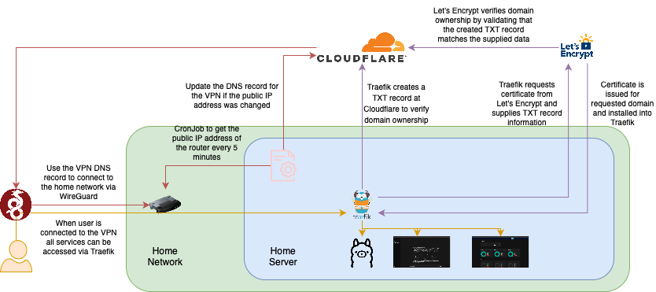

After my
[last blog post](https://ricoberger.de/blog/posts/use-cloudflare-tunnels-to-access-your-homelab/),
a colleague (hi Falk 👋) shared insights about his homelab setup. Since I'm
always open to new ideas, today's post will explore how to access our homelab
via VPN and how to use Traefik, Cloudflare, and Let's Encrypt to obtain a free
certificate for accessing our services via HTTPS.



## Setup a VPN

Fortunately, the router we are using in this blog post supports access to the
home network via a VPN using WireGuard in the background[^1]. We can simply
activate the function and download the configuration file.

When we examine the downloaded configuration file, we see that we will use the
public IP address of our router to connect to the VPN from outside. However, as
we are getting a dynamically assigned public IP address, we have to note down
the address every day before leaving the house. Since this is very
uncomfortable, we can register a dynamic host record
([DynDNS](https://en.wikipedia.org/wiki/Dynamic_DNS)). There are many DynDNS
providers available; however, we will build our own using Cloudflare.

In the first step we need to create a API token at Cloudflare, which has the
permissions to create and update DNS records.

| Type | Item | Permission |
| ---- | ---- | ---------- |
| Zone | DNS  | Edit       |

Now we will create a new DNS record at Cloudflare for our VPN that points to the
public IP address of our router.

```sh
export CLOUDFLARE_ZONE_ID=
export CLODUFLARE_API_TOKEN=

curl https://api.cloudflare.com/client/v4/zones/${CLOUDFLARE_ZONE_ID}/dns_records \
  -H "Authorization: Bearer ${CLOUDFLARE_API_TOKEN}" \
  -H "Content-Type: application/json" \
  -d '{
    "content": "<PUBLIC-IP-ADDRESS>",
    "name": "vpn.homelab.ricoberger.dev",
    "proxied": false,
    "ttl": 300,
    "type": "A"
  }'
```

To update the DNS record whenever our public IP address changes, we can create a
small script[^2]. This script will retrieve our public IP address and the ID of
the DNS record, then update the DNS record by ID with the new IP address.

```sh
#!/usr/bin/env bash

ipaddress=$(curl 'https://api.ipify.org?format=json' | jq -r .ip)

dnsrecord=$(curl -s -X GET "https://api.cloudflare.com/client/v4/zones/${CLOUDFLARE_ZONE_ID}/dns_records?type=A&name=vpn.homelab.ricoberger.dev" \
  -H "Authorization: Bearer ${CLOUDFLARE_API_TOKEN}" \
  -H "Content-Type: application/json")


dnsrecordid=$(echo "${dnsrecord}" | jq -r '{"result"}[] | .[0] | .id')
dnsrecordipaddress=$(echo "${dnsrecord}" | jq -r '{"result"}[] | .[0] | .content')

if [ "${ipaddress}" == "${dnsrecordipaddress}" ]; then
  echo "DNS record is already up to date"
  exit 0
fi

curl -X PUT https://api.cloudflare.com/client/v4/zones/${CLOUDFLARE_ZONE_ID}/dns_records/${dnsrecordid} \
  -H "Authorization: Bearer ${CLOUDFLARE_API_TOKEN}" \
  -H "Content-Type: application/json" \
  -d '{
    "content": "'${ipaddress}'",
    "name": "vpn.homelab.ricoberger.dev",
    "proxied": false,
    "ttl": 300,
    "type": "A"
  }'
```

Last but not least we create a new cronjob to run the script every five minutes.
To add a new cronjob we run `crontab -e` and add the following entry:

```plaintext
*/5 * * * * update-dns.sh
```

At this point, we have a DNS record (`vpn.homelab.ricoberger.dev`) to access our
VPN and have ensured that it automatically updates when our router's public IP
address changes. In the next step, we will set up Traefik with a Let's Encrypt
certificate to access our services via HTTPS.

## Setup Traefik

We will deploy Traefik using [Docker](https://docs.docker.com/) and
[Docker Compose](https://docs.docker.com/compose/). For that we are creating a
`docker-compose.yaml` file with the following content:

```yaml
services:
  traefik:
    container_name: traefik
    image: traefik:v3.3.4
    restart: always
    security_opt:
      - no-new-privileges:true
    # Use the "proxy" network for the Traefik container
    networks:
      - proxy
    # Map the http and https ports to the host system
    ports:
      - 80:80
      - 443:443
    # Mount the ".env" file which contains our secrets
    env_file: .env
    # - The "docker.sock" file is required to use the Docker provider within
    #   Traefik, see https://doc.traefik.io/traefik/providers/docker/
    # - The "traefik.yaml" file contains the Traefik configuration
    # - The "acme.json" file is used to store the certificate which is issued by
    #   Let's Encrypt
    # - The "config.yaml" file holds the configuration for the File provider,
    #   see https://doc.traefik.io/traefik/providers/file/
    volumes:
      - /etc/localtime:/etc/localtime
      - /var/run/docker.sock:/var/run/docker.sock
      - ./data/traefik.yaml:/traefik.yaml
      - ./data/acme.json:/acme.json
      - ./data/config.yaml:/config.yaml
    # To be able to redirect traffic from Traefik to a service, which is running
    # on the host system we have to add the following extra hosts
    extra_hosts:
      - host.docker.internal:host-gateway
    # Add labels to the Traefik container to configure the entrypoint, the host
    # which can be used to access the Traefik dashboard, the domains for which
    # the certificate should be issued and the basic auth and http to https
    # redirect middleware
    labels:
      - "traefik.enable=true"
      - "traefik.http.routers.traefik.entrypoints=http"
      - "traefik.http.routers.traefik.rule=Host(`traefik.homelab.ricoberger.dev`)"
      - "traefik.http.middlewares.traefik-auth.basicauth.users=${TRAEFIK_DASHBOARD_CREDENTIALS}"
      - "traefik.http.middlewares.traefik-https-redirect.redirectscheme.scheme=https"
      - "traefik.http.middlewares.sslheader.headers.customrequestheaders.X-Forwarded-Proto=https"
      - "traefik.http.routers.traefik.middlewares=traefik-https-redirect"
      - "traefik.http.routers.traefik-secure.entrypoints=https"
      - "traefik.http.routers.traefik-secure.rule=Host(`traefik.homelab.ricoberger.dev`)"
      - "traefik.http.routers.traefik-secure.middlewares=traefik-auth"
      - "traefik.http.routers.traefik-secure.tls=true"
      - "traefik.http.routers.traefik-secure.tls.certresolver=cloudflare"
      - "traefik.http.routers.traefik-secure.tls.domains[0].main=homelab.ricoberger.dev"
      - "traefik.http.routers.traefik-secure.tls.domains[0].sans=*.homelab.ricoberger.dev"
      - "traefik.http.routers.traefik-secure.service=api@internal"

networks:
  proxy:
    external: true
```

In the `docker-compose.yaml` file above, we defined our intention to use the
`proxy` Docker network for Traefik. To create the Docker network, we can run the
following command:

```sh
docker network create proxy
```

The `.env` file containing our secrets should include the Cloudflare API token,
which we used to create the DNS record for the VPN. It should also have the
email address used to issue the certificate and the credentials for the Traefik
dashboard. You can create the credentials by running
`echo $(htpasswd -nB admin) | sed -e s/\\$/\\$\\$/g`.

```plaintext
CF_DNS_API_TOKEN=
TRAEFIK_CERTIFICATESRESOLVERS_CLOUDFLARE_ACME_EMAIL=
TRAEFIK_DASHBOARD_CREDENTIALS=
```

To create the `acme.json` file, which will store the certificate issued by Let's
Encrypt, we will run the following commands:

```sh
touch data/acme.json
chmod 600 data/acme.json
```

In the `traefik.yaml` file, we define the configuration for Traefik as follows:

```sh
log:
  level: DEBUG
api:
  # Enable the Traefik dashboard, see
  # https://doc.traefik.io/traefik/operations/dashboard/
  dashboard: true
  debug: true
# Define the http and https entrypoints and configure the http entrypoint to
# redirect all traffic to the https entrypoint
entryPoints:
  http:
    address: ":80"
    http:
      redirections:
        entryPoint:
          to: https
          scheme: https
  https:
    address: ":443"
serversTransport:
  insecureSkipVerify: true
# Configure the Docker provider, by setting the Docker endpoint to the mounted
# "docker.sock" file and the file provider by setting the name of the
# configuration file, which should be used
providers:
  docker:
    endpoint: "unix:///var/run/docker.sock"
    exposedByDefault: false
  file:
    filename: /config.yaml
# Configure the DNS provider (in our case Cloudflare), which should be used for
# creating the TXT records, required by the DNS-01 challenge to issue the
# certificates
#
# For more information regarding the DNS-01 challenge, see
# https://letsencrypt.org/docs/challenge-types/#dns-01-challenge
certificatesResolvers:
  cloudflare:
    acme:
      storage: acme.json
      caServer: https://acme-v02.api.letsencrypt.org/directory
      # caServer: https://acme-staging-v02.api.letsencrypt.org/directory
      dnsChallenge:
        provider: cloudflare
        resolvers:
          - "1.1.1.1:53"
          - "1.0.0.1:53"
```

Last but not least, we can create the `config.yaml` file by running
`touch data/config.yaml`. Then, we can start Traefik with the following command:

```sh
docker-compose -f docker-compose.yaml up -d --force-recreate
```

If we now take a look at the `acme.json` file (`cat data/acme.json`) we should
see the issued certifacte for `*.homelab.ricoberger.dev` by Let's Encrypt:

```json
{
  "cloudflare": {
    "Account": {
      "Email": "",
      "Registration": {
        "body": {
          "status": "valid"
        },
        "uri": "https://acme-v02.api.letsencrypt.org/acme/acct/<REDACTED>"
      },
      "PrivateKey": "<REDACTED>",
      "KeyType": "4096"
    },
    "Certificates": [
      {
        "domain": {
          "main": "homelab.ricoberger.dev",
          "sans": ["*.homelab.ricoberger.dev"]
        },
        "certificate": "<REDACTED>",
        "key": "<REDACTED>",
        "Store": "default"
      }
    ]
  }
}
```

If we create a new DNS record similar to the one for the VPN, but using the
local IP address instead of the public one
(`ipconfig getifaddr en0 || ipconfig getifaddr en1`) for
`traefik.homelab.ricoberger.dev`, we should be able to access the Traefik
dashboard afterwards via our browser.

```sh
export CLOUDFLARE_ZONE_ID=
export CLODUFLARE_API_TOKEN=

curl https://api.cloudflare.com/client/v4/zones/${CLOUDFLARE_ZONE_ID}/dns_records \
  -H "Authorization: Bearer ${CLOUDFLARE_API_TOKEN}" \
  -H "Content-Type: application/json" \
  -d '{
    "content": "<LOCAL-IP-ADDRESS>",
    "name": "traefik.homelab.ricoberger.dev",
    "proxied": false,
    "ttl": 300,
    "type": "A"
  }'
```

At this point, we have created a wildcard certificate through Let's Encrypt,
allowing us to use it for our services, such as the Traefik Dashboard, which can
be accessed via HTTPS. In the final step, we will examine how to expose the
Ollama API and Open WeUI from the blog post
[Mac mini as AI Server](https://ricoberger.de/blog/posts/mac-mini-as-ai-server/).

For the Ollama API, we are utilizing the file provider of Traefik since it runs
on our host system rather than within a Docker container. To make the Ollama API
accessible via `ollama.homelab.ricoberger.dev`, we need to add the following
configuration to the `data/config.yaml` file:

```yaml
http:
  # Create a new "ollama" router, which uses the "https" entrypoint and is used
  # when the "ollama.homeelab.ricoberger.de" domain is used
  routers:
    ollama:
      entryPoints:
        - "https"
      rule: "Host(`ollama.homelab.ricoberger.dev`)"
      middlewares:
        - default-headers
        - https-redirectscheme
      tls: {}
      service: ollama

  # Create a "ollama" service for the "ollama" router from above, where we set
  # the url of the Ollama API. Since the Ollama API is running on port 11434 on
  # host system, we have to use the "host.docker.internal" address
  services:
    ollama:
      loadBalancer:
        servers:
          - url: "http://host.docker.internal:11434"
        passHostHeader: true
```

For the Open WebUI we can create the following Docker compose file and run it
via `docker-compose -f docker-compose.yaml up -d --force-recreate`

```yaml
name: open-webui

services:
  open-webui:
    container_name: open-webui
    image: ghcr.io/open-webui/open-webui:main
    restart: always
    # Use the "proxy" network, so that the Open WebUI container is using the
    # same network as the Traefik container
    networks:
      - proxy
    volumes:
      - ./data:/app/backend/data
    # Add the extra hosts, so that the Open WebUI is able to access the Ollama
    # API
    extra_hosts:
      - host.docker.internal:host-gateway
    # Add the following labels, so that Traefik knows, the port of the Open
    # WebUI, the entrzpoint which should be used and the domain which should be
    # used
    labels:
      - "traefik.enable=true"
      - "traefik.http.routers.open-webui.rule=Host(`open-webui.homelab.ricoberger.dev`)"
      - "traefik.http.routers.open-webui.entrypoints=https"
      - "traefik.http.routers.open-webui.tls=true"
      - "traefik.http.services.open-webui.loadbalancer.server.port=8080"

networks:
  proxy:
    external: true
```

If we add a DNS record for `ollama.homelab.ricoberger.dev` and
`open-webui.homelab.ricoberger.dev` to Cloudflare as before, we can access the
Ollama API and the Open WebUI through their domains[^3].

That's it for today's post. You can find the complete setup in the
[ricoberger/playground](https://github.com/ricoberger/playground/tree/95b9f245ebe9ef840a8d642bc4c6f530f3452edf/homelab)
repository.

[^1]:
    If your router doesn't support this function, you can create the WireGuard
    setup manually by following one of the many available tutorials. The easiest
    one for me was the one from the Pi-hole documentation:
    [Installing the WireGuard server](https://docs.pi-hole.net/guides/vpn/wireguard/server/).

[^2]:
    An improved version of the script can be found in the
    [ricoberger/playground](https://github.com/ricoberger/playground/blob/95b9f245ebe9ef840a8d642bc4c6f530f3452edf/homelab/dns/dns.sh)
    repository.

[^3]:
    If you prefer not to add DNS records for your homelab services to your DNS
    provider, you can run your own DNS server. I might write a follow-up blog
    post about this.
