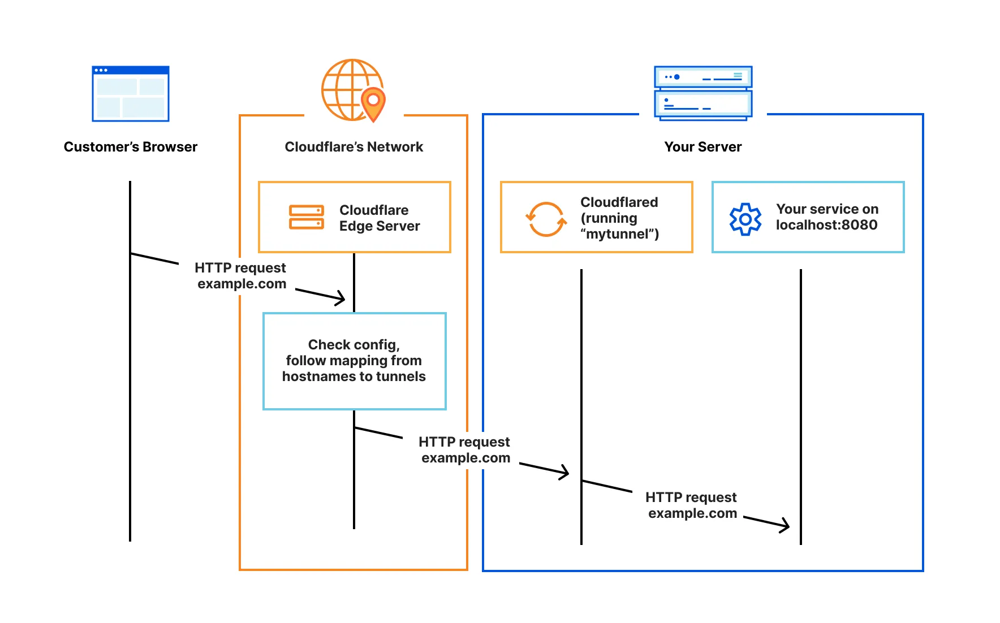

In our
[last blog post](https://ricoberger.de/blog/posts/mac-mini-as-ai-server/), we
looked at how to set up an AI server on a Mac Mini and how to access the server
in our homelab. In today's post, we will make the server available through
Cloudflare Tunnels, allowing us to access it from anywhere.

Cloudflare Tunnel provides us with a secure way to connect our resources to
Cloudflare without a publicly routable IP address. With Tunnel, we do not send
traffic to an external IP — instead, a lightweight daemon in our infrastructure
(`cloudflared`) creates outbound-only connections to Cloudflare's global
network. Cloudflare Tunnel can connect HTTP web servers, SSH servers, remote
desktops, and other protocols safely to Cloudflare. This way, our origins can
serve traffic through Cloudflare without being vulnerable to attacks that bypass
Cloudflare.[^1]

## How It Works

`cloudflared` establishes outbound connections (tunnels) between our resources
and Cloudflare's global network. Tunnels are persistent objects that route
traffic to DNS records. Within the same tunnel, we can run as many `cloudflared`
processes (connectors) as needed. These processes will establish connections to
Cloudflare and send traffic to the nearest Cloudflare data center.



## Setup a Tunnel

In the following, we will set up a Cloudflare Tunnel to expose the Open WebUI
from the
[last blog post](https://ricoberger.de/blog/posts/mac-mini-as-ai-server/) via
`openwebui-homelab.ricoberger.dev`. We will create a new tunnel and DNS entry,
connecting the Open WebUI through the tunnel with Cloudflare. This will route
traffic from `openwebui-homelab.ricoberger.dev` to the `localhost:3000` address,
where the Open WebUI is running.

To proceed, we need to
[add a website to Cloudflare](https://developers.cloudflare.com/fundamentals/setup/manage-domains/add-site/)
or
[change the domain nameservers](https://developers.cloudflare.com/dns/zone-setups/full-setup/setup/)
for `ricoberger.dev` to Cloudflare. Once this is done, we can follow these steps
to create the Cloudflare Tunnel and make our Open WebUI accessible via the
specified domain:

1. [Create an API token](https://developers.cloudflare.com/fundamentals/api/get-started/create-token/)
   with the following permissions:

   | Type    | Item              | Permission |
   | ------- | ----------------- | ---------- |
   | Account | Cloudflare Tunnel | Edit       |
   | Zone    | DNS               | Edit       |

2. Create a tunnel, by making a `POST` request to the
   [Cloudflare Tunnel](https://developers.cloudflare.com/api/resources/zero_trust/subresources/access/subresources/applications/methods/create/)
   endpoint:

   ```sh
   export CLOUDFLARE_ACCOUNT_ID=
   export CLOUDFLARE_API_TOKEN=

   curl "https://api.cloudflare.com/client/v4/accounts/$CLOUDFLARE_ACCOUNT_ID/cfd_tunnel" \
     --header "Content-Type: application/json" \
     --header "Authorization: Bearer $CLOUDFLARE_API_TOKEN" \
     --data '{
       "name": "homelab",
       "config_src": "cloudflare"
     }'
   ```

   ```json
   {
     "success": true,
     "errors": [],
     "messages": [],
     "result": {
       "id": "<tunnel-id>",
       "account_tag": "<REDACTED>",
       "created_at": "2025-03-15T12:46:52.095257Z",
       "deleted_at": null,
       "name": "homelab",
       "connections": [],
       "conns_active_at": null,
       "conns_inactive_at": "2025-03-15T12:46:52.095257Z",
       "tun_type": "cfd_tunnel",
       "metadata": {},
       "status": "inactive",
       "remote_config": true,
       "credentials_file": {
         "AccountTag": "<REDACTED>",
         "TunnelID": "<REDACTED>",
         "TunnelName": "homelab",
         "TunnelSecret": "<REDACTED>"
       },
       "token": "<tunnel-token>"
     }
   }
   ```

3. Copy the `id` and `token` values shown in the output. We will need these
   values to configure and run the tunnel.

   ```sh
   export CLOUDFLARE_TUNNEL_ID=
   export CLOUDFLARE_TUNNEL_TOKEN=
   ```

4. Make a
   [`PUT` request](https://developers.cloudflare.com/api/resources/zero_trust/subresources/tunnels/subresources/cloudflared/subresources/configurations/methods/update/)
   to route our local service URL to a public hostname. Our ingress rules must
   include a catch-all rule at the end. In the following example, `cloudflared`
   will respond with a 404 status code when the request does not match any of
   the previous hostnames.

   ```sh
   curl --request PUT \
     "https://api.cloudflare.com/client/v4/accounts/$CLOUDFLARE_ACCOUNT_ID/cfd_tunnel/$CLOUDFLARE_TUNNEL_ID/configurations" \
     --header "Content-Type: application/json" \
     --header "Authorization: Bearer $CLOUDFLARE_API_TOKEN" \
     --data '{
       "config": {
         "ingress": [
           {
             "hostname": "openwebui-homelab.ricoberger.dev",
             "service": "http://localhost:3000",
             "originRequest": {}
           },
           {
             "service": "http_status:404"
           }
         ]
       }
     }'
   ```

   ```json
   {
     "success": true,
     "errors": [],
     "messages": [],
     "result": {
       "tunnel_id": "<tunnel-id>",
       "version": 1,
       "config": {
         "ingress": [
           {
             "service": "http://localhost:3000",
             "hostname": "openwebui-homelab.ricoberger.dev",
             "originRequest": {}
           },
           {
             "service": "http_status:404"
           }
         ],
         "warp-routing": {
           "enabled": false
         }
       },
       "source": "cloudflare",
       "created_at": "2025-03-15T13:08:36.465147Z"
     }
   }
   ```

5. Create a DNS record for our application. This DNS record allows Cloudflare to
   proxy `openwebui-homelab.ricoberger.dev` traffic to our Cloudflare Tunnel
   (`<tunnel-id>.cfargotunnel.com`).

   ```sh
   export CLOUDFLARE_ZONE_ID=

   curl "https://api.cloudflare.com/client/v4/zones/$CLOUDFLARE_ZONE_ID/dns_records" \
     --header "Content-Type: application/json" \
     --header "Authorization: Bearer $CLOUDFLARE_API_TOKEN" \
     --data '{
       "type": "CNAME",
       "proxied": true,
       "name": "openwebui-homelab.ricoberger.dev",
       "content": "<tunnel-id>.cfargotunnel.com"
     }'
   ```

   ```json
   {
     "result": {
       "id": "<REDACTED>",
       "name": "openwebui-homelab.ricoberger.dev",
       "type": "CNAME",
       "content": "<tunnel-id>.cfargotunnel.com",
       "proxiable": true,
       "proxied": true,
       "ttl": 1,
       "settings": {
         "flatten_cname": false
       },
       "meta": {},
       "comment": null,
       "tags": [],
       "created_on": "2025-03-15T13:17:18.56921Z",
       "modified_on": "2025-03-15T13:17:18.56921Z"
     },
     "success": true,
     "errors": [],
     "messages": []
   }
   ```

6. Install and run the tunnel

   ```sh
   brew install cloudflared
   sudo cloudflared service install $CLOUDFLARE_TUNNEL_TOKEN
   ```

7. Verify tunnel status

   ```sh
   curl "https://api.cloudflare.com/client/v4/accounts/$CLOUDFLARE_ACCOUNT_ID/cfd_tunnel/$CLOUDFLARE_TUNNEL_ID" \
     --header "Content-Type: application/json" \
     --header "Authorization: Bearer $CLOUDFLARE_API_TOKEN"
   ```

   ```json
   {
     "success": true,
     "errors": [],
     "messages": [],
     "result": {
       "id": "<REDACTED>",
       "account_tag": "<REDACTED>",
       "created_at": "2025-03-15T12:46:52.095257Z",
       "deleted_at": null,
       "name": "homelab",
       "connections": [...],
       "conns_active_at": "2025-03-15T13:20:53.912617Z",
       "conns_inactive_at": null,
       "tun_type": "cfd_tunnel",
       "metadata": {},
       "status": "healthy",
       "remote_config": true
     }
   }
   ```

That's it! Now we can open `openwebui-homelab.ricoberger.dev` in our browser to
access the Open WebUI from anywhere.

[^1]:
    [Cloudflare Documentation](https://developers.cloudflare.com/cloudflare-one/connections/connect-networks/)
