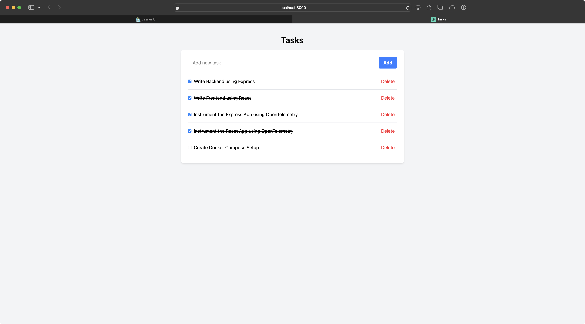
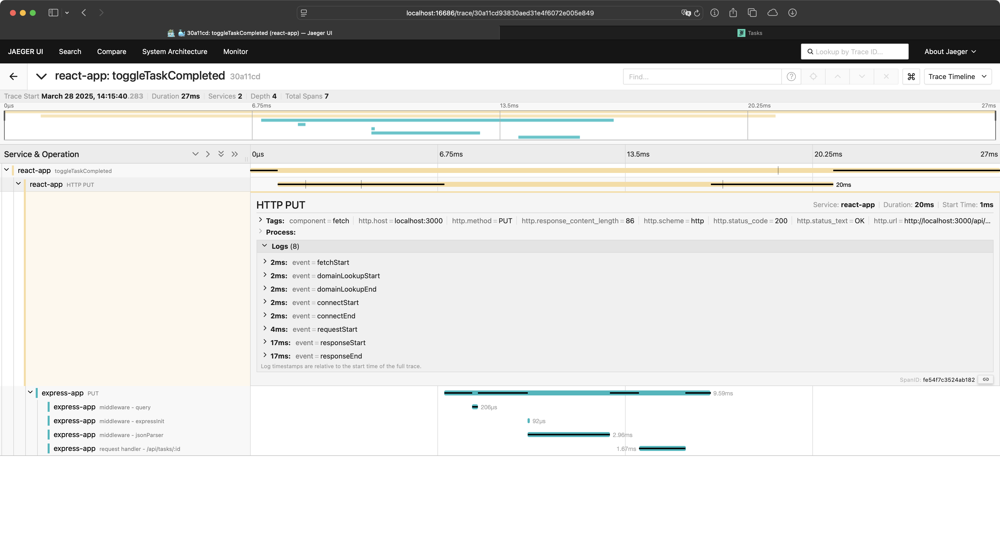

Some years ago, I watched the KubeCon talk
["Tracing is For Everyone: Tracing User Events with GraphQL and OpenTelemetry"](https://www.youtube.com/watch?v=8Ldp9w8wm-U)
by Nina Stawski. Since then, I have wanted to experiment with instrumenting
frontend apps using OpenTelemetry. Recently, the topic came up at work, so I
finally created a small proof of concept to explore this further.

For this proof of concept, we are creating a simple task management app using
React and an [Express](https://expressjs.com/) API. The app allows users to
create tasks, delete tasks, and mark tasks as completed. The tasks are stored in
memory on the Express server. The source code for the complete app is available
in the
[ricoberger/playground](https://github.com/ricoberger/playground/tree/ae2828edd288557eacfba73bd08a8999a3bebe1d/applications/use-opentelemetry-traces-in-react-applications)
repository. A screenshot of the final app is provided below.



To instrument our React application with OpenTelemetry, we create a
[`TraceProvider.jsx`](https://github.com/ricoberger/playground/blob/ae2828edd288557eacfba73bd08a8999a3bebe1d/applications/use-opentelemetry-traces-in-react-applications/frontend/src/components/TraceProvider.jsx)
file in our project. In the first step, we import the `WebTracerProvider` class
from `@opentelemetry/sdk-trace-web` to create a new trace provider that allows
us to automatically trace activities in the browser. Within the trace provider,
we can add resources to the spans, such as the service name. We also need to set
the span processors:

- The `ConsoleSpanExporter` will print all spans to the console. We use it
  solely for testing purposes. In a production setup, this exporter should not
  be used.
- The `OTLPTraceExporter` exports traces to the OpenTelemetry collector and
  requires an endpoint that ends with `/v1/traces`. In our case, we will use the
  same address as our frontend and proxy all requests to the endpoint for the
  OpenTelemetry collector. We will examine this in more detail later.

```jsx
const provider = new WebTracerProvider({
  resource: resourceFromAttributes({
    [ATTR_SERVICE_NAME]: "react-app",
  }),
  spanProcessors: [
    new SimpleSpanProcessor(new ConsoleSpanExporter()),
    new SimpleSpanProcessor(
      new OTLPTraceExporter({
        url: "http://localhost:3000/v1/traces",
      }),
    ),
  ],
});
```

In the next step, we register the trace provider for use with the OpenTelemetry
API. We utilize the `ZoneContextManager` to trace asynchronous operations.
Additionally, we set the appropriate propagators to ensure the trace context is
passed between services. In our case, we use the `B3Propagator` and the
`W3CTraceContextPropagator`.

```jsx
provider.register({
  contextManager: new ZoneContextManager(),
  propagator: new CompositePropagator({
    propagators: [new B3Propagator(), new W3CTraceContextPropagator()],
  }),
});
```

Afterward, we register the instrumentations for the OpenTelemetry SDK. We use
`DocumentLoadInstrumentation` to automatically create a span for the page load
and all loaded assets, and `FetchInstrumentation` to trace all API requests. We
also set the urls for which we want to propagate the trace header and clear the
timing resources.

```jsx
registerInstrumentations({
  instrumentations: [
    new DocumentLoadInstrumentation(),
    new FetchInstrumentation({
      propagateTraceHeaderCorsUrls: ["http://localhost:3000"],
      clearTimingResources: true,
    }),
  ],
});
```

Lastly, we export a `TraceProvider` component. This component will wrap our
[root component](https://github.com/ricoberger/playground/blob/ae2828edd288557eacfba73bd08a8999a3bebe1d/applications/use-opentelemetry-traces-in-react-applications/frontend/src/main.jsx)
to ensure that the tracing setup is properly initialized.

```jsx
export function TraceProvider(props) {
  return <>{props.children}</>;
}
```

At this point, we have automatically instrumented all document loads and API
requests. To create spans manually, we need to create a new tracer using our
provider.

```jsx
export const webTracer = provider.getTracer("web-tracer");
```

Now we can use the `webTracer` to create a new span. We can then execute a
function, in this case, an API call, within the context of the span and add
events to it.

```jsx
function toggleTaskCompleted(id) {
  const span = webTracer.startSpan("toggleTaskCompleted");
  context.with(trace.setSpan(context.active(), span), () => {
    fetch("/api/tasks/" + id, {
      method: "PUT",
      headers: {
        "Content-Type": "application/json",
        Accept: "application/json",
      },
    })
      .then((res) => {
        trace.getSpan(context.active()).addEvent("parseJson");
        return res.json();
      })
      .then((data) => {
        trace.getSpan(context.active()).addEvent("updateTask");
        const updatedTasks = tasks.map((task) => {
          if (id === task.id) {
            return data;
          }
          return task;
        });

        trace.getSpan(context.active()).addEvent("setTasks");
        span.end();
        setTasks(updatedTasks);
      });
  });
}
```

An example trace for when a user marks a task as done in our project can be
found below. It includes our manually created span
`react-app: toggleTaskCompleted` and the automatically generated span
`react-app: HTTP PUT` from the `FetchInstrumentation`. Since we propagate the
trace headers, the spans are also connected to those from our Express backend.



As promised, I would like to review the project setup and explain why we are
using `http://localhost:3000/v1/traces` for the `OTLPTraceExporter`. We are
running the project using a
[Docker Compose file](https://github.com/ricoberger/playground/blob/ae2828edd288557eacfba73bd08a8999a3bebe1d/applications/use-opentelemetry-traces-in-react-applications/docker-compose.yaml),
which starts four containers:

- A `jaeger` container that runs [Jaeger](https://www.jaegertracing.io/). Jaeger
  stores our traces and provides a user-friendly interface to view them.
- A `otel-collector` container that runs the
  [OpenTelemetry Collector](https://opentelemetry.io/docs/collector/). The
  collector receives all spans from our Express backend and React frontend, then
  forwards them to Jaeger. You can find the configuration for the collector
  [here](https://github.com/ricoberger/playground/blob/ae2828edd288557eacfba73bd08a8999a3bebe1d/applications/use-opentelemetry-traces-in-react-applications/otel-collector-config.yaml).
- A `backend` container that runs our Express app.
- A `frontend` container that runs NGINX to serve our frontend app. In the
  [NGINX configuration](https://github.com/ricoberger/playground/blob/ae2828edd288557eacfba73bd08a8999a3bebe1d/applications/use-opentelemetry-traces-in-react-applications/frontend/nginx.conf#L19),
  we define that all requests starting with `/api` are routed to the `backend`
  container, while requests starting with `/v1/traces` are routed to the
  `otel-collector` container.

That's it! If you want to try this on your own, you can check out the
[example project](https://github.com/ricoberger/playground/tree/ae2828edd288557eacfba73bd08a8999a3bebe1d/applications/use-opentelemetry-traces-in-react-applications)
and start it with
`docker compose -f docker-compose.yaml up --force-recreate --build`. Afterward,
you can open `http://localhost:3000` in your browser to create, delete, and mark
tasks as completed. If you access the Jaeger frontend at
`http://localhost:16686`, you should see some traces from our React frontend and
Express backend.
