# Health Mosaic

See all your health data, exactly the way you want.

Health Mosaic turns your Apple Health data into beautiful, fully customizable
dashboards. Pick the metrics that matter to you, choose how they're visualized,
and get the big picture of your health at a glance — on iPhone and Mac.

  

    <a href="./assets/iphone-01-activity.png">
      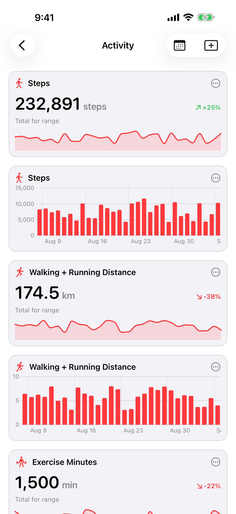
    </a>
  

  

    <a href="./assets/iphone-02-sleep.png">
      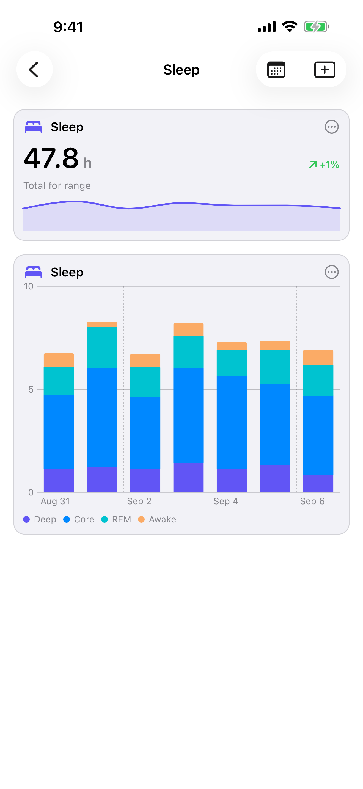
    </a>
  

  

    <a href="./assets/iphone-03-activity.png">
      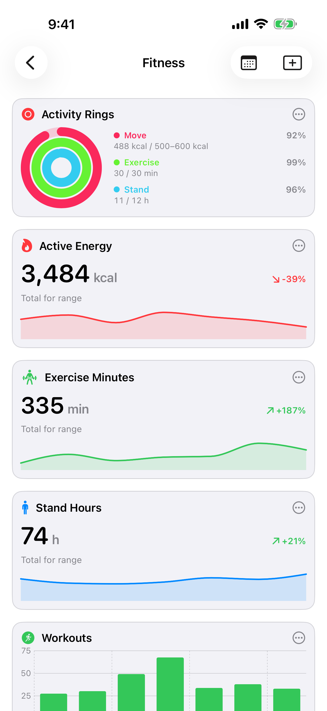
    </a>
  

  

    <a href="./assets/iphone-04-activity.png">
      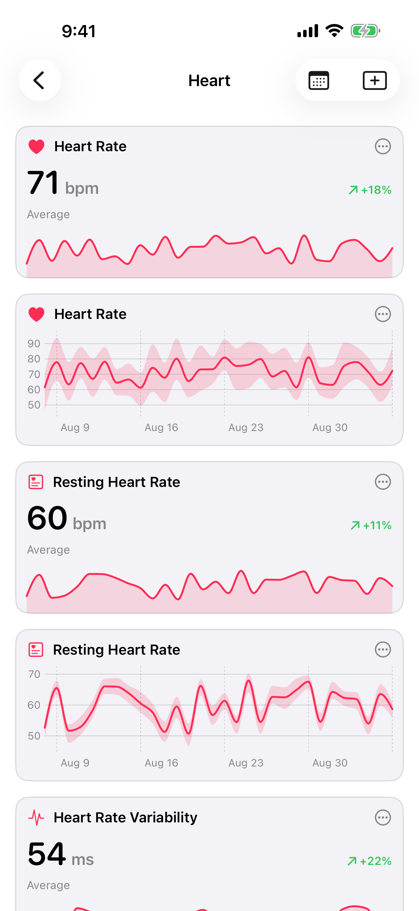
    </a>
  

  

    <a href="./assets/iphone-05-activity.png">
      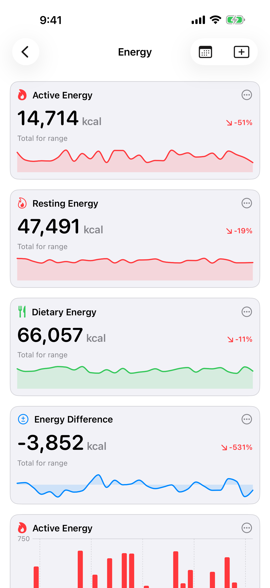
    </a>
  

  

    <a href="./assets/iphone-06-activity.png">
      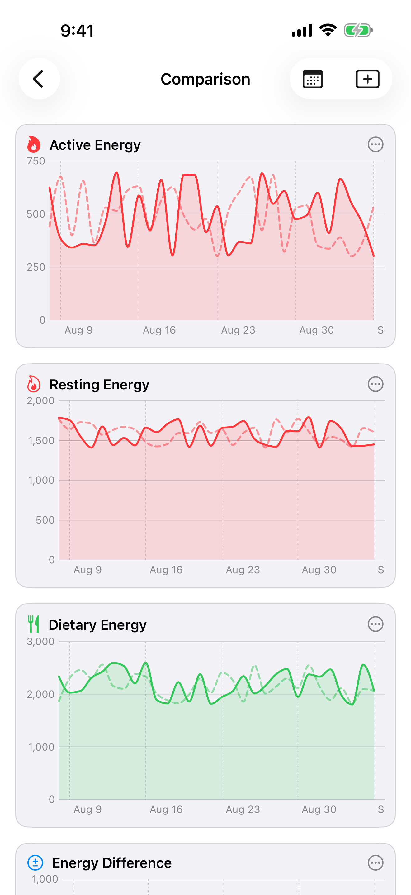
    </a>
  

  

    <a href="./assets/macos-01-activity.png">
      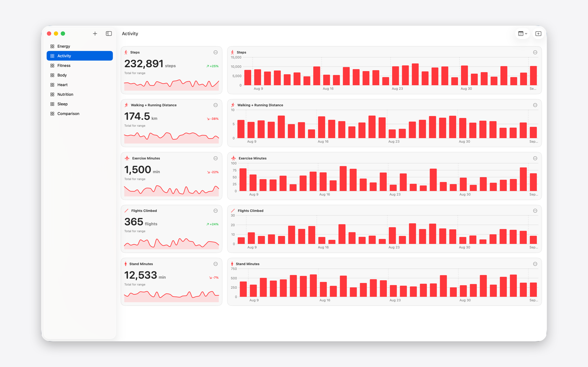
    </a>
  

  

    <a href="./assets/macos-02-sleep.png">
      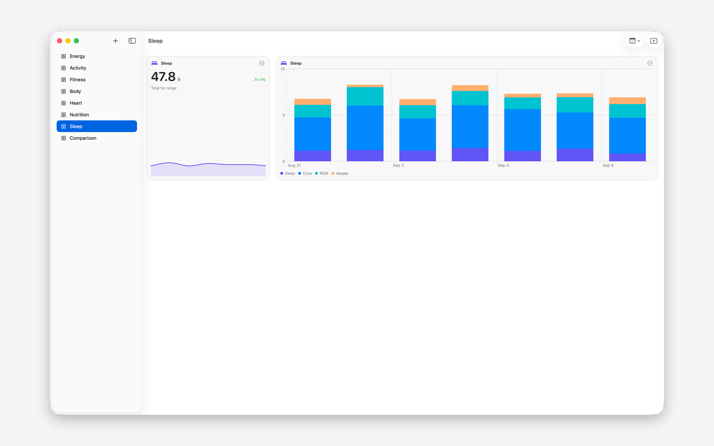
    </a>
  

  

    <a href="./assets/macos-03-activity.png">
      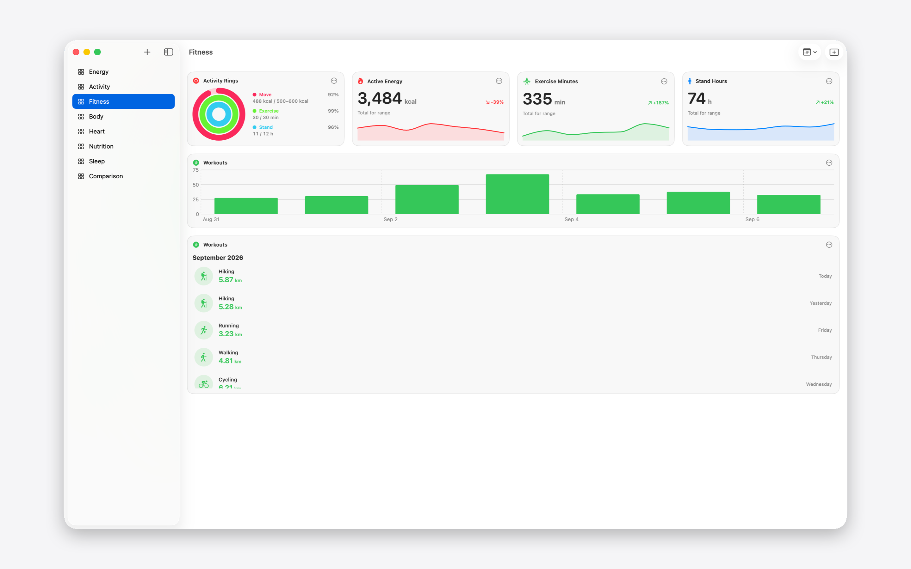
    </a>
  

  

    <a href="./assets/macos-04-activity.png">
      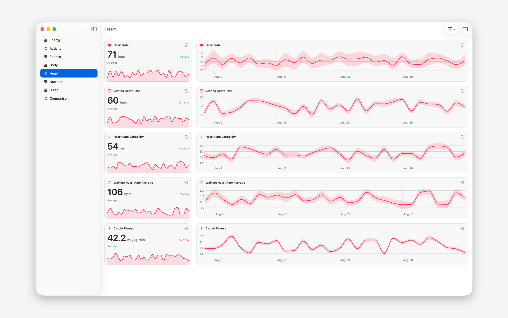
    </a>
  

  

    <a href="./assets/macos-05-activity.png">
      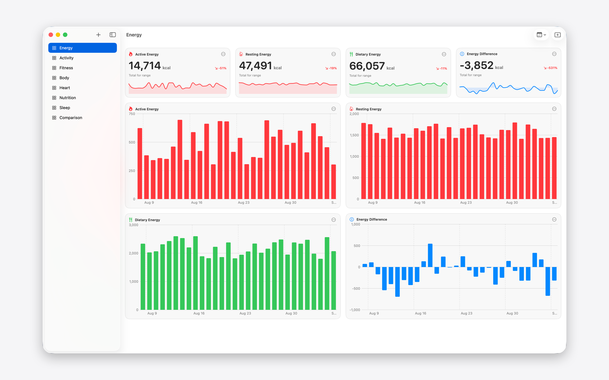
    </a>
  

  

    <a href="./assets/macos-06-activity.png">
      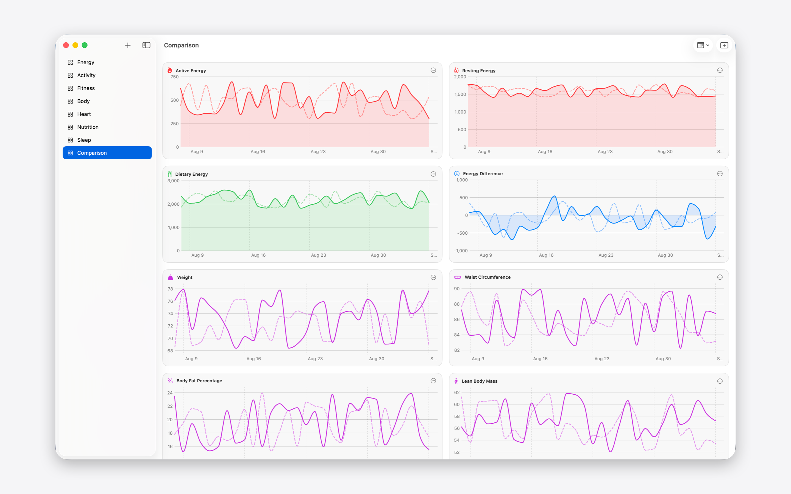
    </a>
  

##### Build Your Own Dashboards

- Create as many dashboards as you like — one for training, one for sleep, one
  for heart health
- Add panels for any metric and arrange them in a flexible grid
- Choose chart type, statistic, color, and size per panel
- Line, bar, and area charts, min–max range bands, stat cards with sparklines, a
  sleep-stage timeline, and Fitness-style workout lists

##### 120+ Health Metrics

Activity, Body Measurements, Cycle Tracking, Hearing, Heart, Mental Wellbeing,
Mobility, Nutrition, Respiratory, Sleep, Vital Signs, Workouts, and more —
including derived insights like Energy Difference (energy burned vs. consumed).

##### Explore Your Trends

- Switch the time range for all panels at once — from a single day to a full
  year
- Compare any panel with the previous period to spot changes over time
- Scrub or hover charts for exact values
- Tap a workout for detailed per-activity stats: pace, speed, heart rate,
  elevation, and more

##### iPhone + Mac, Always in Sync

Your dashboards and settings sync seamlessly through iCloud. Your health data is
never uploaded to iCloud — it mirrors directly and encrypted over your local
network. Keep the iPhone app open on the same network and your Mac shows your
latest data — no setup, no accounts, no servers of ours.

##### Private by Design

Your health data belongs to you. Health Mosaic never uploads your health data to
iCloud or any server — it syncs directly and encrypted between your own devices
over your local network. Your dashboards and settings sync through your
personal, private iCloud database. No accounts, no tracking, no third-party
services. You can export your data anytime as JSON or CSV.

##### More

- Metric or imperial units, switchable anytime
- Available in English, German, French, Italian, Spanish, and Portuguese
- Sensible default dashboards to get you started in seconds

Health Mosaic requires access to Apple Health on iPhone. Please note: only the
iPhone app can read data from Apple Health — the Mac app shows health data
mirrored directly from your iPhone over your local network, so it requires the
iPhone app to be open on the same network and won't show any data on its own.

# Privacy Policy

Your privacy is important to us. It is Health Mosaics's policy to respect your
privacy regarding any information we may collect from you across our
website/app, https://ricoberger.de/projects/health-mosaic/, and other sites we
own and operate.

We only ask for personal information when we truly need it to provide a service
to you. We collect it by fair and lawful means, with your knowledge and consent.
We also let you know why we're collecting it and how it will be used.

We only retain collected information for as long as necessary to provide you
with your requested service. What data we store, we'll protect within
commercially acceptable means to prevent loss and theft, as well as unauthorized
access, disclosure, copying, use or modification.

We don't share any personally identifying information publicly or with
third-parties, except when required to by law.

Our website/app may link to external sites that are not operated by us. Please
be aware that we have no control over the content and practices of these sites,
and cannot accept responsibility or liability for their respective privacy
policies.

You are free to refuse our request for your personal information, with the
understanding that we may be unable to provide you with some of your desired
services.

Your continued use of our website/app will be regarded as acceptance of our
practices around privacy and personal information. If you have any questions
about how we handle user data and personal information, feel free to contact us
via email (support@ricoberger.de).

This policy is effective as of 9 September 2026.
